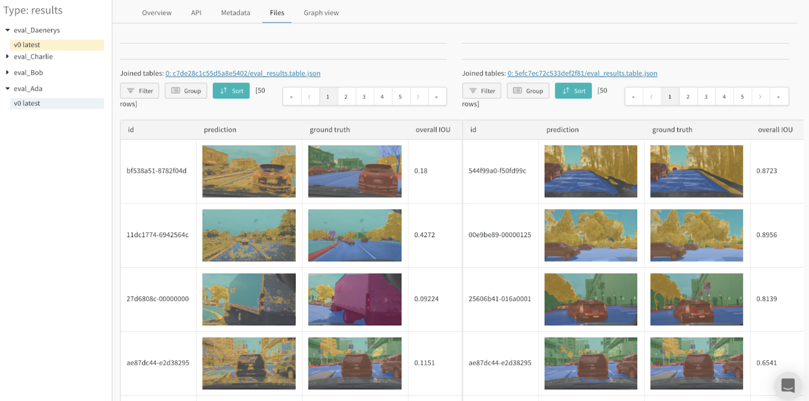

# Tables

Use W&B Tables to log and visualize data and model predictions. Interactively explore your data:

* Compare changes precisely across models, epochs, or individual examples
* Understand higher-level patterns in your data
* Capture and communicate your insights with visual samples

## Why are Tables useful?

**Actually see your data**  
Log metrics and rich media during model training or evaluation, then visualize results in a persistent database synced to the cloud, or to your [self-hosted W&B instance](../self-hosted/). For example, check out this [balanced split of a photos dataset →](https://wandb.ai/stacey/mendeleev/artifacts/balanced_data/inat_80-10-10_5K/ab79f01e007113280018/files/data_split.table.json)


**Interactively explore your data**  
View, sort, filter, group, join, and query Tables to understand your data and model performance—no need to browse static files or rerun analysis scripts. For example, see this project on[ style-transfered audio →](https://wandb.ai/stacey/cshanty/reports/Visualize-Audio-Data-in-W-B--Vmlldzo1NDMxMDk)


**Compare model versions**  
Quickly compare results across different training epochs, datasets, hyperparameter choices, model architectures etc. For example, take a look at this comparison of[ two models on the same test images →](https://wandb.ai/stacey/evalserver_answers_2/artifacts/results/eval_Daenerys/c2290abd3d7274f00ad8/files/eval_results.table.json#b6dae62d4f00d31eeebf$eval_Bob)


**Track every detail and see the bigger picture**  
Zoom in to visualize a specific prediction at a specific step. Zoom out to see the aggregate statistics, identify patterns of errors, and understand opportunities for improvement. This tool works for comparing steps from a single model training, or results across different model versions. Check out this example table analyzing results [after 1 vs 5 epochs on MNIST → ](https://wandb.ai/stacey/mnist-viz/artifacts/predictions/baseline/d888bc05719667811b23/files/predictions.table.json#7dd0cd845c0edb469dec)


## Log a Table

A wandb.Table consists of row-indexed data with named columns and is saved and accessed under a particular key or name.

### Create a Table

To define a Table, specify the columns you want to see for each row of data. Each row might be a single item in your training dataset, a particular step or epoch during training, a prediction made by your model on a test item, an object generated by your model, etc. Each column has a fixed type: numeric, text, boolean, image, video, audio, etc. You don't need to specify the type in advance—simply give each column a name, and make sure to only pass data of that type into that column index. For a more detailed example, see [this report](https://wandb.ai/stacey/mnist-viz/reports/Guide-to-W-B-Tables--Vmlldzo2NTAzOTk#1.-how-to-log-a-wandb.table).

#### From an existing array or dataframe

```python
# assume a model has returned predictions on four images
# with the following fields available:
# - the image id
# - the image pixels, wrapped in a wandb.Image()
# - the model's predicted label
# - the ground truth label
my_mnist_data = [
  [0, wandb.Image("img_0.jpg"), 0, 0],
  [1, wandb.Image("img_1.jpg"), 8, 0],
  [2, wandb.Image("img_2.jpg"), 7, 1],
  [3, wandb.Image("img_3.jpg"), 1, 1]
]
          
# create a wandb.Table() with corresponding columns
columns=["id", "image", "guess", "truth"]
test_table = wandb.Table(data=my_data, columns=columns)
```

#### By adding data incrementally

```python
# create a Table with the same columns as above,
# plus confidence scores for all labels
columns=["id", "image", "guess", "truth"]
for digit in range(10):
    columns.append("score_" + str(digit))
test_table = wandb.Table(columns=columns)

# run inference on every image, assuming my_model returns the
# predicted label, and the ground truth labels are available
for img_id, img in enumerate(mnist_test_data):
    true_label = mnist_test_data_labels[img_id]
    guess_label = my_model.predict(img)
    test_table.add_data(img_id, wandb.Image(img), \
                         guess_label, true_label)
```

### Save a Table to your project

There are two ways to save a Table to W&B: directly from an experiment run via run.log\(\) and in an artifact context with artifact.add\(\). 

#### Use run.log\(\) if

* you're moving quickly and want to try out this feature or see results immediately in your Workspace
* you're not saving a lot of larger meaningful data in the columns \(e.g. mostly numbers, not images or videos you want to make sure to store and easily find in W&B\)
* you have just one meaningful version of a Table per experiment run: you don't need to save and compare multiple versions across epochs

```python
run = wandb.init(project="my_project")
test_table = wandb.Table(data=data, columns=columns)
run.log({"my_test_key" : test_table})
```

#### Use artifact.add\(\) if

* you want to easily compare multiple versions of your Table \(across epochs, checkpoints, model architecture or hyperparameter settings, etc\)
* you're storing a substantial amount of data \(e.g. many files or larger files like videos\) which you'd like to keep organized
* you want to visualize something best represented as an [artifact version](https://docs.wandb.ai/guides/artifacts/artifacts-core-concepts#terminology) \(a dataset, model predictions, samples from a generated model, any other collection of files\)

Refer to this colab for a [detailed example of artifact.add\(\) ](https://wandb.me/dsviz-mnist-colab)→ 

```python
run = wandb.init(project="my_project")
# create a wandb Artifact for each meaningful step
test_predictions = wandb.Artifact("mnist_test_preds", 
                                  type="predictions")
                                  
# [build up your predictions data as above]
test_table = wandb.Table(data=data, columns=columns)
test_predictions.add(test_table, "my_test_key")
run.log_artifact(test_predictions)   
```

### View a Table in your browser

By default, Tables will show up in several places within a W&B project:

* if saved in a **run context with run.log\(\)**:
  * in the run workspace alongside all the metrics logged for a single experiment run
  * in the project workspace as the union of Tables logged by individual runs
* if saved in an **artifact context with artifact.add\(\):**
  * in the Overview tab for a specific artifact version

You can also view Tables by adding a Weave panel as a visualization type in a Workspace or Report \(more details on this coming soon\).

### Save your view

Tables you interact with in the run workspace, project workspace, or a report will automatically save their view state. If you apply any Table operations then close your browser, the Table will retain the last viewed configuration when you next navigate to the table.

Tables you interact with in the artifact context will remain stateless.

To save a Table from a workspace in a particular state, export it to a Report. You can do this from the three dot menu in the top right corner of any workspace visualization panel \(three dots → "Share panel" or "Add to report"\).


## Table interactions

### Table operations 

Customize a single Table to answer specific questions, such as what is the precision of this model's predictions and what are the true labels of the mistakes? These operations are 

* **stateless in an artifact context**: any Table logged alongside an artifact version will reset to its default state after you close the browser window 
* **stateful in a workspace or report context**: any changes you make to a Table in a single run workspace, multi-run project workspace, or Report will persist 


[Try these yourself → ](https://wandb.ai/stacey/mnist-viz/artifacts/predictions/baseline/d888bc05719667811b23/files/predictions.table.json)

#### Sort

Sort all rows in a Table by the value in a given column. Hover over the header, click on the three dot menu, and choose "Sort Asc" or "Sort Desc". 


#### Filter

Filter all rows by an expression via the Filter button in the top left. The expression editor shows a list of options for each term using autocomplete on column names and logical predicate structure. You can connect multiple logical predicates into one expression using "and" or "or" \(and sometimes parentheses\).


#### Group

Group all rows by the value in a particular column \(three dot menu in column header → "Group by"\). By default, this will turn other numeric columns into histograms showing the distribution of values for that column across the group. Grouping is helpful for understanding higher-level patterns in your data.


### Changing the columns

#### Add columns

From the three-dot menu on any column, you can insert a new column to the left or right. Edit the cell expression to compute a new column using references to existing columns, mathematical and logical operators, and aggregation functions when a row is grouped \(like average, sum, min/max\). Optionally give the column a new name below the expression editor.


#### Edit columns and display settings

Tables render column data based on the type of the values logged in that column. By clicking on the column name or "Column settings" from the three-dot menu, you can modify

* **the contents** of the column by editing "Cell expression":  select a different field to show, or build a logical predicate expression as described above, including adding a function like count\(\) or avg\(\), etc to apply to the contents.
* **the column type**: convert between a histogram, an array of values, a number, text, etc. W&B will try to guess the type based on the data contents.
* **the pagination**: select how many objects to view at once in a grouped row
* **the display name** in the column header

#### Remove columns

Select "Remove" to delete a column.

## Table comparison

All the operations described above also work in the context of Table comparison. 


### From the UI

To compare two Tables, start by viewing one Table logged alongside an artifact. Here I've logged a model's predictions on MNIST validation data after each of five epochs \([interactive example →](https://wandb.ai/stacey/mnist-viz/artifacts/predictions/baseline/d888bc05719667811b23/files/predictions.table.json)\)


Next, select a different artifact version for comparison—for example, "v4" to compare to MNIST predictions made by the same model after 5 epochs of training. Hover over the second artifact version in the sidebar and click "Compare" when it appears.


#### Merged view

[Live example → ](https://wandb.ai/stacey/mnist-viz/artifacts/predictions/baseline/d888bc05719667811b23/files/predictions.table.json#7dd0cd845c0edb469dec)

Initially you will see both Tables merged together. The first Table selected has index 0 and a blue highlight, and the second Table has index 1 and a yellow highlight. 


From the merged view, you can

* **choose the join key**: use the dropdown at the top left to set the column to use as the join key for the two tables. Typically this will be the unique identifier of each row, such as the file name of a specific example in your dataset or an incrementing index on your generated samples. Note that it's currently possible to select _any_ column, which may yield illegible Tables and slow queries.
* **concatenate instead of join**: select "concatenating all tables" in this dropdown to _union all the rows_ from both Tables into one larger Table instead of joining across their columns
* **reference each Table explicitly**: use 0, 1, and \* in the filter expression to explicitly specify a column in one or both Table instances
* **visualize detailed numerical differences as histograms**: compare the values in any cell at a glance

#### Side-by-side view

To view the two Tables side-by-side, change the first dropdown from "WBTableFile" to "Row → TableFile". Here the first Table selected is on the left with a blue highlight, and the second one on the right with a yellow highlight. 


From the side-by-side view, you can

* **compare the Tables at a glance**: apply any operations \(sort, filter, group\) to both Tables in tandem and spot any changes or differences quickly. For example, view the incorrect predictions grouped by guess, the hardest negatives overall, the confidence score distribution by true label, etc.
* **explore two Tables independently**: scroll through and focus on the side/rows of interest

### Compare across time

To analyze model performance over training time, log a Table in an artifact context for each meaningful step of training: at the end of every validation step, after every 50 epochs of training, or any frequency that makes sense for your pipeline. Use the side-by-side view to visualize changes in model predictions.


For a more detailed walkthrough of visualizing predictions across training time, [see this report](https://wandb.ai/stacey/mnist-viz/reports/Visualize-Predictions-over-Time--Vmlldzo1OTQxMTk) and this interactive [notebook example →  ](https://wandb.me/dsviz-mnist-colab)

### Compare across model variants

To analyze model performance across different configurations \(hyperparameters, base architectures, etc\), compare two artifact versions logged at the same step for two different models. For example, compare predictions between a `baseline` and a new model variant, `2x_layers_2x_lr`, where the first convolutional layer doubles from 32 to 64, the second from 128 to 256, and the learning rate from 0.001 to 0.002. From [this live example](https://wandb.ai/stacey/mnist-viz/artifacts/predictions/baseline/d888bc05719667811b23/files/predictions.table.json#2bb3b1d40aa777496b5d$2x_layers_2x_lr), use the side-by-side view and filter down to the incorrect predictions after 1 \(left tab\) versus 5 training epochs \(right tab\). 

This is a toy example of model comparison, but it illustrates the ease, flexibility, and depth of the exploratory analysis you can do with Tables—without rerunning any of your code, writing new one-off scripts, generating new charts, etc.











## Join tables

There are several strategies for joining Tables—more examples coming soon.

#### Programmatically

To join two Tables you've logged previously in an artifact context, fetch them from the artifact and join the result into a new Table. For example, read one Table of original songs and another Table of synthesized versions of the same songs, join on "song\_id", and upload a new Table to explore \([live example → ](https://wandb.ai/stacey/cshanty/artifacts/analysis/synth_summary/0af204744b98ae0469cf/files/synth_explore.joined-table.json)\).

```python
run = wandb.init(project="my_project")

# fetch original songs table
orig_songs = run.use_artifact('original_songs:latest')
orig_table = orig_songs.get("original_samples")

# fetch synthesized songs table
synth_songs = run.use_artifact('synth_songs:latest') 
synth_table = synth_songs.get("synth_samples")

# join tables on "song_id"
join_table = wandb.JoinedTable(orig_table, synth_table "song_id")
join_at = wandb.Artifact("synth_summary", "analysis")

# add table to artifact and log to W&B
join_at.add(join_table, "synth_explore")
run.log_artifact(join_at)
```

## Example projects with W&B Tables

### Image classification

Read [this report](https://wandb.ai/stacey/mendeleev/reports/Visualize-Data-for-Image-Classification--VmlldzozNjE3NjA), follow[ this colab](https://wandb.me/dsviz-nature-colab), or explore this [artifacts context ](https://wandb.ai/stacey/mendeleev/artifacts/val_epoch_preds/val_pred_gawf9z8j/2dcee8fa22863317472b/files/val_epoch_res.table.json)for a CNN identifying 10 types of living things \(plants, bird, insects, etc\) from [iNaturalist](https://www.inaturalist.org/pages/developers) photos.


### Audio

Interact with audio Tables in[ this report ](https://wandb.ai/stacey/cshanty/reports/Visualize-Audio-Data-in-W-B--Vmlldzo1NDMxMDk)on timbre transfer. In [this live example](https://wandb.ai/stacey/cshanty/artifacts/analysis/synth_summary/0af204744b98ae0469cf/files/synth_explore.joined-table.json), you can compare a recorded whale song with a synthesized rendition of the same melody on an instrument like violin or trumpet.


### Text

Browse text samples from training data or generated output, dynamically group by relevant fields, and align your evaluation across model variants or experiment settings. Explore a simple character-based RNN for generating Shakespeare in [this report → ](https://wandb.ai/stacey/nlg/reports/Visualize-Text-Data-Predictions--Vmlldzo1NzcwNzY)


### Video

Browse and aggregate over videos logged during training to understand your models. Here is an early example using the [SafeLife benchmark](https://wandb.ai/safelife/v1dot2/benchmark) for RL agents seeking to [minimize side effects → ](https://wandb.ai/stacey/saferlife/artifacts/video/videos_append-spawn/c1f92c6e27fa0725c154/files/video_examples.table.json)


### Comparing model variants \(semantic segmentation\)

An [interactive notebook](https://wandb.me/dsviz-cars-demo) and[ live example ](https://wandb.ai/stacey/evalserver_answers_2/artifacts/results/eval_Daenerys/c2290abd3d7274f00ad8/files/eval_results.table.json#a57f8e412329727038c2$eval_Ada)of logging Tables for semantic segmentation and comparing different models. Try your own queries[ in this Table → ](https://wandb.ai/stacey/evalserver_answers_2/artifacts/results/eval_Daenerys/c2290abd3d7274f00ad8/files/eval_results.table.json)















### Analyzing improvement over training time

A detailed report on [visualizing predictions over time](https://wandb.ai/stacey/mnist-viz/reports/Visualize-Predictions-over-Time--Vmlldzo1OTQxMTk) and the accompanying [interactive notebook → ](https://wandb.me/dsviz-mnist-colab)


