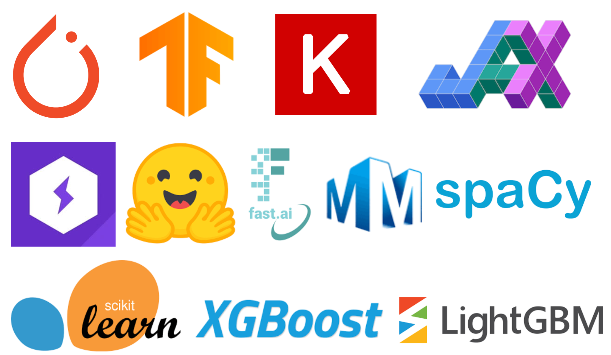

# Integrations

Weights & Biases integrations make it fast and easy to set up experiment tracking and data versioning inside existing projects. If you're using a popular ML framework (ex. [PyTorch](pytorch.md)), library (ex. [Hugging Face](huggingface.md)), or service (ex. [SageMaker](other/sagemaker.md)), check out the integrations below and in the navigation bar on the left!

<figure><figcaption>
A flavor of the wandb integrations available 
</figcaption></figure>

## Code and Tutorials

* [Examples](https://github.com/wandb/examples): Working, end-to-end Google Colabs and script examples for all of our integrations
* [Video Tutorials](https://www.youtube.com/playlist?list=PLD80i8An1OEGajeVo15ohAQYF1Ttle0lk): Learn to use W\&B with YouTube videos for PyTorch, Keras, and more.

## Guides for Specific Integrations

See the navigation bar on the left for all our integrations



* [Keras](keras.md)
* [PyTorch](pytorch.md)
* [PyTorch Lightning](lightning.md)
* [PyTorch Ignite](other/ignite.md)
* [TensorFlow](tensorflow.md)
* [Fastai](fastai/)
* [Scikit-Learn](scikit.md)



* [Hugging Face](huggingface.md)
* [YOLOv5](yolov5.md)
* [MMDetection](https://docs.wandb.ai/guides/integrations/mmdetection)
* [Simple Transformers](other/simpletransformers.md)
* [spaCy](spacy.md)
* [XGBoost](xgboost.md)
* [LightGBM](lightgbm.md)



* [TensorBoard](tensorboard.md)
* [SageMaker](other/sagemaker.md)
* [Kubeflow Pipelines](other/kubeflow-pipelines-kfp.md)
* [Docker](other/docker.md)
* [Databricks](other/databricks.md)
* [Ray Tune](other/ray-tune.md)
* [OpenAI Gym](other/openai-gym.md)


