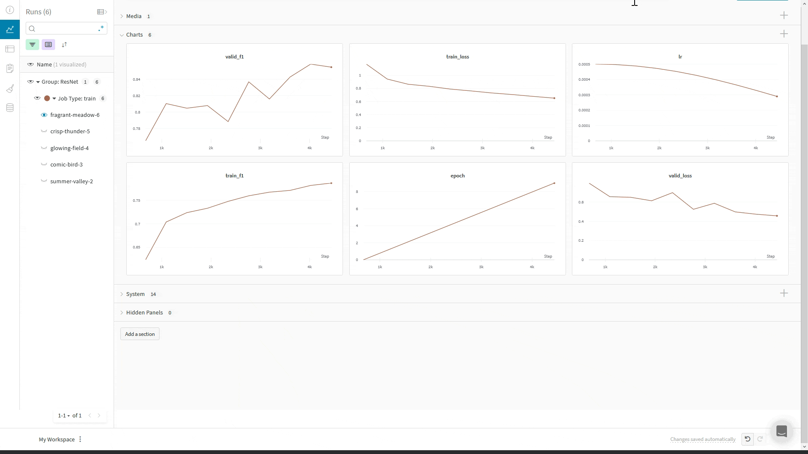

# PyTorch Lightning

PyTorch Lightning provides a lightweight wrapper for organizing your PyTorch code and easily adding advanced features such as [distributed training](https://pytorch-lightning.readthedocs.io/en/latest/multi_gpu.html) and [16-bit precision](https://pytorch-lightning.readthedocs.io/en/latest/amp.html). W&B provides a lightweight wrapper for logging your ML experiments. But you don't need to combine the two yourself: we're incorporated directly into the PyTorch Lightning library, so you can always check out [their documentation](https://pytorch-lightning.readthedocs.io/en/stable/extensions/generated/pytorch_lightning.loggers.WandbLogger.html#pytorch_lightning.loggers.WandbLogger) for reference information on the API.

## ⚡ Get going lightning-fast with just two lines.

```python
from pytorch_lightning.loggers import WandbLogger  # newline 1
from pytorch_lightning import Trainer

wandb_logger = WandbLogger()  # newline 2
trainer = Trainer(logger=wandb_logger)
```



## Check out interactive examples!



Run GPU-accelerated PyTorch Lighting plus W&B logging without installing anything using [this Colab](http://wandb.me/lit-colab). And follow along with a video tutorial!





See how PyTorch Lighting and W&B can accelerate your model development and help you climb the leaderboard with [this Kaggle Kernel](https://www.kaggle.com/ayuraj/use-pytorch-lightning-with-weights-and-biases).





Read more on specific topics in these blog posts made with Weights & Biases' [Reports](../reports.md):

* [Multi-GPU Training](https://wandb.ai/wandb/wandb-lightning/reports/Multi-GPU-Training-Using-PyTorch-Lightning--VmlldzozMTk3NTk)
* [Image Classification](https://wandb.ai/wandb/wandb-lightning/reports/Image-Classification-using-PyTorch-Lightning--VmlldzoyODk1NzY) and [Semantic Segmentation](https://wandb.ai/borisd13/lightning-kitti/reports/Lightning-Kitti--Vmlldzo3MTcyMw)
* [Transfer Learning](https://wandb.ai/wandb/wandb-lightning/reports/Transfer-Learning-Using-PyTorch-Lightning--VmlldzoyODk2MjA)



## Common questions

### How does W&B integrate with Lightning?

The core integration is based on the [Lightning `loggers` API](https://pytorch-lightning.readthedocs.io/en/stable/extensions/logging.html), which lets you write much of your logging code in a framework-agnostic way. `Logger`s are passed to the [Lightning `Trainer`](https://pytorch-lightning.readthedocs.io/en/stable/common/trainer.html) and are triggered based on that API's rich [hook-and-callback system](https://pytorch-lightning.readthedocs.io/en/stable/extensions/callbacks.html). This keeps your research code well-separated from engineering and logging code.

### What does the integration log without any additional code?

We'll save your model checkpoints to W&B, where you can view them with the Netron model viewer or download them for use in future runs. We'll also capture [system metrics](../../ref/app/features/system-metrics.md), like GPU usage and network I/O, environment information, like hardware and OS information, [code state](../../ref/app/features/panels/code.md) \(including git commit and diff patch, notebook contents and session history\), and anything printed to the standard out.

### How do I log scalar metrics, like accuracy, mIoU, and SSIM?

Because the `WandbLogger` is part of the broader [Lightning `loggers` API](https://pytorch-lightning.readthedocs.io/en/stable/extensions/logging.html), logging of scalar values to W&B can be done in a framework-agnostic way: just call `self.log`.

You can calculate these scalar metrics with [Lightning's `Metric` API](https://pytorch-lightning.readthedocs.io/en/stable/extensions/metrics.html). In addition to providing robust and tested methods for calculating quantities like accuracy and signal-to-noise ratio, `Metric`s do lots of work under the hood, like maintaining state for efficient epoch-wise calculation and abstracting away device management. The code snippet below shows best practices for defining `LightningModule`s so that metric calculation and logging works regardless of device or parallelism strategies used. That way you can get the most out of PyTorch Lightning's advanced features for high-performance code without compromising on logging.

```python
import pytorch_lightning as pl


class MyLitModule(pl.LightningModule):

  def __init__(self, *args, **kwargs):
    # initialize module here    
    acc = pl.metrics.Accuracy()
    # use .clone so that each metric can maintain its own state
    self.train_acc = acc.clone()
    # assign all metrics as attributes of module so they are detected as children
    self.valid_acc = acc.clone()
    
  def training_step(self, batch, batch_idx):
    inputs, targets  = batch
    preds = self(inputs)
    # return a dictionary
    return {"loss": loss, "preds": preds, "targets": targets}
    
  def training_step_end(self, outs):
    # log accuracy on each step_end, for compatibility with data-parallel
    self.train_acc(outs["preds"], outs["targets"])
    self.log({"train/acc_step": self.train_acc})
    
  def training_epoch_end(self, outs):
    # additional log mean accuracy at the end of the epoch
    self.log("train/acc_epoch", self.train_acc.compute())
```


Lightning's `Metrics` are being transferred into a stand-alone library, `torchmetrics`, and will be unavailable in the base package starting with version 1.5. Read more [here](https://devblog.pytorchlightning.ai/torchmetrics-pytorch-metrics-built-to-scale-7091b1bec919).


### How do I log media objects?

Weights & Biases provides a wide variety of data types for rich media logging \(read [the guide](../track/log.md) or check [the reference docs](../../ref/python/data-types/) for more\).

Unlike scalars, media objects are logged differently by each framework. To keep this more involved logging code separate from the core logic of your research code, use [Lightning `Callback`s](https://pytorch-lightning.readthedocs.io/en/stable/extensions/callbacks.html).

Inside your `Callback`, you can either call `wandb.log`, as when using `wandb` with other libraries, or `trainer.logger.experiment.log`. In either case, you can do anything you could do with [wandb.log](../../ref/python/log.md), like 


When manually calling `wandb.log` or `trainer.logger.experiment.log`, make sure to include the key/value pair `"global_step": trainer.global_step`. That way, you can line up the information you're currently logging with information logged via other methods.




Log the input and output images of an autoencoder or other image-to-image transformation network. Input-output pairs are combined into single images.


```python
import pytorch_lightning as pl
from pytorch_lightning.loggers import WandbLogger
import torch
import wandb


class WandbImageCallback(pl.Callback):
    """Logs the input and output images of a module.
    
    Images are stacked into a mosaic, with output on the top
    and input on the bottom."""
    
    def __init__(self, val_samples, max_samples=32):
        super().__init__()
        self.val_imgs, _ = val_samples
        self.val_imgs = self.val_imgs[:max_samples]
          
    def on_validation_end(self, trainer, pl_module):
        val_imgs = self.val_imgs.to(device=pl_module.device)
    
        outs = pl_module(val_imgs)
    
        mosaics = torch.cat([outs, val_imgs], dim=-2)
        caption = "Top: Output, Bottom: Input"
        trainer.logger.experiment.log({
            "val/examples": [wandb.Image(mosaic, caption=caption) 
                              for mosaic in mosaics],
            "global_step": trainer.global_step
            })
            
...

trainer = pl.Trainer(
    ...
    callbacks=[WandbImageCallback(val_samples)]
)
```



Logs the input image and the output label for a single-class classification network.


```python
import pytorch_lightning as pl
from pytorch_lightning.loggers import WandbLogger
import torch
import wandb


class WandbImagePredCallback(pl.Callback):
    """Logs the input images and output predictions of a module.
    
    Predictions and labels are logged as class indices."""
    
    def __init__(self, val_samples, num_samples=32):
        super().__init__()
        self.val_imgs, self.val_labels = val_samples
        self.val_imgs = self.val_imgs[:num_samples]
        self.val_labels = self.val_labels[:num_samples]
          
    def on_validation_epoch_end(self, trainer, pl_module):
        val_imgs = self.val_imgs.to(device=pl_module.device)

        logits = pl_module(val_imgs)
        preds = torch.argmax(logits, 1)

        trainer.logger.experiment.log({
            "val/examples": [
                wandb.Image(x, caption=f"Pred:{pred}, Label:{y}") 
                    for x, pred, y in zip(val_imgs, preds, self.val_labels)
                ],
            "global_step": trainer.global_step
            })
            
...

trainer = pl.Trainer(
    ...
    callbacks=[WandbImagePredCallback(val_samples)]
)
```



