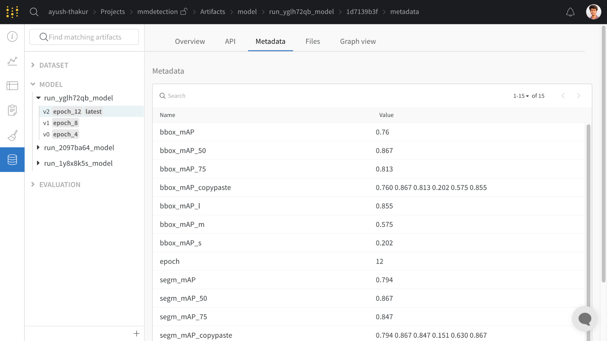

# MMDetection

[](https://github.com/wandb/examples/blob/master/colabs/mmdetection/Train\_an\_Object\_Detection%2BSemantic\_Segmentation\_Model\_with\_MMDetection\_and\_W%26B.ipynb)

[MMDetection](https://github.com/open-mmlab/mmdetection/) is an open source object detection toolbox based on PyTorch and is part of the [OpenMMLab](https://openmmlab.com/). It offers composable and modular API design which you can use to easily build custom object detection and segmentation pipelines.

[Weights and Biases](https://wandb.ai/site) is directly integrated into MMDetection through a dedicated `MMDetWandbHook` that can be used to:

✅ Log training and evaluation metrics.

✅ Log versioned model checkpoints.

✅ Log versioned validation dataset with ground truth bounding boxes.

✅ Log and visualize model predictions.

## :fire: Getting Started

### Sign up and Log in to wandb

a) [**Sign up**](https://wandb.ai/site) for a free account

b) Pip install the `wandb` library

c) To login in your training script, you'll need to be signed in to you account at www.wandb.ai, then **you will find your API key on the** [**Authorize page**](https://wandb.ai/authorize)**.**

If you are using Weights and Biases for the first time you might want to check out our [quickstart](../../quickstart.md)



```
pip install wandb

wandb login
```



```python
!pip install wandb

wandb.login()
```



### Using `MMDetWandbHook`

You can get started with Weights and Biases by adding the `MMDetWandbHook` to the MMDetection `log_config` method of the config system.


`MMDetWandbHook` is supported by [MMDetection v2.25.0](https://twitter.com/OpenMMLab/status/1532193548283432960?s=20\&t=dzBiKn9dlNdrvK8e\_q0zfQ) and above.


```python
import wandb
...

config_file = 'mmdetection/configs/path/to/config.py'
cfg = Config.fromfile(config_file)

cfg.log_config.hooks = [
    dict(type='TextLoggerHook'),
    dict(type='MMDetWandbHook',
         init_kwargs={'project': 'mmdetection'},
         interval=10,
         log_checkpoint=True,
         log_checkpoint_metadata=True,
         num_eval_images=100,
         bbox_score_thr=0.3)]
```

| Name                      | Description                                                                                                                                                             |
| ------------------------- | ----------------------------------------------------------------------------------------------------------------------------------------------------------------------- |
| `init_kwargs`             | (`dict`) A dict passed to wandb.init to initialize a W\&B run.                                                                                                          |
| `interval`                | (`int`) Logging interval (every k iterations). Defaults to `50`.                                                                                                        |
| `log_checkpoint`          | (`bool`) Save the checkpoint at every checkpoint interval as W\&B Artifacts. Use this for model versioning where each version is a checkpoint. Defaults to `False`.     |
| `log_checkpoint_metadata` | (`bool`) Log the evaluation metrics computed on the validation data with the checkpoint, along with current epoch as a metadata to that checkpoint. Defaults to `True`. |
| `num_eval_images`         | (`int`) The number of validation images to be logged. If zero, the evaluation won't be logged. Defaults to `100`.                                                       |
| `bbox_score_thr`          | (`float`) Threshold for bounding box scores. Defaults to `0.3`.                                                                                                         |

### :chart\_with\_upwards\_trend: Log Metrics

Start tracking train and eval metrics by using the `init_kwargs` argument in `MMDetWandbHook`. This argument takes in a dictionary of key-value pairs which in turn is passed to `wandb.init` which controls which project your run is logged to as well as other features of your run.

```
init_kwargs={
    'project': 'mmdetection',
    'entity': 'my_team_name',
    'config': {'lr': 1e-4, 'batch_size':32},
    'tags': ['resnet50', 'sgd'] 
}
```

Check out all the arguments for wandb.init [here](https://docs.wandb.ai/ref/python/init)


### :checkered\_flag: Checkpointing

You can reliably store these checkpoints as [W\&B Artifacts](broken-reference/) by using the `log_checkpoint=True` argument in `MMDetWandbHook`. This feature depends on the MMCV's [`CheckpointHook`](https://mmcv.readthedocs.io/en/latest/api.html?highlight=CheckpointHook#mmcv.runner.CheckpointHook) that periodically save the model checkpoints. The period is determined by `checkpoint_config.interval`.


Every W\&B account comes with 100 GB of free storage for datasets and models.


.png>)

### :mega: Checkpoint with Metadata

If `log_checkpoint_metadata` is `True`, every checkpoint version will have metadata associated with it. This feature depends on the `CheckpointHook` as well as `EvalHook` or `DistEvalHook`. The metadata is logged only when the checkpoint interval is divisible by evaluation interval.



### Visualize Dataset and Model Prediction <a href="#visualize-dataset-and-model-prediction" id="visualize-dataset-and-model-prediction"></a>

The ability to interactively visualize the dataset and especially the model prediction can help build and debug better models. Using `MMDetWandbHook` you can now log the validation data as W\&B Tables and create versioned W\&B Tables for model prediction.

The `num_eval_images` argument controls the number of validation samples that are logged as W\&B Tables. Here are a few things to note:

* If the `num_eval_images=0` the validation data, as well as model predictions, will not be logged.
* If `validate=False` for [`mmdet.core.train_detector`](https://mmdetection.readthedocs.io/en/latest/\_modules/mmdet/apis/train.html?highlight=train\_detector) API, the validation data and model predictions will not be logged.
* If the `num_eval_images` is greater than the total number of validation samples, the complete validation dataset is logged.



The `val_data` is uploaded only once. The `run_<id>_pred`table and subsequent runs use referencing to the uploaded data to save memory. A new version of `val_data` is created only when it's changed.


## Next Steps

If you want to train an instance segmentation model (Mask R-CNN) on a custom dataset, you can check out our [How to Use Weights & Biases with MMDetection](https://wandb.ai/ayush-thakur/mmdetection/reports/How-to-Use-Weights-Biases-with-MMDetection--VmlldzoyMTM0MDE2) W\&B Report on [Fully Connected](https://wandb.ai/fully-connected).

Any questions or issues about this Weights & Biases integration? Open an issue in the [MMDetection github repository](https://github.com/open-mmlab/mmdetection) and we'll catch it and get you an answer :)

### Learn more about versioning and visualization:


[broken-reference](broken-reference/)



[data-vis](../data-vis/)

