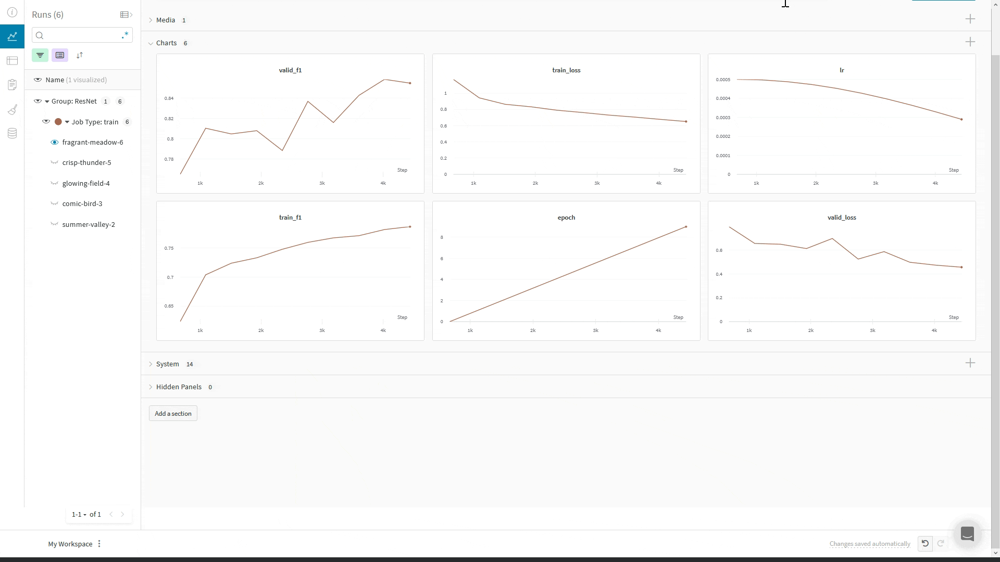

# MosaicML Composer

[](https://wandb.me/composer)

[Composer](https://github.com/mosaicml/composer) is a library for training neural networks better, faster, and cheaper. It contains many state-of-the-art methods for accelerating neural network training and improving generalization, along with an optional [Trainer](https://docs.mosaicml.com/en/v0.5.0/trainer/using\_the\_trainer.html) API that makes _composing_ many different enhancements easy.&#x20;

W\&B provides a lightweight wrapper for logging your ML experiments. But you don't need to combine the two yourself: Weights & Biases is incorporated directly into the Composer library via the [WandBLogger](https://docs.mosaicml.com/en/latest/api\_reference/composer.loggers.wandb\_logger.html#composer-loggers-wandb-logger).&#x20;

## Start logging to W\&B with two lines of code

```python
from composer import Trainer
from composer.loggers import WandBLogger

wandb_logger = WandBLogger(init_params=init_params)
trainer = Trainer(..., logger=wandb_logger)
```



## Using Composer's `WandBLogger`

Composer library has the [WandBLogger](https://docs.mosaicml.com/en/latest/api\_reference/composer.loggers.wandb\_logger.html#composer-loggers-wandb-logger) class that can be used along the  `Trainer` to log metrics to Weights and Biases. It is a simple as instantiating the logger and passing it to the `Trainer`

```
wandb_logger = WandBLogger()
trainer = Trainer(logger=wandb_logger)
```

### Logger arguments

Below are some of the most used parameters in WandbLogger, see the [Composer documentation](https://docs.mosaicml.com/en/latest/api\_reference/composer.loggers.wandb\_logger.html#composer-loggers-wandb-logger) for a full list and description

| Parameter                       | Description                                                                                                                                                                                                                                                                                                                                                              |
| ------------------------------- | ------------------------------------------------------------------------------------------------------------------------------------------------------------------------------------------------------------------------------------------------------------------------------------------------------------------------------------------------------------------------ |
| `init_params`                   | Params to pass to `wandb.init` such as your wandb `project`, `entity`, `name` or `config` etc [See here](https://docs.wandb.ai/ref/python/init) for the full list `wandb.init` accepts                                                                                                                                                                                   |
| `log_artifacts`                 | Wheter to log checkpoints to wandb                                                                                                                                                                                                                                                                                                                                       |
| `log_artifacts_every_n_batches` | Interval at which to upload Artirfacts. Only applicable when `log_artifacts=True`                                                                                                                                                                                                                                                                                        |
| `rank_zero_only`                | Whether to log only on the rank-zero process. When logging `artifacts` **** to wandb, it is highly recommended to log on all ranks. Artifacts from ranks ≥1 will not be stored, which may discard pertinent information. For example, when using Deepspeed ZeRO, it would be impossible to restore from checkpoints without artifacts from all ranks (default: `False`). |

A typical usage would be:

```
init_params = {"project":"composer", 
               "name":"imagenette_benchmark",
               "config":{"arch":"Resnet50",
                         "use_mixed_precision":True
                         }
               }

wandb_logger = WandBLogger(log_artifacts=True, init_params=init_params)
```

### Log prediction samples

You can use [Composer's Callbacks](https://docs.mosaicml.com/en/latest/trainer/callbacks.html) system to control when you log to Weights & Biases via the WandBLogger, in this example we log a sample of our validation images and predictions:



```python
import wandb
from composer import Callback, State, Logger

class LogPredictions(Callback):
    def __init__(self, num_samples=100, seed=1234):
        super().__init__()
        self.num_samples = num_samples
        self.data = []
        
    def eval_batch_end(self, state: State, logger: Logger):
        """Compute predictions per batch and stores them on self.data"""
        
        if state.timer.epoch == state.max_duration: #on last val epoch
            if len(self.data) < self.num_samples:
                n = self.num_samples
                x, y = state.batch_pair
                outputs = state.outputs.argmax(-1)
                data = [[wandb.Image(x_i), y_i, y_pred] for x_i, y_i, y_pred in list(zip(x[:n], y[:n], outputs[:n]))]
                self.data += data
            
    def eval_end(self, state: State, logger: Logger):
        "Create a wandb.Table and logs it"
        columns = ['image', 'ground truth', 'prediction']
        table = wandb.Table(columns=columns, data=self.data[:self.num_samples])
        wandb.log({'sample_table':table}, step=int(state.timer.batch))         
...

trainer = Trainer(
    ...
    loggers=[WandBLogger()],
    callbacks=[LogPredictions()]
)
```


