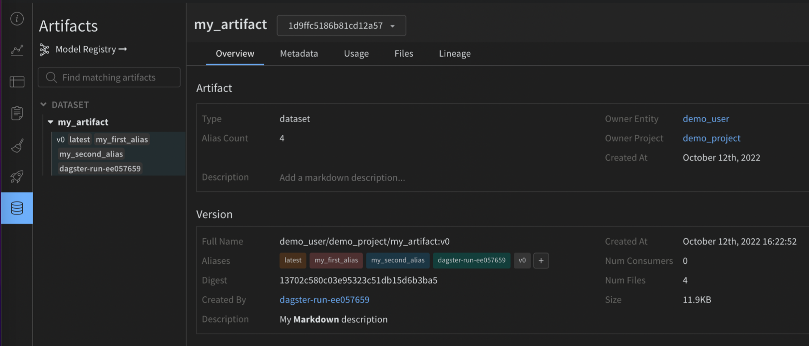

# Dagster

Use Dagster and Weights & Biases (W\&B) to orchestrate your MLOps pipelines and maintain ML assets. The integration with W\&B makes it easy within Dagster to:

* use and create W\&B [Artifacts](https://docs.wandb.ai/guides/artifacts)
* use and create Registered Models in W\&B [Model Registry](https://docs.wandb.ai/guides/models)
* run training jobs on dedicated compute using W\&B [Launch](https://docs.wandb.ai/guides/launch)
* use the [wandb](https://github.com/wandb/wandb) client in ops and assets

The W\&B Dagster integration provides a W\&B-specific Dagster resource and IO Manager:

* `wandb_resource`: a Dagster [resource](https://docs.dagster.io/concepts/resources) used to authenticate and communicate to the W\&B API.&#x20;
* `wandb_artifacts_io_manager`: a Dagster [IO Manager ](https://docs.dagster.io/concepts/io-management/io-managers)used to consume W\&B Artifacts.

The following guide demonstrates how to satisfy prerequisites to use W\&B in Dagster, how to create and use W\&B Artifacts in ops and assets, how to use W\&B Launch and recommended best practices.

### Before you get started

You will need the following resources to use Dagster within Weights and Biases:

1. W\&B API Key
2. W\&B entity (user or team): An entity is a username or team name where you send W\&B Runs and Artifacts. Make sure to create your account or team entity in the W\&B App UI before you log runs. . If you do not specify ain entity, the run will be sent to your default entity, which is usually your username. Change your default entity in[ your settings](https://wandb.ai/settings) under Project Defaults.
3. W\&B project: The name of the project where W\&B Runs are stored.

Find your W\&B entity by checking the profile page for that user or team in the W\&B App. You can use a pre-existing W\&B project or create a new one. New projects can be created on the W\&B App homepage or on user/team profile page. If a project does not exist it will be automatically created when you first use it. The proceeding instructions demonstrate how to get an API key.

#### How to get an API key:

1. [Log in](https://wandb.ai/login) to W\&B.\
   Note: if you are using W\&B Server ask your admin for the instance host name.
2. Collect your API key by navigating to the [authorize page](https://wandb.ai/authorize) or in your user/team settings. For a production environment we recommend using a [service account](https://docs.wandb.ai/guides/technical-faq/general#what-is-a-service-account-and-why-is-it-useful) to own that key.&#x20;
3. Set an environment variable for that API key export `WANDB_API_KEY=YOUR_KEY`.

The proceeding examples demonstrate where to specify your API key in your Dagster code. Make sure to specify your entity and project name within the wandb\_config nested dictionary.&#x20;

You can pass different `wandb_config` values to different ops/assets if you want to use a different W\&B Project. For more information about possible keys you can pass, see the Configuration section below.



Text

```yaml
# add this to your config.yaml
# alternatively you can set the config in Dagit's Launchpad or JobDefinition.execute_in_process
# Reference: https://docs.dagster.io/concepts/configuration/config-schema#specifying-runtime-configuration
resources:
 wandb_config:
   config:
     entity: my_entity # replace this with your W&B entity
     project: my_project # replace this with your W&B project
```

Text

```python
@job(
   resource_defs={
       "wandb_config": make_values_resource(
           entity=str,
           project=str,
       ),
       "wandb_resource": wandb_resource.configured(
           {"api_key": {"env": "WANDB_API_KEY"}}
       ),
       "io_manager": wandb_artifacts_io_manager,
   }
)
def simple_job_example():
   my_op()
```





```python
from dagster_wandb import wandb_artifacts_io_manager, wandb_resource
from dagster import (
   load_assets_from_package_module,
   make_values_resource,
   repository,
   with_resources,
)

from . import assets

@repository
def my_repository():
   return [
       *with_resources(
           load_assets_from_package_module(assets),
           resource_defs={
               "wandb_config": make_values_resource(
                   entity=str,
                   project=str,
               ),
               "wandb_resource": wandb_resource.configured(
                   {"api_key": {"env": "WANDB_API_KEY"}}
               ),
               "wandb_artifacts_manager": wandb_artifacts_io_manager.configured(
                   {"cache_duration_in_minutes": 60} # only cache files for one hour
               ),
           },
           resource_config_by_key={
               "wandb_config": {
                   "config": {
                       "entity": "my_entity", # replace this with your W&B entity
                       "project": "my_project", # replace this with your W&B project
                   }
               }
           },
       ),
   ]
```

Note that we are configuring the IO Manager cache duration in this example contrary to the example for `@job`.



#### &#x20;Configuration

The proceeding configuration options are used as settings on the W\&B-specific Dagster resource and IO Manager provided by the integration.

* `wandb_resource`: Dagster [resource](https://docs.dagster.io/concepts/resources) used to communicate with the W\&B API. It automatically authenticates using the provided API key. Properties:
  * `api_key`: (str, required): a W\&B API key necessary to communicate with the W\&B API.
  * `host`: (str, optional): the API host server you wish to use. Only required if you are using W\&B Server. It defaults to the Public Cloud host: [https://api.wandb.ai](https://api.wandb.ai)
* `wandb_artifacts_io_manager`: Dagster [IO Manager](https://docs.dagster.io/concepts/io-management/io-managers) to consume W\&B Artifacts. Properties:
  * `base_dir`: (int, optional) Base directory used for local storage and caching. W\&B Artifacts and W\&B Run logs will be written and read from that directory. By default, it’s using the `DAGSTER_HOME` directory.
  * `cache_duration_in_minutes`: (int, optional) to define the amount of time W\&B Artifacts and W\&B Run logs should be kept in the local storage. Only files and directories that were not opened for that amount of time are removed from the cache. Cache purging happens at the end of an IO Manager execution. You can set it to 0, if you want to disable caching completely. Caching improves speed when an Artifact is reused between jobs running on the same machine. It defaults to 30 days.
  * `run_id`: (str, optional): A unique ID for this run, used for [resuming](https://docs.wandb.ai/guides/track/advanced/resuming). It must be unique in the project, and if you delete a run you can't reuse the ID. Use the name field for a short descriptive name, or config for saving hyperparameters to compare across runs. The ID cannot contain the following special characters:`/\#?%:.`. You need to set the Run ID when you are doing experiment tracking inside Dagster to allow the IO Manager to resume the run. By default it’s set to the Dagster Run ID e.g  `7e4df022-1bf2-44b5-a383-bb852df4077e`.
  * `run_name`: (str, optional) A short display name for this run, which is how you'll identify this run in the UI. By default, it’s set to a string with the following format `dagster-run-[8 first characters of the Dagster Run ID]` e.g. `dagster-run-7e4df022`.
  * `run_tags`: (list\[str], optional): A list of strings, which will populate the list of tags on this run in the UI. Tags are useful for organizing runs together, or applying temporary labels like "baseline" or "production". It's easy to add and remove tags in the UI, or filter down to just runs with a specific tag. Any W\&B Run used by the integration will have the `dagster_wandb` tag.

### Use W\&B Artifacts with Dagster

The integration with W\&B Artifact relies on a Dagster IO Manager.

[IO Managers](https://docs.dagster.io/concepts/io-management/io-managers) are user-provided objects that are responsible for storing the output of an asset or op and loading it as input to downstream assets or ops. For example, an IO Manager might store and load objects from files on a filesystem.

\
The integration provides an IO Manager for W\&B Artifacts. This allows any Dagster `@op` or `@asset` to create and consume W\&B Artifacts natively. Here’s a simple example of an @asset producing a W\&B Artifact of type dataset containing a Python list.

```python
@asset(
    name="my_artifact",
    metadata={
        "wandb_artifact_arguments": {
            "type": "dataset",
                    }
    },
    io_manager_key="wandb_artifacts_manager",
)
def create_dataset():
    return [1, 2, 3] # this will be stored in an Artifactpyt
```

You can annotate your `@op`, `@asset` and `@multi_asse`t with a metadata configuration in order to write Artifacts. Similarly you can also consume W\&B Artifacts even if they were created outside Dagster.

### Write W\&B Artifacts

Before continuing, we recommend you to have a good understanding of how to use W\&B Artifacts. Consider reading the [Guide on Artifacts](https://docs.wandb.ai/guides/artifacts).

Return an object from a Python function to write a W\&B Artifact. The following objects are supported by W\&B:

* Python objects (int, dict, list…)
* W\&B objects (Table, Image, Graph…)
* W\&B Artifact objects

The proceeding examples demonstrate how to write W\&B Artifacts with Dagster assets (`@asset`):



Anything that can be serialized with the [pickle](https://docs.python.org/3/library/pickle.html) module is pickled and added to an Artifact created by the integration. The content is unpickled when you read that Artifact inside Dagster (see Reading artifacts for more details).&#x20;

```
@asset(
    name="my_artifact",
    metadata={
        "wandb_artifact_arguments": {
            "type": "dataset",
        }
    },
    io_manager_key="wandb_artifacts_manager",
)
def create_dataset():
    return [1, 2, 3]
```

W\&B supports multiple Pickle-based serialization modules ([pickle](https://docs.python.org/3/library/pickle.html), [dill](https://github.com/uqfoundation/dill), [cloudpickle](https://github.com/cloudpipe/cloudpickle), [joblib](https://github.com/joblib/joblib)). You can also use more advanced serialization like [ONNX](https://onnx.ai/) or [PMML](https://en.wikipedia.org/wiki/Predictive\_Model\_Markup\_Language). Refer to the [Serialization](https://docs.wandb.ai/guides/integrations/dagster#serialization-configuration) section for more information.



Any native W\&B object (e.g [Table](https://docs.wandb.ai/ref/python/data-types/table), [Image](https://docs.wandb.ai/ref/python/data-types/image), [Graph](https://docs.wandb.ai/ref/python/data-types/graph)) is added to an Artifact created by the integration. Here’s an example using a Table.\


```python
import wandb

@asset(
    name="my_artifact",
    metadata={
        "wandb_artifact_arguments": {
            "type": "dataset",
        }
    },
    io_manager_key="wandb_artifacts_manager",
)
def create_dataset_in_table():
    return wandb.Table(columns=["a", "b", "c"], data=[[1, 2, 3]])
```



For complex use cases, it might be necessary to build your own Artifact object. The integration still provides useful additional features like augmenting the metadata on both sides of the integration.

```python
import wandb

MY_ASSET = "my_asset"

@asset(
    name=MY_ASSET,
    io_manager_key="wandb_artifacts_manager",
)
def create_artifact():
   artifact = wandb.Artifact(MY_ASSET, "dataset")
   table = wandb.Table(columns=["a", "b", "c"], data=[[1, 2, 3]])
   artifact.add(table, "my_table")
   return artifact
```



#### Configuration

A configuration dictionary called `wandb_artifact_configuration` can be set on an `@op`, `@asset` and `@multi_asset`. This dictionary must be passed in the decorator arguments as metadata. This configuration is required to control the IO Manager reads and writes of W\&B Artifacts.

* For `@op`, it’s located in the output metadata through the [Out](https://docs.dagster.io/\_apidocs/ops#dagster.Out) metadata argument.&#x20;
* For `@asset`, it’s located in the metadata argument on the asset.&#x20;
* For `@multi_asset`, it’s located in each output metadata through the [AssetOut](https://docs.dagster.io/\_apidocs/assets#dagster.AssetOut) metadata arguments.

Supported properties:

* `name`: (str) human-readable name for this artifact, which is how you can identify this artifact in the UI or reference it in use\_artifact calls. Names can contain letters, numbers, underscores, hyphens, and dots. The name must be unique across a project. Required for @op.
* `type`: (str) The type of the artifact, which is used to organize and differentiate artifacts. Common types include dataset or model, but you can use any string containing letters, numbers, underscores, hyphens, and dots. Required when the output is not already an Artifact.
* `description`: (str) Free text that offers a description of the artifact. The description is markdown rendered in the UI, so this is a good place to place tables, links, etc.
* `aliases`: (list\[str]) An array containing one or more aliases you want to apply on the Artifact. The integration will also add the “latest” tag to that list whether it’s set or not. This is an effective way for you to manage versioning of models and datasets.
* `add_dirs`: (list\[dict\[str, Any]]): An array containing configuration for each local directory to include in the Artifact. It supports the same arguments as the homonymous method in the SDK: [https://docs.wandb.ai/ref/python/artifact#add\_dir](https://docs.wandb.ai/ref/python/artifact#add\_dir)
* `add_files`: (list\[dict\[str, Any]]): An array containing configuration for each local file to include in the Artifact. It supports the same arguments as the homonymous method in the SDK: [https://docs.wandb.ai/ref/python/artifact#add\_file](https://docs.wandb.ai/ref/python/artifact#add\_file)
* `add_references`: (list\[dict\[str, Any]]): An array containing configuration for each [external reference](https://docs.wandb.ai/guides/artifacts/track-external-files) to include in the Artifact. It supports the same arguments as the homonymous method in the SDK: [https://docs.wandb.ai/ref/python/artifact#add\_reference](https://docs.wandb.ai/ref/python/artifact#add\_reference)
* `serialization_module`: (dict) Configuration of the serialization module to be used. Refer to the Serialization section for more information.
  * `name`: (str) Name of the serialization module. Accepted values: `pickle`, `dill`, `cloudpickle`, `joblib`. The module needs to be available locally.
  * `parameters`: (dict\[str, Any]) Optional arguments passed to the serialization function. It accepts the same parameters as the dump method for that module e.g. `{"compress": 3, "protocol": 4}`.

The proceeding code examples demonstrate how to configure a dictionary on an `@op`, `@asset` and `@multi_asset` computations:



```python
@op(
   out=Out(
       metadata={
           "wandb_artifact_configuration": {
               "name": "my_artifact",
               "type": "dataset",
           }
       }
   )
)
def create_dataset():
   return [1, 2, 3]
```



```python
@asset(
   name="my_artifact",
   metadata={
       "wandb_artifact_configuration": {
           "type": "dataset",
       }
   },
   io_manager_key="wandb_artifacts_manager",
)
def create_dataset():
   return [1, 2, 3]
```

You do not need to pass a name through the configuration because the `@asset` already has a name. The integration sets the Artifact name as the asset name.



Text

```python
@multi_asset(
   name="create_datasets",
   outs={
          "first_table": AssetOut(
           metadata={
               "wandb_artifact_configuration": {
                   "type": "training_dataset",
               }
           },
           io_manager_key="wandb_artifacts_manager",
       ),
       "second_table": AssetOut(
           metadata={
               "wandb_artifact_configuration": {
                   "type": "validation_dataset",
               }
           },
           io_manager_key="wandb_artifacts_manager",
       ),
   },
   group_name="my_multi_asset_group",
)
def create_datasets():
   first_table = wandb.Table(columns=["a", "b", "c"], data=[[1, 2, 3]])
   second_table = wandb.Table(columns=["d", "e"], data=[[4, 5]])

   return first_table, second_table
```



### Advanced Example <a href="#advanced-example" id="advanced-example"></a>

```python
@asset(
   name="my_advanced_artifact",
   metadata={
       "wandb_artifact_configuration": {
           "type": "dataset",
           "description": "My **Markdown** description",
           "aliases": ["my_first_alias", "my_second_alias"],
           "add_dirs": [
               {
                   "name": "My directory",
                   "local_path": "path/to/directory",
               }
           ],
           "add_files": [
               {
                   "name": "validation_dataset",
                   "local_path": "path/to/data.json",
               },
               {
                   "is_tmp": True,
                   "local_path": "path/to/temp",
               },
           ],
           "add_references": [
               {
                   "uri": "https://picsum.photos/200/300",
                   "name": "External HTTP reference to an image",
               },
               {
                   "uri": "s3://my-bucket/datasets/mnist",
                   "name": "External S3 reference",
               },
           ],
       }
   },
   io_manager_key="wandb_artifacts_manager",
)
def create_advanced_artifact():
   return [1, 2, 3]

```

The asset is materialized with useful metadata on both sides of the integration:

* W\&B side: the source integration name and version, the python version used, the pickle protocol version and more.
* Dagster side:&#x20;
  * Dagster Run ID
  * W\&B Run: ID, name, path, URL
  * W\&B Artifact: ID, name, type, version, size, URL
  * W\&B Entity
  * W\&B Project

The proceeding image demonstrates the metadata from W\&B that was added to the Dagster asset. This information would not be available without the integration.

<figure><figcaption></figcaption></figure>

The following image demonstrates how the provided configuration was enriched with useful metadata on the W\&B Artifact. This information should help for reproducibility and maintenance.

<div>

<figure><figcaption></figcaption></figure>

 

<figure><figcaption></figcaption></figure>

 

<figure><figcaption></figcaption></figure>

</div>


If you use a static type checker like mypy, import the configuration type definition object using:

`from dagster_wandb import WandbArtifactConfiguration`


### Read W\&B Artifacts

Reading W\&B Artifacts is similar to writing them. A configuration dictionary called `wandb_artifact_configuration` can be set on an `@op` or `@asset`. The only difference is that we must set the configuration on the input instead of the output.

For `@op`, it’s located in the input metadata through the [In](https://docs.dagster.io/\_apidocs/ops#dagster.In) metadata argument. You need to explicitly pass the name of the Artifact.

For `@asset`, it’s located in the input metadata through the [AssetIn](https://docs.dagster.io/\_apidocs/assets#dagster.AssetIn) metadata argument. You should not pass an Artifact name because the name of the parent asset should match it.&#x20;

If you want to have a dependency on an Artifact created outside the integration you will need to use [SourceAsset](https://docs.dagster.io/\_apidocs/assets#dagster.SourceAsset). It will always read the latest version of that asset.

The following examples demonstrate how to read an Artifact from various ops.



```python
@op(
   ins={
       "artifact": In(
           metadata={
               "wandb_artifact_configuration": {
                   "name": "my_artifact",
               }
           }
       )
   },
   io_manager_key="wandb_artifacts_manager"
)
def read_artifact(context, artifact):
   context.log.info(artifact)c
```



```python
@asset(
   name="my_asset",
   ins={
       "artifact": AssetIn(
           # if you don't want to rename the input argument you can remove 'asset_key'
           asset_key="parent_dagster_asset_name",
           input_manager_key="wandb_artifacts_manager",
       )
   },
)
def read_artifact(context, artifact):
   context.log.info(artifact)
```



```python
my_artifact = SourceAsset(
   key=AssetKey("my_artifact"),  # the name of the W&B Artifact
   description="Artifact created outside Dagster",
   io_manager_key="wandb_artifacts_manager",
)


@asset
def read_artifact(context, my_artifact):
   context.log.info(my_artifact)
```



#### Configuration

The proceeding configuration is used to indicate what the IO Manager should collect and provide as inputs to the decorated functions. The following read patterns are supported.

1.  To get an named object contained within an Artifact use `get`:\


    ```python
    @asset(
       ins={
           "table": AssetIn(
               asset_key="my_artifact_with_table",
               metadata={
                   "wandb_artifact_configuration": {
                       "get": "my_table",
                   }
               },
               input_manager_key="wandb_artifacts_manager",
           )
       }
    )
    def get_table(context, table):
       context.log.info(table.get_column("a"))
    ```
2. To get the local path of a downloaded file contained within an Artifact use `get_path`:

```python
@asset(
   ins={
       "path": AssetIn(
           asset_key="my_artifact_with_file",
           metadata={
               "wandb_artifact_configuration": {
                   "get_path": "name_of_file",
               }
           },
           input_manager_key="wandb_artifacts_manager",
       )
   }
   )
def get_path(context, path):
   context.log.info(path)
```

3\. To get the entire Artifact object (with the content downloaded locally):

```python
@asset(
   ins={
       "artifact": AssetIn(
           asset_key="my_artifact",
           input_manager_key="wandb_artifacts_manager",
       )
   },
)
def get_artifact(context, artifact):
   context.log.info(artifact.name)
```

Supported properties:

* `get`: (str) Gets the W\&B object located at the artifact relative name.
* `get_path`: (str) Gets the path to the file located at the artifact relative name.

### Serialization configuration

By default, the integration will use the standard [pickle](https://docs.python.org/3/library/pickle.html) module, but some objects are not compatible with it. For example, functions with yield will raise an error if you try to pickle them.&#x20;

\
Thankfully, we support more Pickle-based serialization modules ([dill](https://github.com/uqfoundation/dill), [cloudpickle](https://github.com/cloudpipe/cloudpickle), [joblib](https://github.com/joblib/joblib)). You can also use more advanced serialization like [ONNX](https://onnx.ai/) or [PMML](https://en.wikipedia.org/wiki/Predictive\_Model\_Markup\_Language) by returning a serialized string or creating an Artifact directly. The right choice will depend on your use case, refer to the available literature on this subject.

#### Pickle-based serialization modules


Pickling is [known to be insecure](https://snyk.io/blog/guide-to-python-pickle/).  Only use W\&B objects if security is a concern. We recommend signing your data and storing the hash keys in your own systems. For more complex use cases don’t hesitate to contact us, we will be happy to help.


You can configure the serialization used through the `serialization_module` dictionary in the `wandb_artifact_configuration`.  Make sure the module is available on the machine running Dagster.

The integration will automatically know which serialization module to use when you read that Artifact.

The currently supported modules are `pickle`, `dill`, `cloudpickle` and `joblib`.

Here’s a simplified example where we create a “model” serialized with `joblib` and then use it for inference.

```python
@asset(
    name="my_joblib_serialized_model",
    compute_kind="Python",
    metadata={
        "wandb_artifact_configuration": {
            "type": "model",
            "serialization_module": {
                "name": "joblib"
            },
        }
    },
    io_manager_key="wandb_artifacts_manager",
)
def create_model_serialized_with_joblib():
    # This is not a real ML model but this would not be possible with the pickle module
    return lambda x, y: x + y

@asset(
    name="inference_result_from_joblib_serialized_model",
    compute_kind="Python",
    ins={
        "my_joblib_serialized_model": AssetIn(
            input_manager_key="wandb_artifacts_manager",
        )
    },
    metadata={
        "wandb_artifact_configuration": {
            "type": "results",
        }
    },
    io_manager_key="wandb_artifacts_manager",
)
def use_model_serialized_with_joblib(
    context: OpExecutionContext, my_joblib_serialized_model
):
    inference_result = my_joblib_serialized_model(1, 2)
    context.log.info(inference_result)  # Prints: 3
    return inference_resul
```

#### Ad

#### Advanced serialization formates (ONNX, PMML)

It’s common to use interchange file formats like ONNX and PMML. The integration supports those formats but it requires a bit more work than for Pickle-based serialization.

There are two different methods to use those formats.

1. Convert your model to the selected format, then return the string representation of that format as if it were a normal Python objects. The integration will pickle that string. You can then rebuild your model using that string.
2. Create a new local file with your serialized model, then build a custom Artifact with that file using the `add_file` configuration.

Here’s an example of a Scikit-learn model being serialized using ONNX.

```python
import numpy
import onnxruntime as rt
from skl2onnx import convert_sklearn
from skl2onnx.common.data_types import FloatTensorType
from sklearn.datasets import load_iris
from sklearn.ensemble import RandomForestClassifier
from sklearn.model_selection import train_test_split

from dagster import AssetIn, AssetOut, asset, multi_asset

@multi_asset(
    compute_kind="Python",
    outs={
        "my_onnx_model": AssetOut(
            metadata={
                "wandb_artifact_configuration": {
                    "type": "model",
                }
            },
            io_manager_key="wandb_artifacts_manager",
        ),
        "my_test_set": AssetOut(
            metadata={
                "wandb_artifact_configuration": {
                    "type": "test_set",
                }
            },
            io_manager_key="wandb_artifacts_manager",
        ),
    },
    group_name="onnx_example",
)
def create_onnx_model():
    # Inspired from https://onnx.ai/sklearn-onnx/

    # Train a model.
    iris = load_iris()
    X, y = iris.data, iris.target
    X_train, X_test, y_train, y_test = train_test_split(X, y)
    clr = RandomForestClassifier()
    clr.fit(X_train, y_train)

    # Convert into ONNX format
    initial_type = [("float_input", FloatTensorType([None, 4]))]
    onx = convert_sklearn(clr, initial_types=initial_type)

    # Write artifacts (model + test_set)
    return onx.SerializeToString(), {"X_test": X_test, "y_test": y_test}


@asset(
    name="experiment_results",
    compute_kind="Python",
    ins={
        "my_onnx_model": AssetIn(
            input_manager_key="wandb_artifacts_manager",
        ),
        "my_test_set": AssetIn(
            input_manager_key="wandb_artifacts_manager",
        ),
    },
    group_name="onnx_example",
)
def use_onnx_model(context, my_onnx_model, my_test_set):
    # Inspired from https://onnx.ai/sklearn-onnx/

    # Compute the prediction with ONNX Runtime
    sess = rt.InferenceSession(my_onnx_model)
    input_name = sess.get_inputs()[0].name
    label_name = sess.get_outputs()[0].name
    pred_onx = sess.run(
        [label_name], {input_name: my_test_set["X_test"].astype(numpy.float32)}
    )[0]
    context.log.info(pred_onx)
    return pred_onx
```

#### Advanced usage

To view advanced usage of the integration, refer to the following full code examples:

* [Advanced usage example for assets](https://github.com/dagster-io/dagster/blob/wandb-integration/examples/with\_wandb/with\_wandb/assets/advanced\_example.py)
* [Partitioned job example](https://github.com/dagster-io/dagster/blob/wandb-integration/examples/with\_wandb/with\_wandb/ops/partitioned\_job.py)
* [Linking a model to the Model Registry](https://github.com/dagster-io/dagster/blob/wandb-integration/examples/with\_wandb/with\_wandb/assets/model\_registry\_example.py)

### Use W\&B Launch with Dagster


Beta product in active development

Interested in Launch? Reach out to your account team to talk about joining the customer pilot program for W\&B Launch.

Pilot customers need to use AWS EKS or SageMaker to qualify for the beta program. We ultimately plan to support additional platforms.


The Dagster integration helps with:

* Running one or multiple Launch agents in your Dagster instance.
* Executing local Launch jobs within your Dagster instance.
* Remote Launch jobs on-prem or in a cloud.

#### Launch agents

The integration provides an importable `@op` called `run_launch_agent`. It starts a Launch Agent and runs it as a long running process until stopped manually.

Agents are processes that poll launch queues and execute the jobs (or dispatch them to external services to be executed) in order.

You can also view useful descriptions for all properties in Launchpad.

<figure><figcaption></figcaption></figure>

The following code snippet demonstrates an example configuration file along with a Python script starts a W\&B Launch Agent:

```yaml
# add this to your config.yaml
# alternatively you can set the config in Dagit's Launchpad or JobDefinition.execute_in_process
# Reference: https://docs.dagster.io/concepts/configuration/config-schema#specifying-runtime-configuration
resources:
 wandb_config:
   config:
     entity: my_entity # replace this with your W&B entity
     project: my_project # replace this with your W&B project
ops:
 run_launch_agent:
   config:
     max_jobs: -1
     queues: 
       - my_dagster_queue


```

```python
from dagster_wandb.launch.ops import run_launch_agent
from dagster_wandb.resources import wandb_resource

from dagster import job, make_values_resource
@job(
   resource_defs={
       "wandb_config": make_values_resource(
           entity=str,
           project=str,
       ),
       "wandb_resource": wandb_resource.configured(
           {"api_key": {"env": "WANDB_API_KEY"}}
       ),
   },
)
def run_launch_agent_example():
   run_launch_agent()

```

#### Launch Jobs

The integration provides an importable `@op` called `run_launch_job`. It executes your Launch job.

A Launch job is assigned to a queue in order to be executed. You can create a queue or use the default one. Make sure you have an active agent listening to that queue. You can run an agent inside your Dagster instance but can also consider using a [deployable agent](https://docs.wandb.ai/guides/launch/agents#deployable-agents) in Kubernetes.

You can also view useful descriptions for all properties in Launchpad.

<figure><figcaption></figcaption></figure>

#### Example

The following code snippet demonstrates an example configuration file along with a Python script starts a W\&B Launch Job:

```yaml
# add this to your config.yaml
# alternatively you can set the config in Dagit's Launchpad or JobDefinition.execute_in_process
# Reference: https://docs.dagster.io/concepts/configuration/config-schema#specifying-runtime-configuration
resources:
 wandb_config:
   config:
     entity: my_entity # replace this with your W&B entity
     project: my_project # replace this with your W&B project
ops:
 my_launched_job:
   config:
     entry_point:
       - python
       - train.py
     queue: my_dagster_queue
     uri: https://github.com/wandb/example-dagster-integration-with-launch
```

```python
from dagster_wandb.launch.ops import run_launch_job
from dagster_wandb.resources import wandb_resource

from dagster import job, make_values_resource


@job(
   resource_defs={
       "wandb_config": make_values_resource(
           entity=str,
           project=str,
       ),
       "wandb_resource": wandb_resource.configured(
           {"api_key": {"env": "WANDB_API_KEY"}}
       ),
   },
)
def run_launch_job_example():
   run_launch_job.alias("my_launched_job")() # we rename the job with an alias
```

### Best practices

#### Use the IO Manager to read and write Artifacts.&#x20;

You should never need to use [Artifact.download()](https://docs.wandb.ai/ref/python/artifact#download) or [Run.log\_artifact()](https://docs.wandb.ai/ref/python/run#log\_artifact) directly. Those methods are handled by integration. Simply return the data you wish to store in Artifact and let the integration do the rest. This will provide better lineage for the Artifact in W\&B.

#### Only build an Artifact object yourself for complex use cases.

Python objects and W\&B objects should be returned from your ops/assets. The integration handles bundling the Artifact.

For complex use cases, you can build an Artifact directly in a Dagster job. We recommend you pass an Artifact object to the integration for metadata enrichment such as the source integration name and version, the python version used, the pickle protocol version and more.

#### Add files, directories and external references to your Artifacts through the metadata.

Use the integration `wandb_artifact_configuration` object to add any file, directory or external references (Amazon S3, GCS, HTTP, etc.). See the [advanced example](https://docs.wandb.ai/guides/dagster#advanced-example) in the Artifact configuration section for more information.

#### Use an @asset instead of an `@op` when an Artifact is produced.

Artifacts are assets. It is recommended to use an asset when Dagster maintains that asset. This will provide better observability in the Dagit Asset Catalog.

#### Use a SourceAsset to consume an Artifact created outside Dagster.

This allows you to take advantage of the integration to read externally created Artifacts. Otherwise, you can only use Artifacts created by the integration.

#### Use W\&B Launch to orchestrate training on dedicated compute for large models.

You can train small models inside your Dagster cluster and you can run Dagster in a Kubernetes cluster with GPU nodes. We recommend using W\&B Launch for large model training. This will prevent overloading your instance and provide access to more adequate compute.&#x20;

#### When experiment tracking within Dagster, set your W\&B Run ID to the value of your Dagster Run ID.

We recommend that you both: make the Run [resumable](https://docs.wandb.ai/guides/track/advanced/resuming) and set the W\&B Run ID to the Dagster Run ID or to a string of your choice. Following this recommendation ensures your W\&B metrics and W\&B Artifacts are stored in the same W\&B Run when you train models inside of Dagster.

Either set the W\&B Run ID to the Dagster Run ID.

```python
wandb.init(
    id=context.run_id,
    resume="allow",
    ...
)
```

Or choose your own W\&B Run ID and pass it to the IO Manager configuration.

```python
wandb.init(
    id="my_resumable_run_id",
    resume="allow",
    ...
)
```

```python
@job(
   resource_defs={
       "io_manager": wandb_artifacts_io_manager.configured(
           {"wandb_run_id": "my_resumable_run_id"}
       ),
   }
)
```

#### Ad

#### Only collect data you need with get or get\_path for large W\&B Artifacts.

By default, the integration will download an entire Artifact. If you are using very large artifacts you might want to only collect the specific files or objects you need. This will improve speed and resource utilization.

#### For Python objects adapt the pickling module to your use case.

By default, the W\&B integration will use the standard [pickle](https://docs.python.org/3/library/pickle.html) module. But some objects are not compatible with it. For example, functions with yield will raise an error if you try to pickle them. W\&B supports other Pickle-based serialization modules ([dill](https://github.com/uqfoundation/dill), [cloudpickle](https://github.com/cloudpipe/cloudpickle), [joblib](https://github.com/joblib/joblib)).&#x20;

You can also use more advanced serialization like [ONNX](https://onnx.ai/) or [PMML](https://en.wikipedia.org/wiki/Predictive\_Model\_Markup\_Language) by returning a serialized string or creating an Artifact directly. The right choice will depend on your use case, refer to the available literature on this subject.

\
