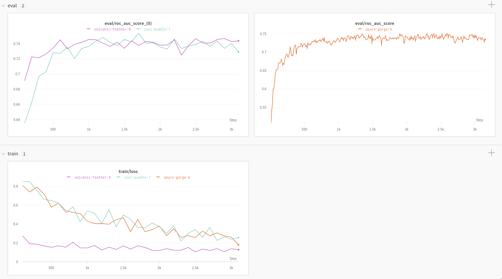

# DeepChem

The [DeepChem library](https://github.com/deepchem/deepchem) provides open source tools that democratize the use of deep-learning in drug discovery, materials science, chemistry, and biology. This W&B integration adds simple and easy-to-use experiment tracking and model checkpointing  while training models using DeepChem.

## 🧪 DeepChem logging in 3 lines of code

```python
logger = WandbLogger(…)
model = TorchModel(…, wandb_logger=logger)
model.fit(…)
```



## Report & Google Colab

To read a Report with charts generated using the W&B DeepChem integration, have a look here:



If you'd rather dive straight into working code, check out this [Google Colab](https://colab.research.google.com/drive/14FKoN4pOileKTvmdcTdhwzcSMzPzPtKj?usp=sharing#scrollTo=1_ZMHcO7Awcc).

## Getting started: track experiments

Setup Weights & Biases for DeepChem models of type [KerasModel](https://deepchem.readthedocs.io/en/latest/api_reference/models.html#keras-models) or [TorchModel](https://deepchem.readthedocs.io/en/latest/api_reference/models.html#pytorch-models).

### **1\) Install the `wandb` library and log in**



```python
!pip install wandb

import wandb
wandb.login()
```



```
pip install wandb
wandb login
```



### 2\) Initialize and configure WandbLogger

```python
from deepchem.models import WandbLogger 

logger = WandbLogger(entity="my_entity", project="my_project")
```

### **3\) Log your training and evaluation data to W&B**

Training loss and evaluation metrics can be automatically logged to Weights & Biases. Optional evaluation can be enabled using the DeepChem [ValidationCallback](https://github.com/deepchem/deepchem/blob/master/deepchem/models/callbacks.py), the `WandbLogger` will detect ValidationCallback callback and log the metrics generated.

```python
from deepchem.models import TorchModel, ValidationCallback

vc = ValidationCallback(…)  # optional
model = TorchModel(…, wandb_logger=logger)
model.fit(…, callbacks=[vc]) 
logger.finish()
```

## `WandbLogger` Arguments

<table>
  <thead>
    <tr>
      <th style="text-align:left">Argument</th>
      <th style="text-align:left">Usage</th>
    </tr>
  </thead>
  <tbody>
    <tr>
      <td style="text-align:left">name</td>
      <td style="text-align:left">
        <p>(str) A display name for the run in the W&amp;B dashboard.</p>
        <p>Default: None</p>
      </td>
    </tr>
    <tr>
      <td style="text-align:left">entity</td>
      <td style="text-align:left">
        <p>(str) W&amp;B username or team name</p>
        <p>Default: None</p>
      </td>
    </tr>
    <tr>
      <td style="text-align:left">project</td>
      <td style="text-align:left">
        <p>(str) W&amp;B project name</p>
        <p>Default: None</p>
      </td>
    </tr>
    <tr>
      <td style="text-align:left">mode</td>
      <td style="text-align:left">
        <p>(str) W&amp;B online or offline mode</p>
        <p>Default: &quot;online&quot;</p>
      </td>
    </tr>
    <tr>
      <td style="text-align:left">id</td>
      <td style="text-align:left">
        <p>(str) A unique ID for this run, used for resuming</p>
        <p>Default: None</p>
      </td>
    </tr>
    <tr>
      <td style="text-align:left">resume</td>
      <td style="text-align:left">
        <p>(bool or str) Sets the resuming behaviour</p>
        <p>Default: None</p>
      </td>
    </tr>
    <tr>
      <td style="text-align:left">anonymous</td>
      <td style="text-align:left">
        <p>(bool) Controls anonymous data logging</p>
        <p>Default: &quot;never&quot;</p>
      </td>
    </tr>
    <tr>
      <td style="text-align:left">save_run<em>_</em>history</td>
      <td style="text-align:left">
        <p>(bool) Whether to save the run history at the end (used for testing purposes)</p>
        <p>Default: False</p>
      </td>
    </tr>
  </tbody>
</table>


