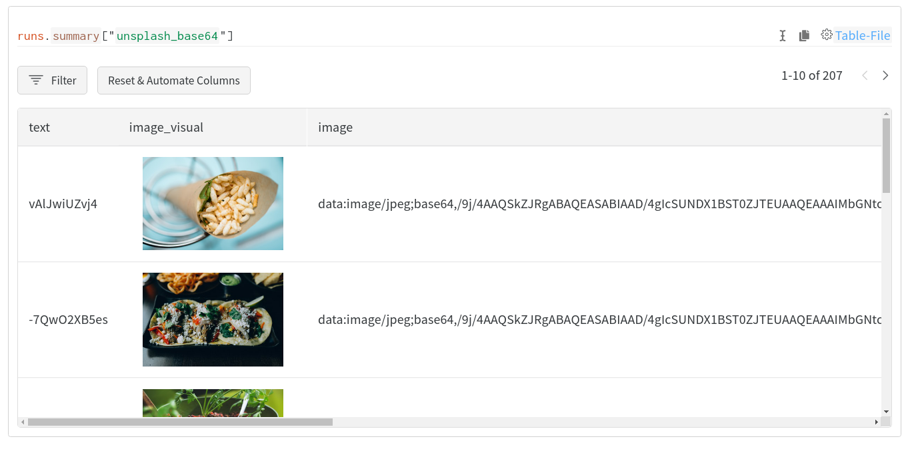

# Prodigy

Prodigy is an annotation tool for creating training and evaluation data for machine learning models, error analysis, data inspection & cleaning. This [W&B integration](https://github.com/wandb/client/blob/master/wandb/integration/prodigy/prodigy.py) adds simple and easy-to-use functionality to upload your Prodigy annotated dataset directly to W&B for visualization in W&B Tables. For more information on Prodigy, installation & setup, please refer to the [Prodigy documentation](https://prodi.gy/docs/).



## Example

This W&B Report demonstrates visualizations generated using the W&B Prodigy integration:



## Getting Started

Use `upload_dataset` to upload your annotated prodigy dataset directly from the local Prodigy database to W&B in our [Table](https://docs.wandb.ai/ref/python/data-types/table) format.

```python
from wandb.integration.prodigy import upload_dataset
upload_dataset("name_of_dataset_in_database")
```

W&B will automatically try to convert images and named entity fields to [wandb.Image](https://docs.wandb.ai/ref/python/data-types/image) and [wandb.Html](https://docs.wandb.ai/ref/python/data-types/html) respectively. Extra columns may be added to the resulting table to include these visualizations.

## Requirements

The W&B Prodigy integration requires these libraries:

* `spacy` \(&gt; 3.0.0\)
* `en_core_web_md` pipeline from spaCy \(see [Installation](https://spacy.io/usage/models)\)
* `Pillow`
* `scipy`

## Arguments

| Parameter | Functio |
| :--- | :--- |
| name | The name of the dataset in the local database setup by Prodigy |

## Basic Example

```python
import wandb
from wandb.integration.prodigy import upload_dataset

run = wandb.init(project='prodigy')
upload_dataset("news_headlines_ner")
wandb.finish()
```

## Also using spaCy?

W&B also has an integration with spaCy, see the [docs here](https://docs.wandb.ai/guides/integrations/spacy)

