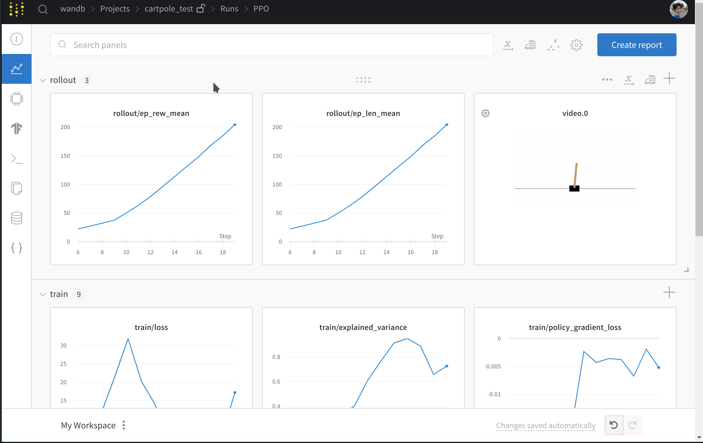

# Stable Baselines 3

W&B supports integration with [Stable Baselines 3](https://github.com/DLR-RM/stable-baselines3) via a callback, which help to

* Record metrics such as losses and episodic returns
* Upload videos of agents playing the games
* Save the trained model
* Log model's hyperparameters
* Log model gradient histograms

See example run [https://wandb.ai/wandb/sb3/runs/1jyr6z10](https://wandb.ai/wandb/sb3/runs/1jyr6z10)

### Basic Example

```python
import time
import gym
from stable_baselines3 import PPO
from stable_baselines3.common.monitor import Monitor
from stable_baselines3.common.vec_env import DummyVecEnv, VecVideoRecorder
from wandb.integration.sb3 import WandbCallback
import wandb

config = {"policy_type": "MlpPolicy", "total_timesteps": 25000}
experiment_name = f"PPO_{int(time.time())}"
wandb.init(
    name=experiment_name,
    project="sb3",
    config=config,
    sync_tensorboard=True,  # auto-upload sb3's tensorboard metrics
    monitor_gym=True,  # auto-upload the videos of agents playing the game
    save_code=True,  # optional
)

def make_env():
    env = gym.make("CartPole-v1")
    env = Monitor(env)  # record stats such as returns
    return env
env = DummyVecEnv([make_env])
env = VecVideoRecorder(env, "videos",
    record_video_trigger=lambda x: x % 2000 == 0, video_length=200)
model = PPO(config["policy_type"], env, verbose=1,
    tensorboard_log=f"runs/{experiment_name}")
model.learn(
    total_timesteps=config["total_timesteps"],
    callback=WandbCallback(
        gradient_save_freq=100,
        model_save_freq=1000,
        model_save_path=f"models/{experiment_name}",
    ),
)
```

After running the code above, you should see a dashboard similar to the following:



