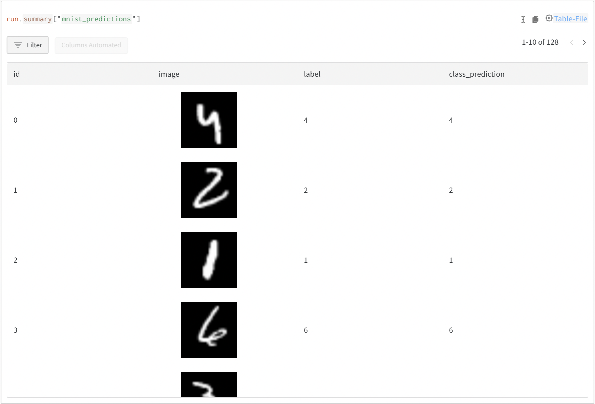

# spaCy

[spaCy](https://spacy.io) is a popular "industrial-strength" NLP library: fast, accurate models with a minimum of fuss. As of spaCy v3, Weights and Biases can now be used with [`spacy train`](https://spacy.io/api/cli#train) to track your spaCy model's training metrics as well as to save and version your models and datasets. And all it takes is a few added lines in your configuration!

## Getting Started: Track and Save your Models

### **1)** **Install the `wandb` library and log in**



```python
!pip install wandb

import wandb
wandb.login()
```



```python
pip install wandb
wandb login
```



### **2) Add the `WandbLogger` to your spaCy config file**

spaCy config files are used to specify all aspects of training, not just logging -- GPU allocation, optimizer choice, dataset paths, and more. Minimally, under `[training.logger]` you need to provide the key `@loggers` with the value `"spacy.WandbLogger.v3"`, plus a `project_name`. You can also turn on [dataset and model versioning](../artifacts/) by just adding a line to the config file.


For more on how spaCy training config files work and on other options you can pass in to customize training, check out [spaCy's documentation](https://spacy.io/usage/training).




```python
[training.logger]
@loggers = "spacy.WandbLogger.v3"
project_name = "my_spacy_project"
remove_config_values = ["paths.train", "paths.dev", "corpora.train.path", "corpora.dev.path"]
log_dataset_dir = "./corpus"
model_log_interval = 1000
```



| Name                   | Description                                                                                                                                                                                                                                |
| ---------------------- | ------------------------------------------------------------------------------------------------------------------------------------------------------------------------------------------------------------------------------------------ |
| `project_name`         | `str`. The name of the Weights & Biases [project](../../ref/app/pages/project-page.md). The project will be created automatically if it doesn’t exist yet.                                                                                 |
| `remove_config_values` | `List[str]` . A list of values to exclude from the config before it is uploaded to W\&B. `[]` by default.                                                                                                                                  |
| `model_log_interval`   | `Optional int`. `None` by default. If set, [model versioning](../artifacts/model-versioning.md) with [Artifacts ](../artifacts/)will be enabled. Pass in the number of steps to wait between logging model checkpoints. `None` by default. |
| `log_dataset_dir`      | `Optional str`. If passed a path, the dataset will be uploaded as an [Artifact](../artifacts/) at the beginning of training. `None` by default.                                                                                            |
| `entity`               | `Optional str` . If passed, the run will be created in  the specified entity                                                                                                                                                               |
| `run_name`             | `Optional str` . If specified, the run will be created with the specified name.                                                                                                                                                            |

### 3) Start training

Once you have added the `WandbLogger` to your spaCy training config you can run `spacy train` as usual.



```python
!python -m spacy train \
    config.cfg \
    --output ./output \
    --paths.train ./train \
    --paths.dev ./dev
```



```python
python -m spacy train \
    config.cfg \
    --output ./output \
    --paths.train ./train \
    --paths.dev ./dev
```



When training begins, a link to your training run's [W\&B page](../../ref/app/pages/run-page.md) will be output which will take you to this run's experiment tracking [dashboard](../track/app.md) in the Weights & Biases web UI.

## Data Visualization with W\&B Tables

Use [W\&B Tables](https://docs.wandb.ai/guides/data-vis) to log, query, and analyze your data. You can think of a W\&B Table as a `DataFrame` that you can interact with inside W\&B. Tables support rich media types, primitive and numeric types, as well as nested lists and dictionaries.

This pseudo-code shows you how to log images, along with their ground truth and predicted class, to W\&B Tables. You can use the same structure to log your text data:

```python
# Create a new W&B Run
wandb.init(project="mnist")

# Create a W&B Table
my_table = wandb.Table(columns=["id", "image", "labels", "prediction"])

# Get your image data and make predictions
image_tensors, labels = get_mnist_data()
predictions = model(image_tensors)

# Add your image data and predictions to the W&B Table
for idx, im in enumerate(image_tensors): 
  my_table.add_data(idx, wandb.Image(im), labels[idx], predictions[id])

# Log your Table to W&B
wandb.log({"mnist_predictions": my_table})
```

This is will produce a Table like this:



For more examples of data visualization with W\&B Tables, please see [the documentation](https://docs.wandb.ai/guides/data-vis).[  \
](https://docs.wandb.ai/guides/integrations/keras)
