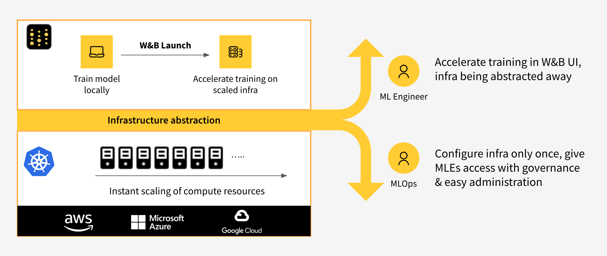

# Launch Jobs


#### <mark style="color:red;">**Beta product in active development**</mark>

<mark style="color:red;">**Interested in Launch? Reach out to your account team to talk about joining the customer pilot program for W\&B Launch.**</mark>

<mark style="color:red;">**Pilot customers need to use AWS EKS or SageMaker to qualify for the beta program. We plan to support additional platforms.**</mark>


Connect your own SageMaker or Kubernetes cluster, then easily queue and manage jobs using W\&B Launch. Kick off jobs on your own infrastructure from the W\&B UI or CLI.

With W\&B Launch you can:

* Execute runs in reproducible containerized environments
* Queue and launch jobs across your own clusters, locally or in the cloud
* Easily tweak hyperparameters or input data and retrain models
* Automatically trigger evaluation jobs on newly trained models

<figure><figcaption></figcaption></figure>
