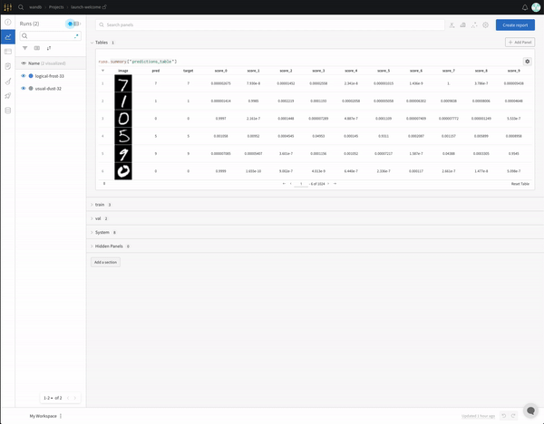

# W\&B Launch


_This new product is in active development. Please message support@wandb.com with questions and suggestions._


Use W\&B Launch to kick off jobs on your own infrastructure from the W\&B UI or CLI.

* Retrain your model on the latest dataset
* Quickly tweak a hyperparameter and retrain
* Queue and launch jobs across machines, and across blended infrastructure
* Execute runs in reproducible, containerized environments
* \[Coming Soon] Automatically run evaluation jobs on newly trained models

## Quickstart


Before you start, add **instant replay** to your bio on your profile page — this is the secret phrase to unlock W\&B Launch features in the UI.


1. From [the sample project](https://wandb.ai/wandb/launch-welcome), pick a run to re-train and copy its URL.
2. Run the launch command to re-run that run with a different config parameter, like dropout: `wandb launch`[ `https://wandb.ai/wandb/launch-welcome/runs/2er1eom2`](https://wandb.ai/wandb/launch-welcome/runs/2er1eom2) `-a dropout=0.7`
3. Click the run link from the command line to view live results from model retraining.

### Launch UI

You can also use Launch through the W\&B web interface. Open the launch-welcome project again, open the dropdown by a run, and select **Add to Launch queue**.

A modal should appear, pre-populated with the original config values in the run. Edit this config to change any of the original parameters, select the entity and project you'd like to send the run to then click **Push Run**.

You've now queued an edited version of the run, which is now waiting to be picked up by an agent. Back in your terminal, run:

`wandb launch-agent <your-selected-project-name>`

If you happened to queue the run to anything other than the default queue, add `-q <queue-name>` to your command. You should see that the agent picks up the run and builds a container with your edits to the run, just as before.

Now that you've launched runs via the CLI and the UI, take a look at the documentation to integrate Launch with your infrastructure and workflow.

## Documentation

* CLI reference for [`wandb launch`](../../ref/cli/wandb-launch.md) and [`wandb launch-agent`](../../ref/cli/wandb-launch-agent.md)``
* Resource documentation for supported Launch integrations:
  * [Local](integrations/local.md)
  * [Amazon SageMaker](integrations/sagemaker.md)
  * [GCP Vertex AI](integrations/vertex.md)
  * [Kubernetes](integrations/kubernetes.md)
* Details on [Launch containerization](containers.md) and bring-your-own-container options
* Details on [Launch agents](agents.md), including how to deploy an agent in your own infrastructure

## Frequently asked questions

### Can I use launch to create new runs?

`wandb launch` supports running new runs (i.e. runs not based on an existing wandb run) from both remote git repositories or local directories.

To launch from a git repo, run the same launch commands as above but with the URL to a Github, GitLab, or Bitbucket repo, e.g. `wandb launch https://github.com/user/repo`. We require that the repo contain either a `requirements.txt` or `environment.yml` configuration file for dependencies, and the code should be already instrumented with wandb for us to track it as normal.

To launch from a local directory, run with a local path, e.g. `wandb launch path/to/local`. As with git repos, we also require a `requirements.txt` or `environment.yml` file at the root of the provided path. Queueing is not currently supported for launching from a local directory.

In both cases, you'll want to specify an entry point using the `--entry-point` or `-E` flag.

### Does every agent have to work from the same queue?

No, different agents can listen to different queues. You can manage your run queues in the Launch Tab within a project workspace. This way you can set up a run queue for different machines or different users.

To create a new run queue:

1. Go to your [project page](https://docs.wandb.ai/ref/app/pages/project-page), and click on the Launch tab. Create, delete and view the runs in each queue within a [project workspace](../../ref/app/pages/project-page.md#workspace-tab).
2. Click the "Create Queue" button to create a new run queue. If your project is inside a team, you can create a private queue, or you can create a queue that is available to the entire team.

.png>)

You can specify the name of the queue for an agent to use using the `wandb launch-agent --queues <queue-name> <project>`

### Can I connect agents to different queues?

An agent can run jobs from a single queue or multiple queues at a time, specified as a list of comma-separated names, e.g. `--queues q1,q2,q3`. If you don't specify a queue with the `--queues` flag, the agent will run jobs from the default queue for the project.

### How can I delete a run queue?

Full run queues can be deleted as well. Select the queue or queues to be deleted, and click delete. This will delete queued runs that have not started, but not delete any runs that have been started.

.png>)


The project's default queue cannot be deleted.

