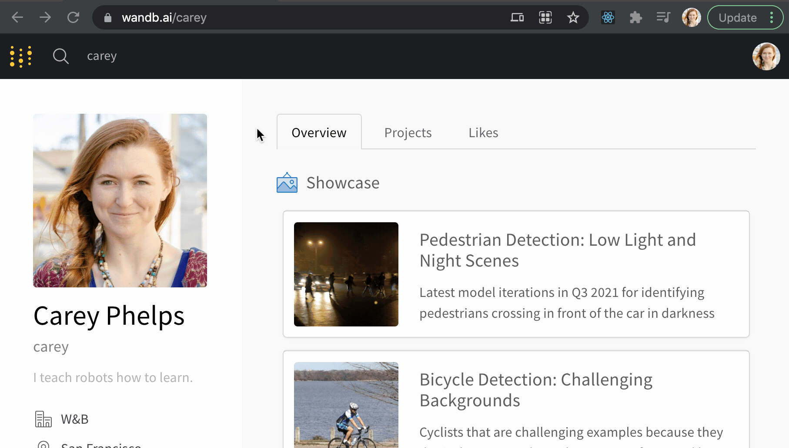
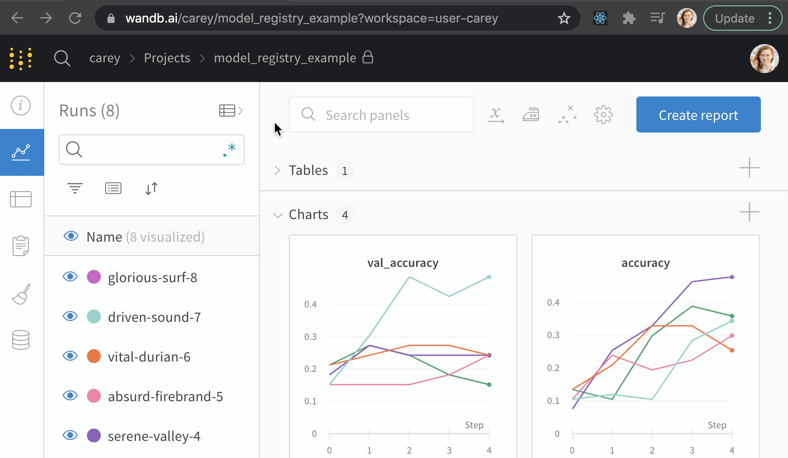
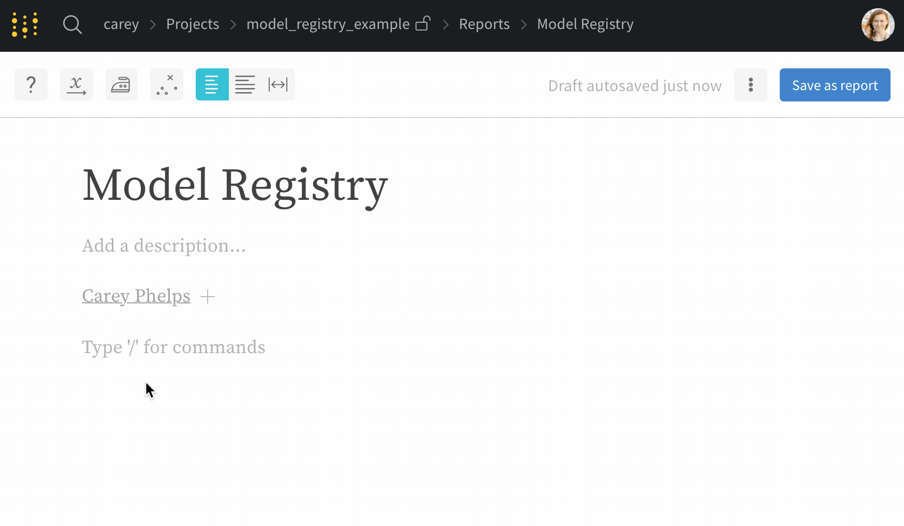
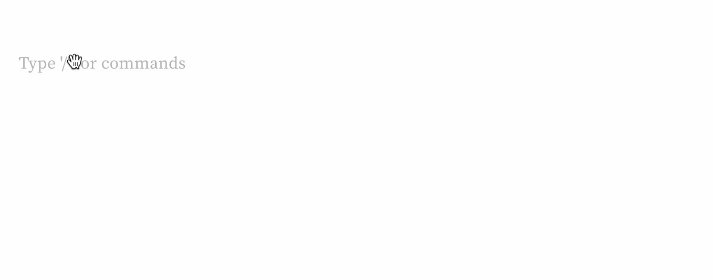
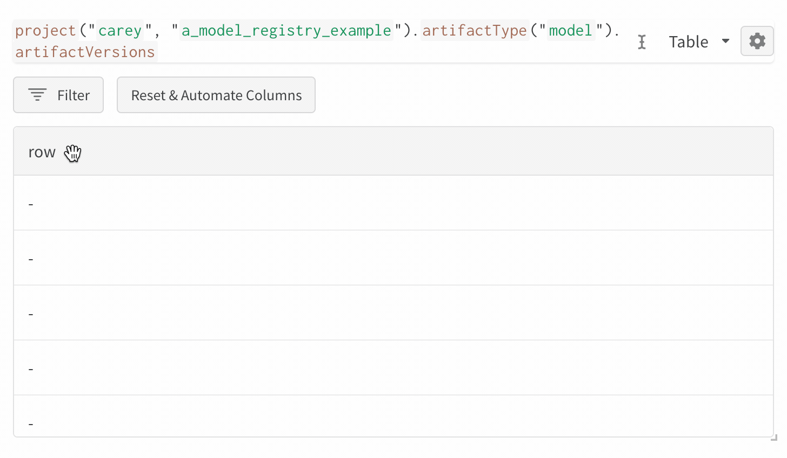
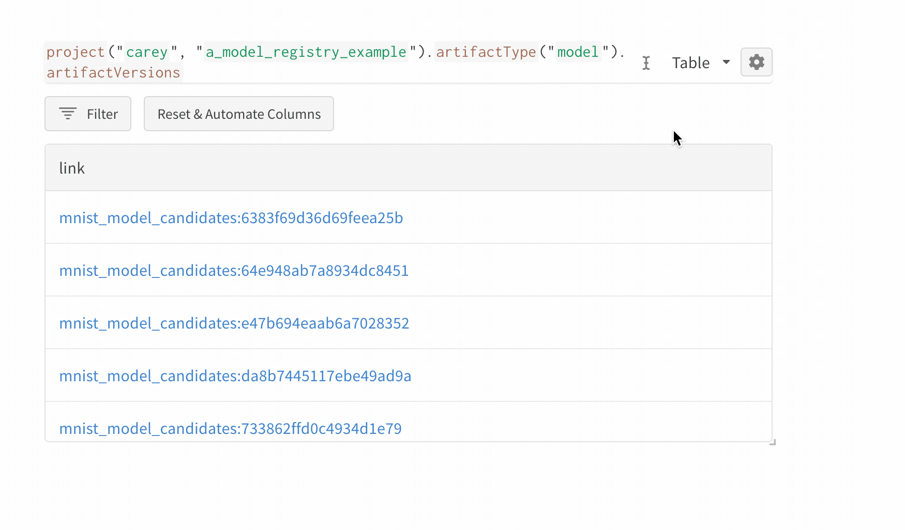
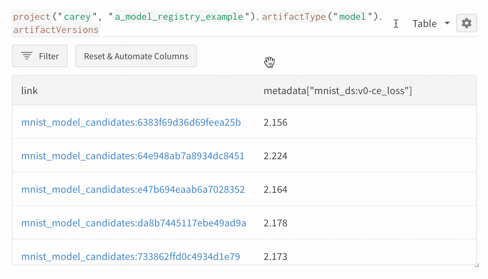
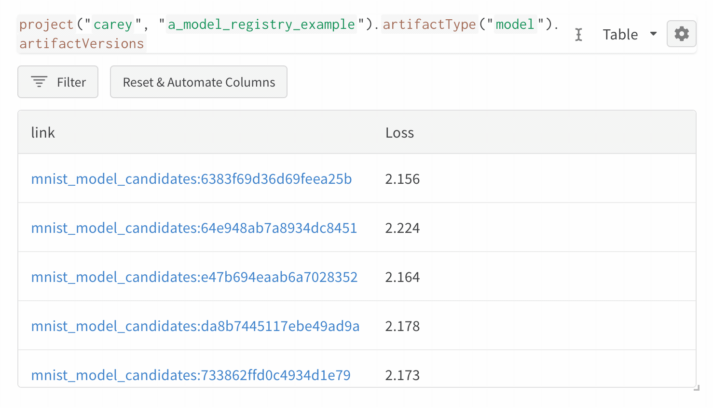

# \[Beta] Model Management

_We are actively building out the model registry and model evaluation use cases for W\&B. Please contact us with questions and suggestions at support@wandb.com. To unlock Weave panels, add `weave-report` to your profile page bio._

Use W\&B for **Model Management** to track and report on the complete lifecycle of a model:

1. **Datasets**: The exact version of the dataset a model trained on
2. **Code**: The code used in model training
3. **Models**: The weights of the trained model itself
4. **Metrics**: The evaluation results of a model on different golden datasets
5. **Statuses**: Where each model is in the pipeline (ex. "staging" or "production")

## [Model Registry Demo](https://wandb.ai/timssweeney/model\_registry\_example/reports/MNIST-Model-Status--Vmlldzo4OTIyNTA)

Use the interactive W\&B UI to view all saved model versions, compare models on evaluation metrics, and track the status of models at different stages in the pipeline.

_To unlock Weave panels, add `weave-report` to your profile page bio._

.png>)

## Quickstart Walkthrough

[Clone our **GitHub Examples Repo**](https://github.com/wandb/examples/tree/master/examples/model-evaluation)** **and follow along with this `model-evaluation` code example.

### **1. Install requirements**

Install the Weights & Biases library `wandb` and other dependencies.

```
pip install -r requirements.txt
```

### **2. Register a dataset**

Generate and register a dataset for a particular model use case. In this example, we use the MNIST dataset for simplicity.

```
python dataset_generator.py
```

### **3. Train some models**

Train a model based on the latest available dataset for the given model use case. Tweak hyperparameters from the command line, like this:

```
python model_trainer.py
python model_trainer.py --validation_split 0.05
python model_trainer.py --validation_split 0.2
python model_trainer.py --batch_size 64
python model_trainer.py --batch_size 160
```

Later you'll be able to compare training performance for different models in the W\&B dashboard.


Did you hit a weird error? Try waiting a little longer for your dataset from Step #2 to get registered before running Step #3 to train on that dataset.


Here is an [example dashboard](https://wandb.ai/carey/model\_registry\_example?workspace=user-carey) comparing the models we've trained so far.

.png>)

### **4. Evaluate candidate models**

Next, run the evaluator script to:

1. Finds all models that haven't yet been evaluated on the latest evaluation dataset
2. Runs the evaluation job for each model
3. Labels the best model "production" to feed into an inference system

```
python model_evaluator.py
```

### 5. Visualize results

Create tables to visualize your results. Here's [an example report](https://wandb.ai/timssweeney/model\_registry\_example/reports/MNIST-Model-Status--Vmlldzo4OTIyNTA) that captures and compares trained models:

.png>)

In this example, this [**Weave**](../ref/app/features/panels/weave.md) table is visualizing logged model [**Artifacts**](artifacts/) with:

1. **Model link**: A link to the registered model artifact in the app
2. **Version**: A unique version number for each registered model
3. **Status**: A label to indicate key model versions, like `production`&#x20;
4. **Loss @ 10k**: Metric calculated on an evaluation set of 10k
5. **Loss @ 1k:** Model metric calculated on an evaluation set of 1k

## Core features for model management

There are a few key features you can use to build your own Model Registry:

1. ****[**Runs**](track/): Track a job execution in your ML pipeline — ex. model training, model evaluation
2. ****[**Artifacts**](artifacts/): Track job inputs and outputs — ex. datasets, trained models
3. ****[**Tables**](data-vis/): Track and visualize tabular data — ex. evaluation datasets, model predictions
4. ****[**Weave**](../ref/app/features/panels/weave.md): Query and visualize logged data — ex. a list of trained models.
5. ****[**Reports**](reports/): Organize and visualize results — ex. charts, tables, and notes

## Model Registry Table

Once you have logged model Artifacts, it's time to query those artifacts.

### 1. Activate Weave

Go to your profile page and add `weave-report` to your bio to activate this new beta query feature.



### 2. Create a report

In a project, go to the **Reports** tab and click **Create a report.**



### 3. Add a Weave panel

Type `/weave` to create a new Weave panel in your report. If you want to remove the Weave panel later, you can click the handle on the left sidebar and click Delete.



### 4. Query your logged models

Start typing a query in the weave panel.&#x20;



Here's what each piece of the query in my example means:

* **projects("carey", "a\_model\_registry\_example")**: This pulls data from the entity `carey` and the project called `a_model_registry_example`.&#x20;
* **artifactType("model")**: This pulls all the artifacts of type `model` in this project.
* **artifactVersions**: This pulls all the artifact versions of type `model`.

### 5. Get the links to all model artifacts

Add a column to pull all the links to different logged model artifacts.



### 6. Get the evaluation metric for each model

Create a new row in the table, and query for the loss. This was calculated in the evaluation step, which tested each model on a held-out dataset.

`row.metadata["mnist_ds:v0-ce_loss"]`



Optionally, you can rename the loss column so it's more readable.&#x20;




### 7. Add a date created column

Sometimes it's nice to sort the table by the created time. Add a column:

`row.createdBy.createdAt`



### 8. Add a status column

Use the artifacts `alias` field to keep track of the status of different artifacts in your model registry. Add a column with `row.aliases`&#x20;

Then make the Panel visualize the results of the query as:  `List of: String`


