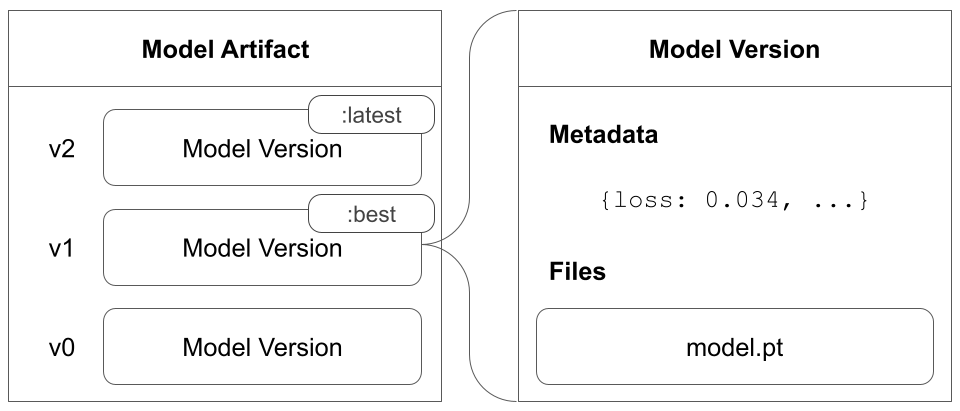

# Model Management Concepts

First, let's define the data model & terminology used throughout this guide:

* **Model Version:** a package of data & metadata describing a trained model.
* **Model Artifact:** a sequence of logged Model Versions - often tracking the progress of training.
* **Model Collection:** a selection of linked Model Versions - often representing all the candidate models for a single modeling use case or task

_Hint: A Model Version will always belong to one and only one Model Artifact, yet may belong to zero or more Model Collections._


For those familiar with W\&B Artifacts: a Model is exactly an Artifact with `type="model"`, a Model Version is an Artifact Version belonging to such an Artifact, and a Model Collection is an Artifact Collection of `type="model"`.


In W\&B a **Model Version** is an immutable directory of data; it is up to you to decide what files & formats are appropriate to store (and restore) your model architecture & learned parameters. Typically you will want to store whatever files are produced from the serialization process provided by your modeling library (eg [PyTorch](https://pytorch.org/tutorials/beginner/saving\_loading\_models.html) & [Keras](https://www.tensorflow.org/guide/keras/save\_and\_serialize)).

Furthermore, a **Model Artifact** is a sequence of Model Versions. Model Artifact can **alias** specific versions so that downstream consumers can pin to such aliases. It is extremely common for a W\&B Run to produce many versions of a model while training (periodically saving checkpoints). Using this approach, each individual model being trained by the Run corresponds to its own Model Artifact, and each checkpoint corresponds to its own Model Version of the respective Model Artifact. _View an_ [_example Model Artifact_](https://wandb.ai/timssweeney/model\_management\_docs\_official\_v0/artifacts/model/mnist-zws7gt0n)_!_

Finally, a **Model Collection** is a set links to Model Versions. A Model Collection can be accessed exactly like act like Model Artifacts (identified by `[[entityName/]/projectName]/collectionName:alias`), however it acts more like a folder of "bookmarks" - where each "version" of a Model Collection is actually a link to an Model Version belonging to a Model Artifact of the same type. A Model Version may be linked to any number of Model Collections. Typically you will create a Model Collection for each of your use cases / modeling tasks and use aliases like "production" or "staging" to denote versions with special purposes. _View an_ [_example Model Collection!_](https://wandb.ai/timssweeney/model\_management\_docs\_official\_v0/artifacts/model/MNIST%20Grayscale%2028x28)__

.png>)

While developing an ML Model, you will likely have dozens, hundreds, or even thousands of Runs which produce Model Versions - they may come from notebooks, remote training jobs, CI/CD pipelines, etc... Most likely, not all of those models are great; often you are iterating on scripts, parameters, architectures, preprocessing logic and more. The separation of Artifacts and Collections allows you to produce a massive number of Artifacts (think of them like "draft models"), and periodically _link_ your high performing versions to a the curated Model Collection. Then, use aliases to mark which Version in a Collection is at which stage in the lifecycle. Each person in your team can collaborate on a single use case (Collection), while having the freedom to explore and experiment without polluting namespaces or conflicting with others' work.
