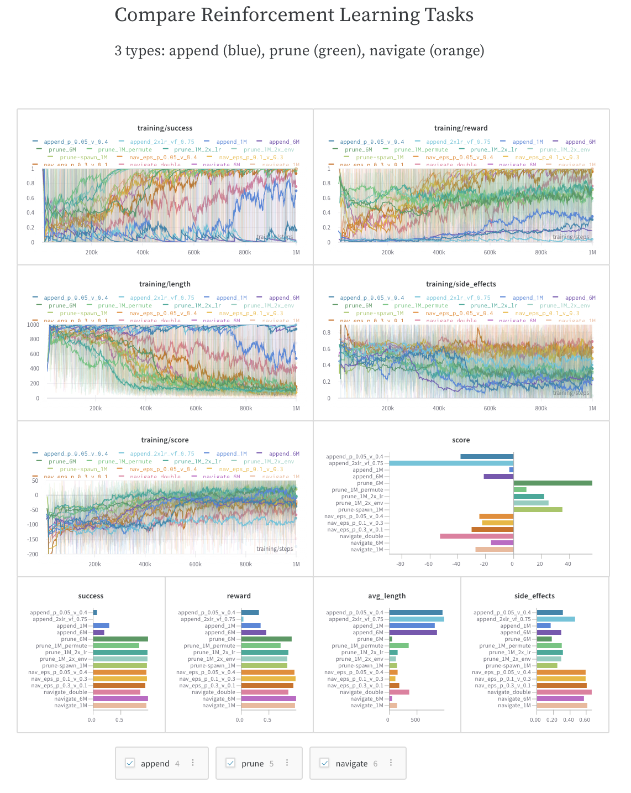
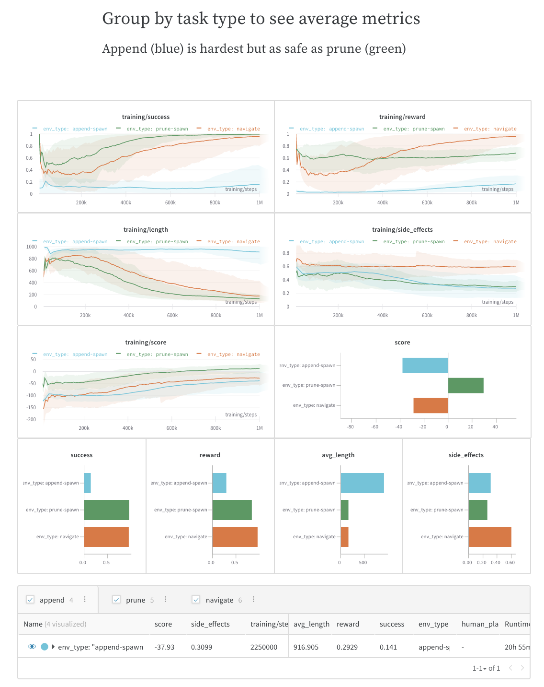
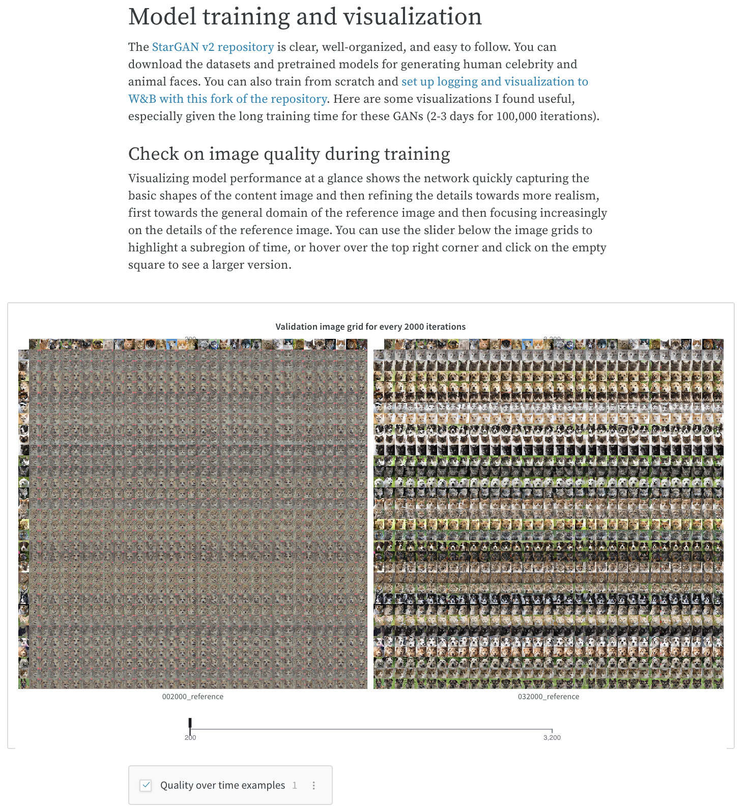
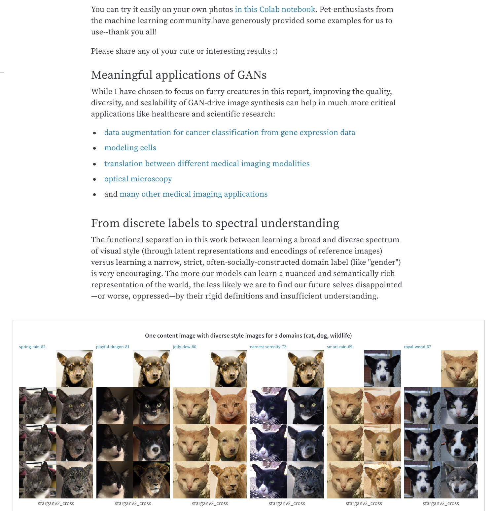
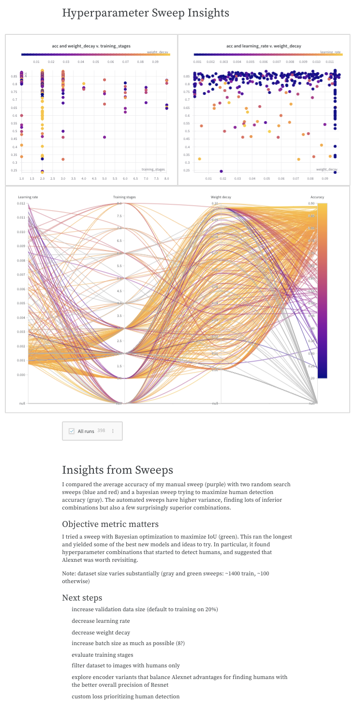
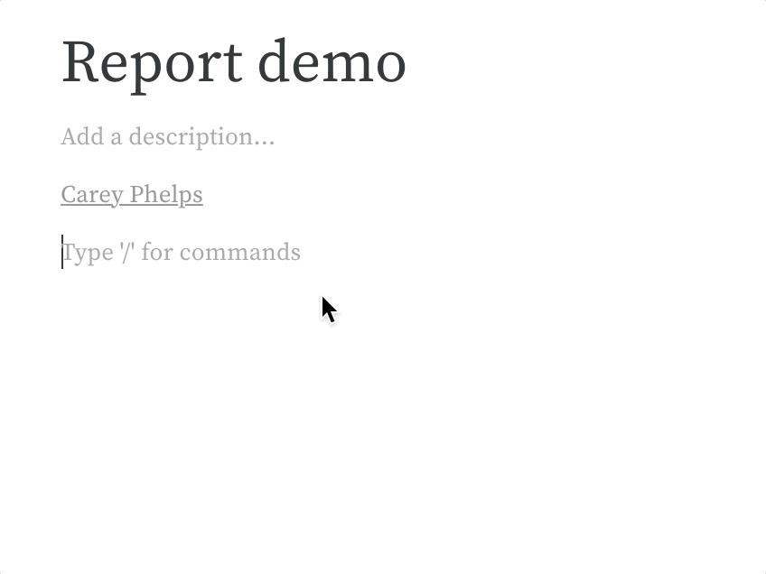

# Collaborative Reports

Reports let you organize and embed visualizations, describe your findings, share updates with collaborators, and more. 

## Typical Use Cases for Reports

1. **Notes**: Add a graph with a quick note to yourself.
2. **Collaboration**: Share findings with your colleagues.
3. **Work log**: Track what you've tried and plan next steps.

### **Notes: Add a visualization with a quick summary**

Capture an important observation, an idea for future work, or a milestone reached in the development of a project. All experiment runs in your report will link to their parameters, metrics, logs, and code, so  you can save the full context of your work.

Jot down some text and pull in relevant charts to illustrate your insight \([comparing networks in distributed training →](https://wandb.ai/stacey/estuary/reports/When-Inception-ResNet-V2-is-too-slow--Vmlldzo3MDcxMA) \)

Save the best examples from a complex code base for easy reference and future interaction \(example: [LIDAR point clouds → ](https://wandb.ai/stacey/lyft/reports/LIDAR-Point-Clouds-of-Driving-Scenes--Vmlldzo2MzA5Mg)\) 

### **Collaboration: Share findings with your colleagues**

Explain how to get started with a project, share what you've observed so far, and synthesize the latest findings. Your colleagues can make suggestions or discuss details using comments on any panel or at the end of the report.

Include dynamic settings so that your colleagues can explore for themselves, get additional insights, and better plan their next steps. In this example, three types of experiments can be visualized independently, compared, or averaged \([SafeLife benchmark experiments →](https://wandb.ai/stacey/saferlife/reports/SafeLife-Benchmark-Experiments--Vmlldzo0NjE4MzM)\).

Use sliders and configurable media panels to showcase a model's results or training progress \(example → [StarGANv2](https://wandb.ai/stacey/stargan/reports/Cute-Animals-and-Post-Modern-Style-Transfer-StarGAN-v2-for-Multi-Domain-Image-Synthesis---VmlldzoxNzcwODQ)\) 

### **Work log: Track what you've tried and plan next steps**

Write down your thoughts on experiments, your findings, and any gotchas and next steps as you work through a project, keeping everything organized in one place. This lets you "document" all the important pieces beyond your scripts \(example: [tuning transformers →](https://wandb.ai/stacey/winograd/reports/Who-is-Them-Text-Disambiguation-with-Transformers--VmlldzoxMDU1NTc)\).

Tell the story of a project, which you and others can reference later to understand how and why a model was developed \(example → [The View from the Driver's Seat](https://wandb.ai/stacey/deep-drive/reports/The-View-from-the-Driver-s-Seat--Vmlldzo1MTg5NQ)\)

### \*\*\*\*[See the OpenAI case study →](https://bit.ly/wandb-learning-dexterity)

Once you have [experiments in W&B](../quickstart.md), easily visualize results in reports. Here's a quick overview video.



## How to create a report 

You can create a new report from a workspace, or directly from the report tab in a project.‌‌

### 1. Create a report from a workspace 

Click **Create report** in the upper right corner of your workspace. This gives you a way to pull in some charts from the page to use in your new custom page.

We provide a few quick templates to guide you or you can create a blank report and start there.‌

* **Snapshot** adds the current date/time to the title, and adds a filter to the run set, which means only runs created before the current time are included in the snapshot.
* **Dashboard** titles the report “Project Dashboard” and adds a filter to match exactly the current set of selected runs.
* **Update** titles the report “&lt;today’s date&gt; Project Update” and filters to the exact set of runs that were selected in the workspace.
* **Blank** gives you the space to add a fresh panel grid and visualizations, or just write some notes to yourself.

### 2. From the report tab‌ 

Go to the Reports tab in your project, and click **Create Report** button on the report page. This creates a new blank report. Save that report to get a shareable link, or send charts to the report from different workspaces, and even different projects!

## How to edit a report

Create a new report, and start typing. The whole page is a rich text area where you can write notes and save custom visualizations and tables.

### Add new charts, headings, lists, or LaTex equations

On a new line, press `/` to add rich content.

### Add charts to a report

Again press `/`, then add a panel grid, then add a panel \(like a line plot, scatter plot, or parallel coordinates chart\). Each panel grid has a set of run sets and a set of panels. The run sets at the bottom of the section control what data shows up on the panels in the grid. Create a new panel grid if you want to add charts that pull data from a different set of runs.

### Duplicate and delete panel grids

If you have a good layout that you'd like to reuse, you can select a panel grid and copy-paste it to duplicate it in the same report, or even paste it into a different report.

As you can see in the gif below, you can highlight a whole panel grid section by clicking the drag handle in the upper right corner. You can also click and drag to highlight and select a region in a report, which can include panel grids, text, and headings.

To delete a panel grid, simply select it and press `delete` on your keyboard.

## Collaborate on reports

Once you've saved a report, you can click the **Share** button to collaborate. Make sure the visibility settings on your project allow your collaborators to access the report— you'll need an open project or a team project to share a report that you can edit together.

When you press edit, you'll be editing a draft copy of the report. This draft auto-saves, and when you press **Save to report** you'll be publishing your changes to the shared report.

If one of your collaborators has edited the report in the meantime, you'll get a warning to help you resolve potential edit conflicts.

### Comment on reports

Click the comment button on a panel in a report to add a comment directly to that panel.

## Panel Grids

If you'd like to compare a different set of runs, create a new panel grid. Each section's graphs are controlled by the **Run Sets** at the bottom of that section.

## Run Sets

* **Dynamic run sets**: If you start from "Visualize all" and filter or deselect runs to visualize, the run set will automatically update to show any new runs that match the filters.
* **Static run sets**: If you start from "Visualize none" and select the runs you want to include in your run set, you will only ever get those runs in the run set. No new runs will be added.
* **Defining keys**: If you have multiple Run Sets in a section, the columns are defined by the first run set. To show different keys from different projects, you can click "Add Panel Grid" to add a new section of graphs and run sets with that second set of keys. You can also duplicate a grid section.

## Exporting reports

Click the download button to export your report as a LaTeX zip file. Check the README.md in your downloaded folder to find instructions on how to convert this file to PDF. It's easy to upload the zip file to [Overleaf](https://www.overleaf.com/) to edit the LaTeX.

## Cross-project reports

Compare runs from two different projects with cross-project reports. Use the project selector in the run set table to pick a project.

The visualizations in the section pull columns from the first active runset. If you're not seeing the metric you're looking for in the line plot, make sure that the first run set checked in the section has that column available. This feature supports history data on time series lines, but we don't support pulling different summary metrics from different projects— so a scatter plot wouldn't work for columns that are only logged in another project.

If you really need to compare runs from two projects and the columns aren't working, add a tag to the runs in one project and then move those runs to the other project. You'll still be able to filter to just the runs from each project, but you'll have all the columns for both sets of runs available in the report.

### View-only report links

Share a view-only link to a report that is in a private project or team project.

### Send a graph to a report

Send a graph from your workspace to a report to keep track of your progress. Click the dropdown menu on the chart or panel you'd like to copy to a report and click **Add to report** to select the destination report.

## Reports FAQ

### Upload a CSV to a report

If you currently want to upload a CSV to a report you can do it via the `wandb.Table` format. Loading the CSV in your Python script and logging it as a `wandb.Table` object will allow you to render the data as a table in a report.

### Refreshing data

Reload the page to refresh data in a report and get the latest results from your active runs. Workspaces automatically load fresh data if you have the **Auto-refresh** option active \(available in the dropdown menu in the upper right corner of your page\). Auto-refresh does not apply to reports, so this data will not refresh until you reload the page.

## WYSIWYG Reports FAQ

**What's changed in the new reports release?**

Reports look the same in view mode, and can have all the same content as they did before, but report editing is now WYSIWYG.

**What is WYSIWYG?**

WYSIWYG is an acronym for What You See Is What You Get. It refers to a type of editor where the content always looks the same, whether you're editing or presenting. In contrast, W&B reports used to have Markdown editors, where you edit in [Markdown](https://www.markdownguide.org/) and have to switch to preview mode to see what it'll end up looking like. W&B reports are now fully WYSIWYG.

**Why change to WYSIWYG?**

Users have told us that context switching between Markdown mode and preview mode slows them down. We want to minimize the friction between you and sharing your research with the world, so Markdown-dependent editing had to go. With arbitrary reordering, cut+paste, and undo history for everything \(even panel grids!\), making reports should feel much more natural now. Furthermore, WYSIWYG makes it easier for us to add new advanced features in the future, like video embeds, commenting on specific text selections, and real-time collaboration.

**My report looks different after converting from Markdown.**

We try to keep your report looking the same after converting to WYSIWYG, but the process isn't perfect. If the changes are drastic or unexpected, let us know and we'll look into the issue. Until your editing session ends, you'll have the option of reverting the report back to its pre-conversion state.

**I prefer Markdown. Can I still use it?**

Absolutely! Type "/mark" anywhere in the document and hit enter to insert a Markdown block. You can edit these blocks with Markdown the way you used to.

**My report is running slowly now.**

Sorry! We're constantly working on performance improvements, but WYSIWYG reports may run slowly on older hardware or exceptionally large reports. You can assuage the problem for now by collapsing sections of the report that you're not currently working on, like so:

**How do I delete a panel grid?**

Select the panel grid, and hit delete/backspace. The easiest way to select a panel grid is by clicking its drag handle on the top-right, like so:

**How do I insert a table?**

Tables are the only feature from Markdown that we haven't added a WYSIWYG equivalent for yet. But because we still support Markdown, you can add a table by adding a Markdown block and creating a table inside of it.

**I converted my report to WYSIWYG but I'd like to revert back to Markdown.**

If you converted your report using the message at the top of the report, simply hit the red "Revert" button to return to your pre-converted state. Note that any changes you've made after converting will be lost.

If you converted a single Markdown block, try hitting cmd+z to undo.

If neither of these options work because you've closed your session after converting, consider discarding your draft and editing your report from its last saved state. If this isn't an option either, let us know through the Intercom bubble at the bottom right and our team can try to restore your last working state. 

**I have a problem that isn't addressed by this FAQ.**

Please send us a message through the Intercom bubble on the bottom-right of the page in the app, with a link to your report and the keyword "WYSIWYG". If you're not seeing an Intercom chat widget, it's likely blocked by your Ad Block browser extensions, and you can contact us at contact@wandb.com instead.

