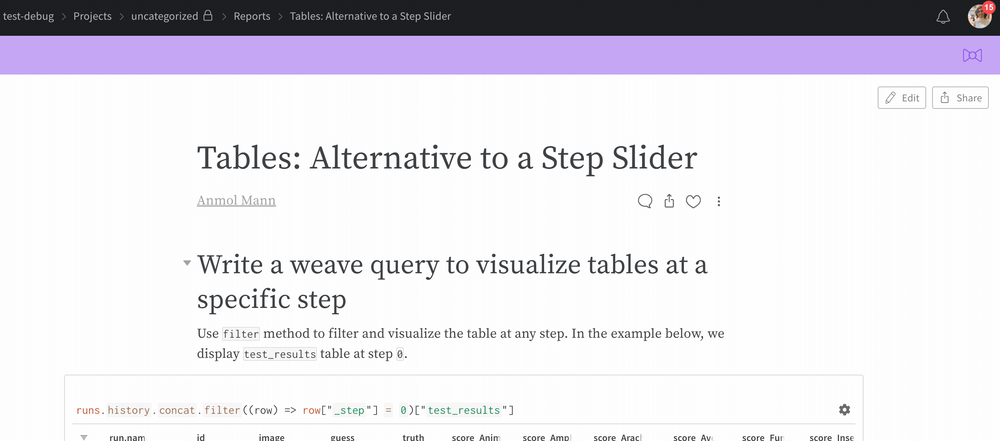

# Cross-project reports

Compare runs from two different projects with cross-project reports. Use the project selector in the run set table to pick a project.

The visualizations in the section pull columns from the first active runset. Make sure that the first run set checked in the section has that column available if you do not see the metric you are looking for in the line plot.

This feature supports history data on time series lines, but we don't support pulling different summary metrics from different projects. In other words, you can not create a scatter plot from columns that are only logged in another project.

If you need to compare runs from two projects and the columns are not working, add a tag to the runs in one project and then move those runs to the other project. You will still be able to filter only the runs from each project, but you will have all the columns for both sets of runs available in the report.

### View-only report links

Share a view-only link to a report that is in a private project or team project.

View-only report links add a secret access token to the URL, so anyone who opens the link can view the page. The magic link can also be used to let anyone view the report without logging in first. For customers on [W\&B Local](../self-hosted/) private cloud installations, these links will still be behind your firewall, so only members of your team with access to your private instance _and_ access to the view-only link will be able to view the report.

**View-only mode**

In view mode, someone who is not logged in can see the charts and mouse over to see tooltips of values, zoom in and out on charts, and scroll through columns in the table. When in view mode, they cannot create new charts or new table queries to explore the data. View-only visitors to the report link won't be able to click on a run to get to the run page. Also, the view-only visitors would not be able to see the share modal but instead would see a tooltip on hover which says: `Sharing not available for view only access`.


Note: The magic links are only available for “Private” and “Team” projects. For “Public” (anyone can view) or “Open” (anyone can view and contribute runs) projects, the links can't turn on/off because this project is public implying that it is already available to anyone with the link.


### Send a graph to a report

Send a graph from your workspace to a report to keep track of your progress. Click the dropdown menu on the chart or panel you'd like to copy to a report and click **Add to report** to select the destination report.

 (2) (3) (3) (3) (3) (4) (4) (5) (1) (1) (1) (1) (1) (3) (1) (1) (1) (1) (1) (1) (1) (1) (1) (6) (1) (3) (1) (1) (1) (1) (1) (1) (1) (1) (1) (1) (1) (1) (1) (1) (1) (1) (1) (1) (1) (1) (1) (1) (1) (1) (1) (1) (1) (14).gif>)
