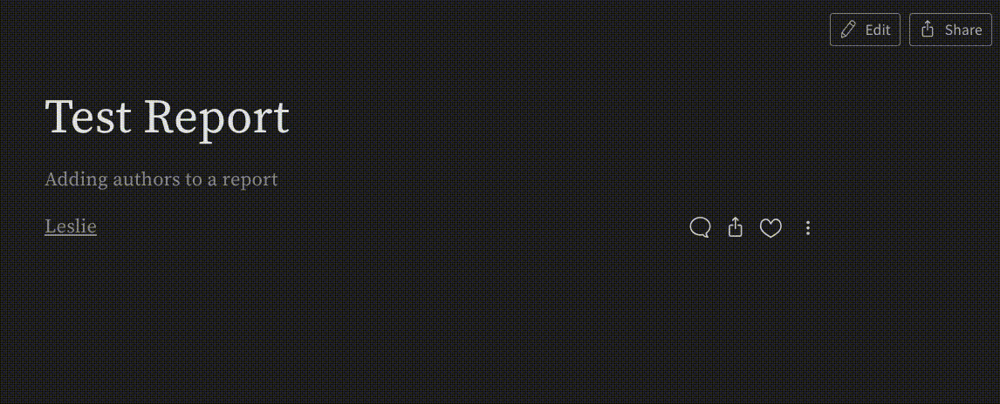
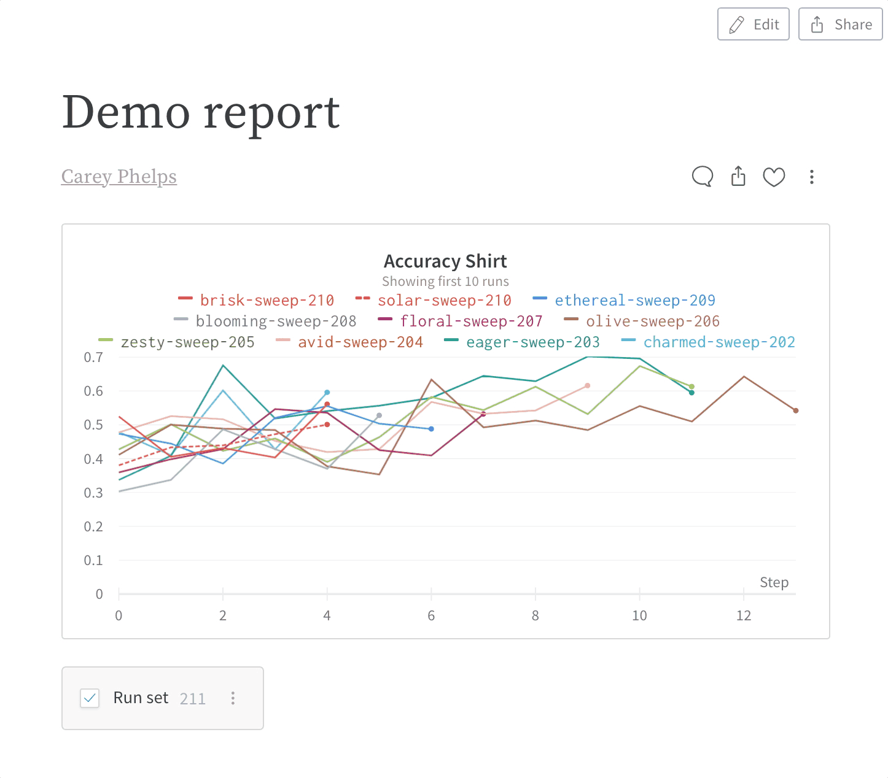

# Reports FAQ

### Upload a CSV to a report

If you currently want to upload a CSV to a report you can do it via the `wandb.Table` format. Loading the CSV in your Python script and logging it as a `wandb.Table` object will allow you to render the data as a table in a report.

### Refreshing data

Reload the page to refresh data in a report and get the latest results from your active runs. Workspaces automatically load fresh data if you have the **Auto-refresh** option active (available in the dropdown menu in the upper right corner of your page). Auto-refresh does not apply to reports, so this data will not refresh until you reload the page.

### Filter and delete unwanted reports

Using the search bar, you can search and filter down the reports list. You can then delete an unwanted report from the list or select all and press 'Delete Reports' to remove them from your project.


### Incorporating LaTeX

LaTeX can be added into reports easily. In order to do so, create a new report, and start typing. The whole page is a rich text area where you can write notes and save custom visualizations and tables.

On a new line, press `/` and scroll to the inline equations tab to add rich content in LaTeX.

 (1) (1) (1) (1) (1) (1) (2) (2) (1) (1) (1) (1).mov>)

### List of markdown shortcuts

| Markdown          | Shortcuts     |
| ----------------- | ------------- |
| Bold              | `*<content>*` |
| Italics           | `_<content>_` |
| List item         | `*` , `-`     |
| Ordered list item | `1.`          |
| Checklist         | `[]`          |
| Blockquote        | `>` , `\|`    |
| Heading 1         | `#`           |
| Heading 2         | `##`          |
| Heading 3         | `###`         |
| Code block        | ` ``` `       |
| Inline code       | `` ` ``       |
| Callout block     | `>>>`         |
| Horizontal rule   | `---`, `___`  |

A comprehensive list of LaTeX can be found [here](https://en.wikibooks.org/wiki/LaTeX/Mathematics).

### Adding multiple authors to a report

When multiple users work on a report together, they should be credited as such. In our reports, you can do just that and add all the users that worked together on a report in the Author line. This is done by clicking Edit on the top right of the page. From there, a '+' will be seen on the right of the author line to where you can add all of the team members that have contributed to the report.



### Embedding Reports

You are able to share the report that you have created by embedding it. This is done simply by clicking Share on the top right of your report and copying the embedded code at the bottom of the pop-up window that appears.&#x20;



### **WYSIWYG FAQ**

**What's changed in the new reports release?**

Reports look the same in view mode, and can have all the same content as they did before, but report editing is now WYSIWYG.

**What is WYSIWYG?**

WYSIWYG is an acronym for What You See Is What You Get. It refers to a type of editor where the content always looks the same, whether you're editing or presenting. In contrast, W\&B reports used to have Markdown editors, where you edit in [Markdown](https://www.markdownguide.org) and have to switch to preview mode to see what it'll end up looking like. W\&B reports are now fully WYSIWYG.

**Why change to WYSIWYG?**

Users have told us that context switching between Markdown mode and preview mode slows them down. We want to minimize the friction between you and sharing your research with the world, so Markdown-dependent editing had to go. With arbitrary reordering, cut+paste, and undo history for everything (even panel grids!), making reports should feel much more natural now. Furthermore, WYSIWYG makes it easier for us to add new advanced features in the future, like video embeds, commenting on specific text selections, and real-time collaboration.

**My report looks different after converting from Markdown.**

We try to keep your report looking the same after converting to WYSIWYG, but the process isn't perfect. If the changes are drastic or unexpected, let us know and we'll look into the issue. Until your editing session ends, you'll have the option of reverting the report back to its pre-conversion state.

**I prefer Markdown. Can I still use it?**

Absolutely! Type "/mark" anywhere in the document and hit enter to insert a Markdown block. You can edit these blocks with Markdown the way you used to.

**My report is running slowly now.**

Sorry! We're constantly working on performance improvements, but WYSIWYG reports may run slowly on older hardware or exceptionally large reports. You can assuage the problem for now by collapsing sections of the report that you're not currently working on, like so:


**How do I delete a panel grid?**

Select the panel grid, and hit delete/backspace. The easiest way to select a panel grid is by clicking its drag handle on the top-right, like so:


**How do I insert a table?**

Tables are the only feature from Markdown that we haven't added a WYSIWYG equivalent for yet. But because we still support Markdown, you can add a table by adding a Markdown block and creating a table inside of it.

**I converted my report to WYSIWYG but I'd like to revert back to Markdown.**

If you converted your report using the message at the top of the report, simply hit the red "Revert" button to return to your pre-converted state. Note that any changes you've made after converting will be lost.

.png>)

If you converted a single Markdown block, try hitting cmd+z to undo.

If neither of these options work because you've closed your session after converting, consider discarding your draft and editing your report from its last saved state. If this isn't an option either, let us know through the Intercom bubble at the bottom right and our team can try to restore your last working state.

**I have a problem that isn't addressed by this FAQ.**

Please send us a message through the Intercom bubble on the bottom-right of the page in the app, with a link to your report and the keyword "WYSIWYG". If you're not seeing an Intercom chat widget, it's likely blocked by your Ad Block browser extensions, and you can contact us at contact@wandb.com instead.
