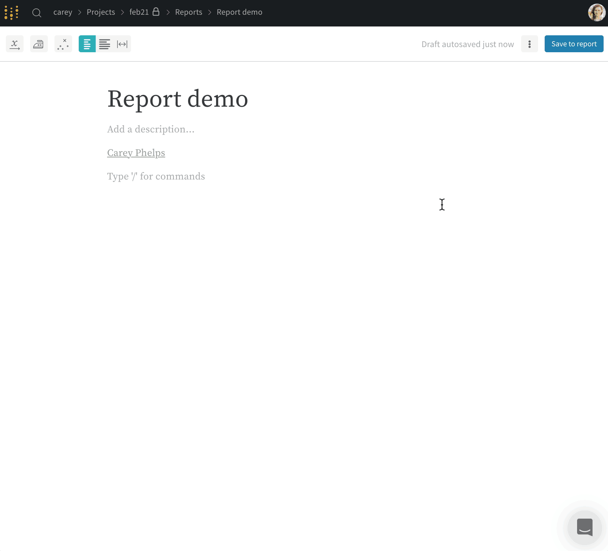
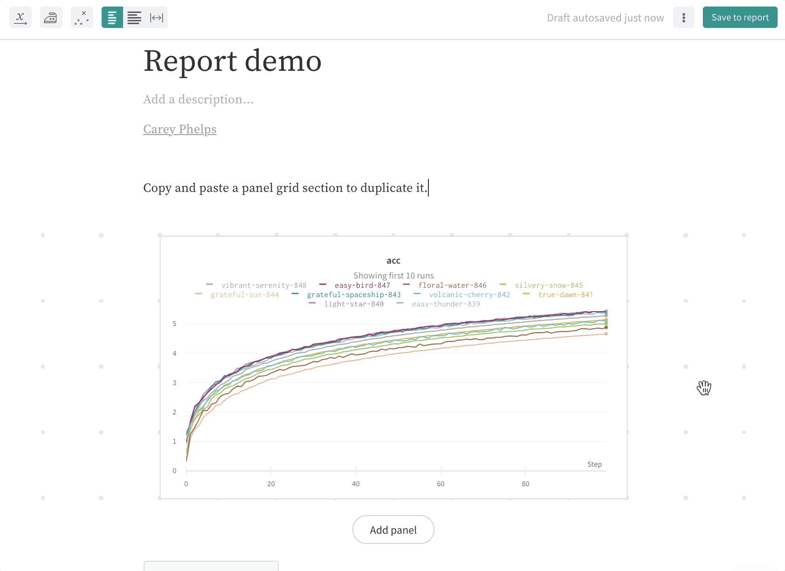
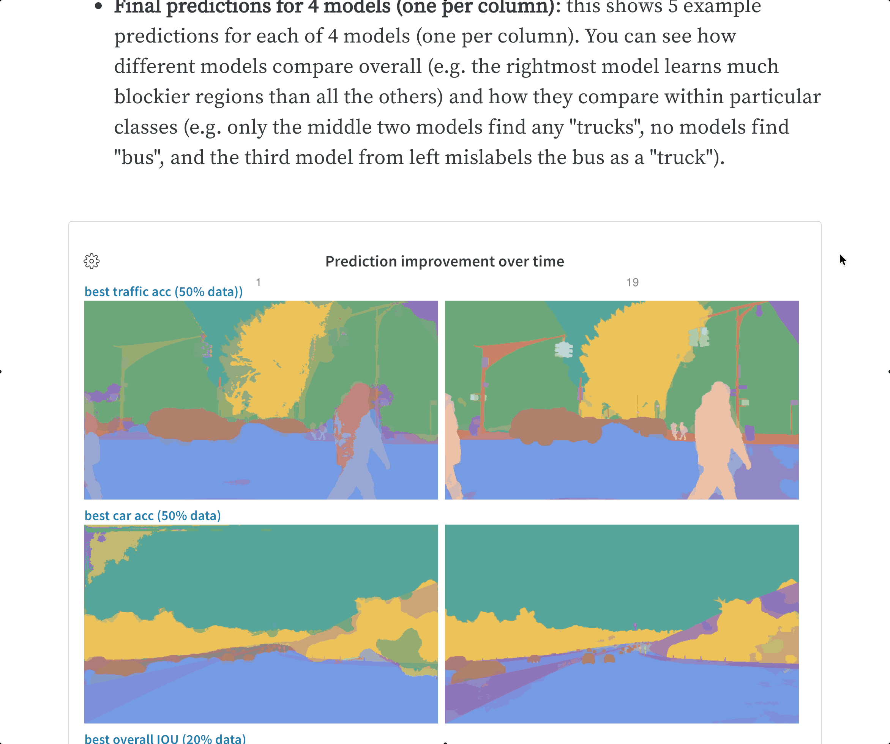
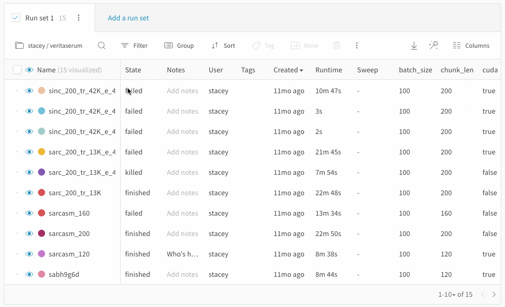

# Reports Walkthrough

## How to create a report 

You can create a new report from a workspace, or directly from the report tab in a project.‌‌

### 1. Create a report from a workspace 

Click **Create report** in the upper right corner of your workspace. This gives you a way to pull in some charts from the page to use in your new custom page.

.png>)

We provide a few quick templates to guide you or you can create a blank report and start there.‌

 (1) (2) (2) (2) (2) (1) (2) (2) (2) (2) (2).png>)

* **Snapshot** adds the current date/time to the title and adds a filter to the run set, which means only runs created before the current time are included in the snapshot.
* **Dashboard** titles the report “Project Dashboard” and adds a filter to match exactly the current set of selected runs.
* **Update** titles the report “\<today’s date> Project Update” and filters to the exact set of runs that were selected in the workspace.
* **Blank** gives you the space to add a fresh panel grid and visualizations, or just write some notes to yourself.

### 2. From the report tab‌ 

Go to the Reports tab in your project, and click **Create Report** button on the report page. This creates a new blank report. Save that report to get a shareable link, or send charts to the report from different workspaces, and even different projects!

.png>)

## How to edit a report

### Add charts to a report

Again press `/`, then add a panel grid, then add a panel (like a line plot, scatter plot, or parallel coordinates chart). Each panel grid has a set of run sets and a set of panels. The run sets at the bottom of the section control what data shows up on the panels in the grid. Create a new panel grid if you want to add charts that pull data from a different set of runs.

### Duplicate and delete panel grids

If you have a good layout that you'd like to reuse, you can select a panel grid and copy-paste it to duplicate it in the same report or even paste it into a different report.

As you can see in the gif below, you can highlight a whole panel grid section by clicking the drag handle in the upper right corner. You can also click and drag to highlight and select a region in a report, which can include panel grids, text, and headings.

To delete a panel grid, simply select it and press `delete` on your keyboard.

## Collaborate on reports

Once you've saved a report, you can click the **Share** button to collaborate. Make sure the visibility settings on your project allow your collaborators to access the report— you'll need an open project or a team project to share a report that you can edit together.

When you press edit, you'll be editing a draft copy of the report. This draft auto-saves, and when you press **Save to report** you'll be publishing your changes to the shared report.

If one of your collaborators has edited the report in the meantime, you'll get a warning to help you resolve potential edit conflicts.

### Comment on reports

Click the comment button on a panel in a report to add a comment directly to that panel.

## Panel grids

If you'd like to compare a different set of runs, create a new panel grid. Each section's graphs are controlled by the **Run Sets** at the bottom of that section.

## Run sets

* **Dynamic run sets**: If you start from "Visualize all" and filter or deselect runs to visualize, the run set will automatically update to show any new runs that match the filters.
* **Static run sets**: If you start from "Visualize none" and select the runs you want to include in your run set, you will only ever get those runs in the run set. No new runs will be added.
* **Defining keys**: If you have multiple Run Sets in a section, the columns are defined by the first run set. To show different keys from different projects, you can click "Add Panel Grid" to add a new section of graphs and run sets with that second set of keys. You can also duplicate a grid section.

## Exporting reports

Click the download button to export your report as a LaTeX zip file. Check the README.md in your downloaded folder to find instructions on how to convert this file to PDF. It's easy to upload the zip file to [Overleaf](https://www.overleaf.com) to edit the LaTeX.

## Cloning reports

Click the 'Clone this report' button to clone your reports.&#x20;

_Use-case_: let's assume you have a specific report template that would act as a baseline for each version of the model trained so far. Further, the difference between the reports created for each one of these model versions would be the output metrics. In such a scenario, you can clone your template report from the report edit dropdown and make any changes needed.

## Embedding reports

By clicking the share icon within your report you will be able to get the direct link for your report or an embeddable piece of code that can render an iframe for your tool of choice.

_Note: Only **public** reports are viewable when embedded currently._

### Confluence

Insert the direct link to the report within the iframe cell.

### Notion

Insert the direct link to the report within the embed cell.

## Cross-project reports

Compare runs from two different projects with cross-project reports. Use the project selector in the run set table to pick a project.

The visualizations in the section pull columns from the first active runset. If you're not seeing the metric you're looking for in the line plot, make sure that the first run set checked in the section has that column available. This feature supports history data on time series lines, but we don't support pulling different summary metrics from different projects— so a scatter plot wouldn't work for columns that are only logged in another project.

If you need to compare runs from two projects and the columns aren't working, add a tag to the runs in one project and then move those runs to the other project. You'll still be able to filter to just the runs from each project, but you'll have all the columns for both sets of runs available in the report.

### View-only report links

Share a view-only link to a report that is in a private project or team project.

View-only report links add a secret access token to the URL, so anyone who opens the link can view the page. For customers on [W\&B Local](../self-hosted/) private cloud installations, these links will still be behind your firewall, so only members of your team with access to your private instance _and_ access to the view-only link will be able to view the report.

In view mode, someone who is not logged in can see the charts and mouse over to see tooltips of values, zoom in and out on charts, and scroll through columns in the table. When in view mode, they cannot create new charts or new table queries to explore the data. View-only visitors to the report link won't be able to click on a run to get to the run page.

### Send a graph to a report

Send a graph from your workspace to a report to keep track of your progress. Click the dropdown menu on the chart or panel you'd like to copy to a report and click **Add to report** to select the destination report.

 (2) (3) (3) (3) (3) (4) (4) (5) (1) (1) (1) (1) (1).gif>)
