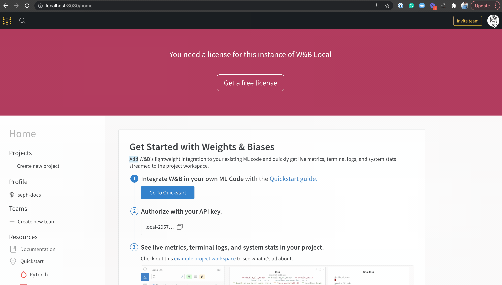

# Private Hosting

## Quickstart to W\&B private-hosting

1.  On any machine with [Docker](https://www.docker.com) and [Python](https://www.python.org) installed, run:

    ```
    pip install wandb
    wandb local 
    ```
2. Generate a free license from the [Deployer](https://deploy.wandb.ai).
3. Add it to your local settings.

#### Paste the license in the ** `/system-admin`** page on your localhost



We also offer [Private Cloud Deployment](setup/private-cloud.md) options for production, which runs a completely scalable infrastructure within your company's AWS or GCP account. This system is a good choice for massively scalable experiment tracking.
