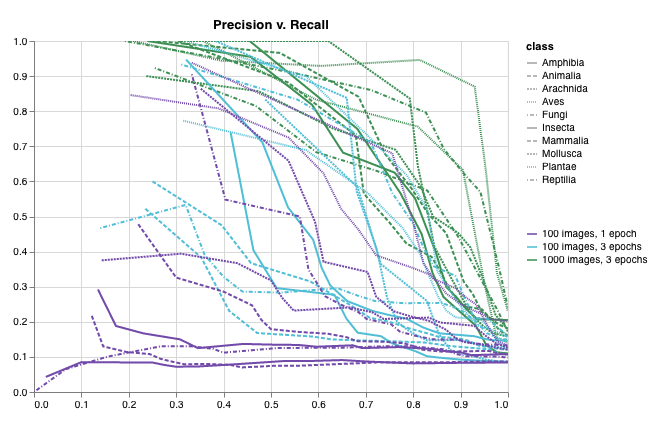
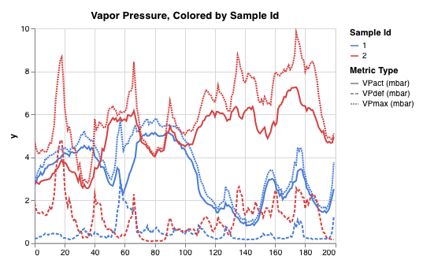

# Log Data & Media with wandb.log

Call `wandb.log(dict)` to log a dictionary of metrics or custom objects to a step. Each time you log, we increment the step by default, letting you view metrics over time.

### Example Usage

```python
wandb.log({"loss": 0.314, "epoch": 5,
           "inputs": wandb.Image(inputs),
           "logits": wandb.Histogram(ouputs),
           "captions": wandb.HTML(captions)
           })
```

### **Common Workflows**

1. **Compare the best accuracy**: To compare the best value of a metric across runs, set the summary value for that metric. By default, summary is set to the last value you logged for each key. This is useful in the table in the UI, where you can sort and filter runs based on their summary metrics — so you could compare runs in a table or bar chart based on their _best_ accuracy, instead of final accuracy. For example, you could set summary like so: `wandb.run.summary["best_accuracy"] = best_accuracy`
2. **Multiple metrics on one chart**: Log multiple metrics in the same call to wandb.log\(\), like this: `wandb.log({'acc': 0.9, 'loss': 0.1})` and they will both be available to plot against in the UI
3. **Custom x-axis**: Add a custom x-axis to the same log call to visualize your metrics against a different axis in the W&B dashboard. For example: `wandb.log({'acc': 0.9, 'epoch': 3, 'batch': 117})`

### **Reference Documentation**

View the reference docs, generated from the `wandb` Python library.





## Logging Objects

We support images, video, audio, custom graphs, and more. Log rich media to explore your results and visually compare your runs, models, and datasets.


You can see working code to log all of these media objects in [this Colab Notebook](http://wandb.me/media-colab), check out what the results look like on wandb.ai [here](https://wandb.ai/lavanyashukla/visualize-predictions/reports/Visualize-Model-Predictions--Vmlldzo1NjM4OA), and follow along with a video tutorial, linked below.





Looking for reference docs for our media types? You want [this page](../../ref/python/data-types/).


### Images

Log images to track inputs, outputs, filter weights, activations, and more!


Images can be logged directly from numpy arrays, as PIL images, or from the filesystem.


It's recommended to log fewer than 50 images per step to prevent logging from becoming a bottleneck during training and image loading from becoming a bottleneck when viewing results.




Provide arrays directly when constructing images manually, e.g. using [`make_grid` from `torchvision`](https://pytorch.org/vision/stable/utils.html#torchvision.utils.make_grid).

Arrays are converted to png using [Pillow](https://pillow.readthedocs.io/en/stable/index.html).

```python
images = wandb.Image(image_array, caption="Top: Output, Bottom: Input")

wandb.log({"examples": images}
```

We assume the image is gray scale if the last dimension is 1, RGB if it's 3, and RGBA if it's 4. If the array contains floats, we convert them to integers between `0` and `255`. If you want to normalize your images differently, you can specify the [`mode`](https://pillow.readthedocs.io/en/3.1.x/handbook/concepts.html#concept-modes) manually or just supply a [`PIL.Image`](https://pillow.readthedocs.io/en/stable/reference/Image.html), as described in the "Logging PIL Images" tab of this panel.



For full control over the conversion of arrays to images, construct the [`PIL.Image`](https://pillow.readthedocs.io/en/stable/reference/Image.html) yourself and provide it directly.

```python
images = [PIL.Image.fromarray(image) for image in image_array]

wandb.log({"examples": [wandb.Image(image) for image in images]}
```




For even more control, create images however you like, save them to disk, and provide a path.

```python
im = PIL.fromarray(...)
rgb_im = im.convert('RGB')
rgb_im.save('myimage.jpg')

wandb.log({"example": wandb.Image("myimage.jpg")})
```




### Image Overlays



Log semantic segmentation masks and interact with them \(altering opacity, viewing changes over time, and more\) via the W&B UI.


To log an overlay, you'll need to provide a dictionary with the following keys and values to the `masks` keyword argument of `wandb.Image`:

- one of two keys representing the image mask:
  - `"mask_data"`: a 2D numpy array containing an integer class label for each pixel
  - `"path"`: \(string\) a path to a saved image mask file
- `"class_labels"`: \(optional\) a dictionary mapping the integer class labels in the image mask to their readable class names

To log multiple masks, log a mask dictionary with multiple keys, as in the code snippet below.

[See a live example →](https://app.wandb.ai/stacey/deep-drive/reports/Image-Masks-for-Semantic-Segmentation--Vmlldzo4MTUwMw)

[Sample code →](https://colab.research.google.com/drive/1SOVl3EvW82Q4QKJXX6JtHye4wFix_P4J)

```python
mask_data = np.array([[1, 2, 2, ... , 2, 2, 1], ...])

class_labels = {
  1: "tree",
  2: "car",
  3: "road"
}

mask_img = wandb.Image(image, masks={
  "predictions": {
    "mask_data": mask_data,
    "class_labels": class_labels
  },
  "ground_truth": {
    ...
  },
  ...
})
```




Log bounding boxes with images, and use filters and toggles to dynamically visualize different sets of boxes in the UI.


[See a live example →](https://app.wandb.ai/stacey/yolo-drive/reports/Bounding-Boxes-for-Object-Detection--Vmlldzo4Nzg4MQ)

To log a bounding box, you'll need to provide a dictionary with the following keys and values to the boxes keyword argument of `wandb.Image`:

- `box_data`: a list of dictionaries, one for each box. The box dictionary format is described below.
  - `position`: a dictionary representing the position and size of the box in one of two formats, as described below. Boxes need not all use the same format.
    - _Option 1:_ `{"minX", "maxX", "minY", "maxY"}`. Provide a set of coordinates defining the upper and lower bounds of each box dimension.
    - _Option 2:_ `{"middle", "width", "height"}`. Provide a set of coordinates specifying the `middle` coordinates as `[x,y]`, and `width` and `height` as scalars.
  - `class_id`: an integer representing the class identity of the box. See `class_labels` key below.
  - `scores`: a dictionary of string labels and numeric values for scores. Can be used for filtering boxes in the UI.
  - `domain`: specify the units/format of the box coordinates. **Set this to "pixel"** if the box coordinates are expressed in pixel space \(i.e. as integers within the bounds of the image dimensions\). By default, the domain is assumed to be a fraction/percentage of the image \(a floating point number between 0 and 1\).
  - `box_caption`: \(optional\) a string to be displayed as the label text on this box
- `class_labels`: \(optional\) A dictionary mapping `class_id`s to strings. By default we will generate class labels `class_0`, `class_1`, etc.

Check out this example:

```python
class_id_to_label = {
    1: "car",
    2: "road",
    3: "building",
    ....
}

img = wandb.Image(image, boxes={
    "predictions": {
        "box_data": [{
            # one box expressed in the default relative/fractional domain
            "position": {
                "minX": 0.1,
                "maxX": 0.2,
                "minY": 0.3,
                "maxY": 0.4
            },
            "class_id" : 2,
            "box_caption": class_id_to_label[2],
            "scores" : {
                "acc": 0.1,
                "loss": 1.2
            },
            # another box expressed in the pixel domain
            # (for illustration purposes only, all boxes are likely
            # to be in the same domain/format)
            "position": {
                "middle": [150, 20],
                "width": 68,
                "height": 112
            },
            "domain" : "pixel",
            "class_id" : 3,
            "box_caption": "a building",
            "scores" : {
                "acc": 0.5,
                "loss": 0.7
            },
            ...
            # Log as many boxes an as needed
        }
        ],
        "class_labels": class_id_to_label
    },
    # Log each meaningful group of boxes with a unique key name
    "ground_truth": {
    ...
    }
})

wandb.log({"driving_scene": img})
```




### Media




```python
wandb.log(
  {"whale songs": wandb.Audio(np_array, caption="OooOoo", sample_rate=32)})
```

The maximum number of audio clips that can be logged per step is 100.




```python
wandb.log(
  {"video": wandb.Video(numpy_array_or_path_to_video, fps=4, format="gif")})
```

If a numpy array is supplied we assume the dimensions are, in order: time, channels, width, height. By default we create a 4 fps gif image \([`ffmpeg`](https://www.ffmpeg.org/) and the [`moviepy`](https://pypi.org/project/moviepy/) python library are required when passing numpy objects\). Supported formats are `"gif"`, `"mp4"`, `"webm"`, and `"ogg"`. If you pass a string to `wandb.Video` we assert the file exists and is a supported format before uploading to wandb. Passing a `BytesIO` object will create a tempfile with the specified format as the extension.

On the W&B [Run](../../ref/app/pages/run-page.md) and [Project](../../ref/app/pages/project-page.md) Pages, you will see your videos in the Media section.



Use `wandb.Table` to log text in tables to show up in the UI. By default, the column headers are `["Input", "Output", "Expected"]`. To ensure optimal UI performance, the default maximum number of rows is set to 10,000. However, users can explicitly override the maximum with `wandb.Table.MAX_ROWS = {DESIRED_MAX}`.

```python
# Method 1
data = [["I love my phone", "1", "1"],["My phone sucks", "0", "-1"]]
wandb.log({"examples": wandb.Table(data=data, columns=["Text", "Predicted Label", "True Label"])})

# Method 2
table = wandb.Table(columns=["Text", "Predicted Label", "True Label"])
table.add_data("I love my phone", "1", "1")
table.add_data("My phone sucks", "0", "-1")
wandb.log({"examples": table})
```

You can also pass a pandas `DataFrame` object.

```python
table = wandb.Table(dataframe=my_dataframe)
```





```python
wandb.log({"custom_file": wandb.Html(open("some.html"))})
wandb.log({"custom_string": wandb.Html('<a href="https://mysite">Link</a>')})
```

Custom html can be logged at any key, and this exposes an HTML panel on the run page. By default we inject default styles, you can disable default styles by passing `inject=False`.

```python
wandb.log({"custom_file": wandb.Html(open("some.html"), inject=False)})
```





```python
wandb.log({"protein": wandb.Molecule(open("6lu7.pdb"))}
```

Log molecular data in any of 10 file types:

`'pdb', 'pqr', 'mmcif', 'mcif', 'cif', 'sdf', 'sd', 'gro', 'mol2', 'mmtf'`

When your run finishes, you'll be able to interact with 3D visualizations of your molecules in the UI.

[See a live example →](https://app.wandb.ai/nbaryd/Corona-Virus/reports/Visualizing-Molecular-Structure-with-Weights-%26-Biases--Vmlldzo2ODA0Mw)





### Histograms



If a sequence of numbers \(e.g. list, array, tensor\) is provided as the first argument, we will construct the histogram automatically by calling `np.histogram`. Note that all arrays/tensors are flattened. You can use the optional `num_bins` keyword argument to override the default of `64` bins. The maximum number of bins supported is `512`.

In the UI, histograms are plotted with the training step on the x-axis, the metric value on the y-axis, and the count represented by color, to ease comparison of histograms logged throughout training. See the "Histograms in Summary" tab of this panel for details on logging one-off histograms.

```python
wandb.log({"gradients": wandb.Histogram(grads)})
```





If you want more control, call `np.histogram` and pass the returned tuple to the `np_histogram` keyword argument.

```python
np_hist_grads = np.histogram(grads, density=True, range=(0., 1.))
wandb.log({"gradients": wandb.Histogram(np_hist_grads)})
```





```python
wandb.run.summary.update(  # if only in summary, only visible on overview tab
  {"final_logits": wandb.Histogram(logits)})
```




If histograms are in your summary they will appear on the Overview tab of the [Run Page](../../ref/app/pages/run-page.md). If they are in your history, we plot a heatmap of bins over time on the Charts tab.

### Custom Charts

These presets have built-in `wandb.plot` methods that make it fast to log charts directly from your script and see the exact visualizations you're looking for in the UI.



`wandb.plot.line()`

Log a custom line plot—a list of connected and ordered points \(x,y\) on arbitrary axes x and y.

```python
data = [[x, y] for (x, y) in zip(x_values, y_values)]
table = wandb.Table(data=data, columns = ["x", "y"])
wandb.log({"my_custom_plot_id" : wandb.plot.line(table, "x", "y",
           title="Custom Y vs X Line Plot")})
```

You can use this to log curves on any two dimensions. Note that if you're plotting two lists of values against each other, the number of values in the lists must match exactly \(i.e. each point must have an x and a y\).


[See in the app →](https://wandb.ai/wandb/plots/reports/Custom-Line-Plots--VmlldzoyNjk5NTA)

[Run the code →](https://tiny.cc/custom-charts)



`wandb.plot.scatter()`

Log a custom scatter plot—a list of points \(x, y\) on a pair of arbitrary axes x and y.

```python
data = [[x, y] for (x, y) in zip(class_x_scores, class_y_scores)]
table = wandb.Table(data=data, columns = ["class_x", "class_y"])
wandb.log({"my_custom_id" : wandb.plot.scatter(table,
                            "class_x", "class_y")})
```

You can use this to log scatter points on any two dimensions. Note that if you're plotting two lists of values against each other, the number of values in the lists must match exactly \(i.e. each point must have an x and a y\).


[See in the app →](https://wandb.ai/wandb/plots/reports/Custom-Scatter-Plots--VmlldzoyNjk5NDQ)

[Run the code →](https://tiny.cc/custom-charts)



`wandb.plot.bar()`

Log a custom bar chart—a list of labeled values as bars—natively in a few lines:

```python
data = [[label, val] for (label, val) in zip(labels, values)]
table = wandb.Table(data=data, columns = ["label", "value"])
wandb.log({"my_bar_chart_id" : wandb.plot.bar(table, "label",
                               "value", title="Custom Bar Chart")
```

You can use this to log arbitrary bar charts. Note that the number of labels and values in the lists must match exactly \(i.e. each data point must have both\).


[See in the app →](https://wandb.ai/wandb/plots/reports/Custom-Bar-Charts--VmlldzoyNzExNzk)

[Run the code →](https://tiny.cc/custom-charts)



`wandb.plot.histogram()`

Log a custom histogram—sort a list of values into bins by count/frequency of occurrence—natively in a few lines. Let's say I have a list of prediction confidence scores \(`scores`\) and want to visualize their distribution:

```python
data = [[s] for s in scores]
table = wandb.Table(data=data, columns=["scores"])
wandb.log({'my_histogram': wandb.plot.histogram(table, "scores",
                           title="Histogram")})
```

You can use this to log arbitrary histograms. Note that `data` is a list of lists, intended to support a 2D array of rows and columns.


[See in the app →](https://wandb.ai/wandb/plots/reports/Custom-Histograms--VmlldzoyNzE0NzM)

[Run the code →](https://tiny.cc/custom-charts)



`wandb.plot.pr_curve()`

Log a [Precision-Recall curve](https://scikit-learn.org/stable/modules/generated/sklearn.metrics.precision_recall_curve.html#sklearn.metrics.precision_recall_curve) in one line:

```python
wandb.log({"pr" : wandb.plot.pr_curve(ground_truth, predictions,
                     labels=None, classes_to_plot=None)})
```

You can log this whenever your code has access to:

- a model's predicted scores \(`predictions`\) on a set of examples
- the corresponding ground truth labels \(`ground_truth`\) for those examples
- \(optionally\) a list of the labels/class names \(`labels=["cat", "dog", "bird"...]` if label index 0 means cat, 1 = dog, 2 = bird, etc.\)
- \(optionally\) a subset \(still in list format\) of the labels to visualize in the plot



[See in the app →](https://wandb.ai/wandb/plots/reports/Plot-Precision-Recall-Curves--VmlldzoyNjk1ODY)

[Run the code →](https://colab.research.google.com/drive/1mS8ogA3LcZWOXchfJoMrboW3opY1A8BY?usp=sharing)



`wandb.plot.roc_curve()`

Log an [ROC curve](https://scikit-learn.org/stable/modules/generated/sklearn.metrics.roc_curve.html#sklearn.metrics.roc_curve) in one line:

```python
wandb.log({"roc" : wandb.plot.roc_curve(ground_truth,
           predictions, labels=None, classes_to_plot=None)})
```

You can log this whenever your code has access to:

- a model's predicted scores \(`predictions`\) on a set of examples
- the corresponding ground truth labels \(`ground_truth`\) for those examples
- \(optionally\) a list of the labels/ class names \(`labels=["cat", "dog", "bird"...]` if label index 0 means cat, 1 = dog, 2 = bird, etc.\)
- \(optionally\) a subset \(still in list format\) of these labels to visualize on the plot


[See in the app →](https://wandb.ai/wandb/plots/reports/Plot-ROC-Curves--VmlldzoyNjk3MDE)

[Run the code →](https://colab.research.google.com/github/wandb/examples/blob/master/colabs/wandb-log/Plot_ROC_Curves_with_W%26B.ipynb)



`wandb.plot.confusion_matrix()`

Log a multi-class [confusion matrix](https://scikit-learn.org/stable/auto_examples/model_selection/plot_confusion_matrix.html) in one line:

```python
wandb.log({"conf_mat" : wandb.plot.confusion_matrix(
                        probs=None,
                        y_true=ground_truth,
                        preds=predictions,
                        class_names=class_names})
```

You can log this wherever your code has access to:

- a model's predicted labels on a set of examples \(`preds`\) or the normalized probability scores \(`probs`\). The probabilities must have the shape \(number of examples, number of classes\). You can supply either probabilities or predictions but not both.
- the corresponding ground truth labels for those examples \(`y_true`\)
- a full list of the labels/class names as strings \(`class_names`, e.g. `class_names=["cat", "dog", "bird"]` if index 0 is cat, 1=dog, 2=bird, etc\)


​[See in the app →](https://wandb.ai/wandb/plots/reports/Confusion-Matrix--VmlldzozMDg1NTM)​

​[Run the code →](https://colab.research.google.com/github/wandb/examples/blob/master/colabs/wandb-log/Log_a_Confusion_Matrix_with_W%26B.ipynb)



`wandb.plot.line_series()`

Plot multiple lines, or multiple different lists of x-y coordinate pairs, on one shared set of x-y axes:

```python
wandb.log({"my_custom_id" : wandb.plot.line_series(
          xs=[0, 1, 2, 3, 4],
          ys=[[10, 20, 30, 40, 50], [0.5, 11, 72, 3, 41]],
          keys=["metric Y", "metric Z"],
          title="Two Random Metrics",
          xname="x units")})
```

Note that the number of x and y points must match exactly. You can supply one list of x values to match multiple lists of y values, or a separate list of x values for each list of y values.



[See in the app →](https://wandb.ai/wandb/plots/reports/Custom-Multi-Line-Plots--VmlldzozOTMwMjU)



### **Custom presets**

Tweak a built-in Custom Chart preset, or create a new preset, then save the chart. Use the chart ID to log data to that custom preset directly from your script.

```python
# Create a table with the columns to plot
table = wandb.Table(data=data, columns=["step", "height"])

# Map from the table's columns to the chart's fields
fields = {"x": "step",
          "value": "height"}

# Use the table to populate the new custom chart preset
# To use your own saved chart preset, change the vega_spec_name
my_custom_chart = wandb.plot_table(vega_spec_name="carey/new_chart",
              data_table=table,
              fields=fields,
              )
```

[Run the code →](https://tiny.cc/custom-charts)

### Matplotlib

```python
import matplotlib.pyplot as plt
plt.plot([1, 2, 3, 4])
plt.ylabel("some interesting numbers")
wandb.log({"chart": plt})
```

You can pass a `matplotlib` pyplot or figure object to `wandb.log()`. By default we'll convert the plot into a [Plotly](https://plot.ly/) plot. If you want to explicitly log the plot as an image, you can pass the plot into `wandb.Image`. We also accept directly logging Plotly charts.


If you’re getting an error “You attempted to log an empty plot” then you can store the figure separately from the plot with `x = plt.figure()` and then log `x` in your call to `wandb.log`.


### 3D Visualizations



Log files in the formats `obj`, `gltf`, or `glb`, and we will render them in the UI when your run finishes.

```python
wandb.log({"generated_samples":
           [wandb.Object3D(open("sample.obj")),
            wandb.Object3D(open("sample.gltf")),
            wandb.Object3D(open("sample.glb"))]})
```


[See a live example →](https://app.wandb.ai/nbaryd/SparseConvNet-examples_3d_segmentation/reports/Point-Clouds--Vmlldzo4ODcyMA)



Log 3D point clouds and Lidar scenes with bounding boxes. Pass in a numpy array containing coordinates and colors for the points to render. In the UI, we truncate to 300,000 points.

```python
point_cloud = np.array([[0, 0, 0, COLOR...], ...])

wandb.log({"point_cloud": wandb.Object3D(point_cloud)})
```

Three different shapes of numpy arrays are supported for flexible color schemes.

- `[[x, y, z], ...]` `nx3`
- `[[x, y, z, c], ...]` `nx4` `| c is a category` in the range `[1, 14]` \(Useful for segmentation\)
- `[[x, y, z, r, g, b], ...]` `nx6 | r,g,b` are values in the range `[0,255]`for red, green, and blue color channels.

Here's an example of logging code below:

- `points`is a numpy array with the same format as the simple point cloud renderer shown above.
- `boxes` is a numpy array of python dictionaries with three attributes:
  - `corners`- a list of eight corners
  - `label`- a string representing the label to be rendered on the box \(Optional\)
  - `color`- rgb values representing the color of the box
- `type` is a string representing the scene type to render. Currently the only supported value is `lidar/beta`

```python
# Log points and boxes in W&B
point_scene = wandb.Object3D({
    "type": "lidar/beta",
    "points": np.array(  # add points, as in a point cloud
        [
            [0.4, 1, 1.3],
            [1, 1, 1],
            [1.2, 1, 1.2]
        ]
    ),
    "boxes": np.array(  # draw 3d boxes
        [
            {
                "corners": [
                    [0,0,0],
                    [0,1,0],
                    [0,0,1],
                    [1,0,0],
                    [1,1,0],
                    [0,1,1],
                    [1,0,1],
                    [1,1,1]
                ],
                "label": "Box",
                "color": [123, 321, 111],
            },
            {
                "corners": [
                    [0,0,0],
                    [0,2,0],
                    [0,0,2],
                    [2,0,0],
                    [2,2,0],
                    [0,2,2],
                    [2,0,2],
                    [2,2,2]
                ],
                "label": "Box-2",
                "color": [111, 321, 0],
            }
        ]
      ),
      "vectors": np.array(  # add 3d vectors
          [
              {"start": [0, 0, 0], "end": [0.1, 0.2, 0.5]}
          ]
      )
})
wandb.log({"point_scene": point_scene})
```




## Incremental Logging

If you want to plot your metrics against different x-axes, you can log the step as a metric, like `wandb.log({'loss': 0.1, 'epoch': 1, 'batch': 3})`. In the UI you can switch between x-axes in the chart settings.

If you want to log to a single history step from lots of different places in your code you can pass a step index to `wandb.log()` as follows:

```python
wandb.log({'loss': 0.2}, step=step)
```

As long as you keep passing the same value for `step`, W&B will collect the keys and values from each call in one unified dictionary. As soon you call `wandb.log()` with a different value for `step` than the previous one, W&B will write all the collected keys and values to the history, and start collection over again. Note that this means you should only use this with consecutive values for `step`: 0, 1, 2, .... This feature doesn't let you write to absolutely any history step that you'd like, only the "current" one and the "next" one.

You can also set `commit=False` in `wandb.log` to accumulate metrics, just be sure to eventually call `wandb.log` with `commit=True` \(the default\) to persist the metrics.

```python
wandb.log({'loss': 0.2}, commit=False)
# Somewhere else when I'm ready to report this step:
wandb.log({'accuracy': 0.8})
```

## Summary Metrics

The summary statistics are used to track single metrics per model. If a summary metric is modified, only the updated state is saved. We automatically set summary to the last history row added unless you modify it manually. If you change a summary metric, we only persist the last value it was set to.

```python
wandb.init(config=args)

best_accuracy = 0
for epoch in range(1, args.epochs + 1):
  test_loss, test_accuracy = test()
  if (test_accuracy > best_accuracy):
    wandb.run.summary["best_accuracy"] = test_accuracy
    best_accuracy = test_accuracy
```

You may want to store evaluation metrics in a runs summary after training has completed. Summary can handle numpy arrays, PyTorch tensors or TensorFlow tensors. When a value is one of these types we persist the entire tensor in a binary file and store high level metrics in the summary object such as min, mean, variance, 95th percentile, etc.

```python
api = wandb.Api()
run = api.run("username/project/run_id")
run.summary["tensor"] = np.random.random(1000)
run.summary.update()
```

### Accessing Logs Directly

The history object is used to track metrics logged by `wandb.log`. You can access the history object via `run.history()`.

```python
api = wandb.Api()
run = api.run("username/project/run_id")
print(run.history())
```

## Frequently Asked Questions

### How can I organize my logged charts and media in the W&B UI?

We treat `/` as a separator for organizing logged panels in the W&B UI. By default, the component of the logged item's name before a `/` is used to define a group of panel called a "Panel Section".

```python
wandb.log({'val/loss': 1.1, 'val/acc': 0.3})  # charts in val/ Panel Section
wandb.log({'train/loss': 0.1, 'train/acc': 0.94})  # charts in train/ Panel Section
```

In the [Workspace](../../ref/app/pages/workspaces.md) settings, you can change whether panels are grouped by just the first component or by all components separated by `/`.

### **How can I compare images or media across epochs or steps?**

Each time you log images from a step, we save them to show in the UI. Expand the image panel, and use the step slider to look at images from different steps. This makes it easy to compare how a model's output changes during training.

### What if I want to log some metrics on batches and some metrics only on epochs?

If you'd like to log certain metrics in every batch and standardize plots, you can log x axis values that you want to plot with your metrics. Then in the custom plots, click edit and select a custom x-axis.

```python
wandb.log({'batch': batch_idx, 'loss': 0.3})
wandb.log({'epoch': epoch, 'val_acc': 0.94})
```

### **How do I log a PNG?**

[`wandb.Image`](../../ref/python/data-types/audio.md) converts numpy arrays or instances of `PILImage` to PNGs by default.

```python
wandb.log({"example": wandb.Image(...)})
# Or multiple images
wandb.log({"example": [wandb.Image(...) for img in images]})
```

### **How do I log a video?**

Videos are logged using the [`wandb.Video`](../../ref/python/data-types/video.md) data type:

```python
wandb.log({"example": wandb.Video("myvideo.mp4")})
```

Now you can view videos in the media browser. Go to your project workspace, run workspace, or report and click "Add visualization" to add a rich media panel.

### How do I log a list of values?

Logging lists directly is not supported. Instead, list-like collections of numerical data are converted to [histograms](../../ref/python/data-types/histogram.md). To log all of the entries in a list, give a name to each entry in the list and use those names as keys in a dictionary, as below.




```python
wandb.log({f"losses/loss-{ii}": loss for ii, loss in enumerate(losses)})
```





```python
wandb.log({"losses": np.array(losses)})  # internally converts losses to a histogram
```




### How do I use custom x-axes?

By default, we increment the global step every time you call `wandb.log`. If you'd like, you can log your own monotonically increasing step and then select it as a custom x-axis on your graphs.

For example, if you have training and validation steps you'd like to align, pass us your own step counter: `wandb.log({"acc": 0.1, "global_step": 1})`. Then in the graphs choose `"global_step"` as the x-axis.

`wandb.log({"acc": 0.1, "batch": 10})` would enable you to choose `"batch"` as an x-axis in addition to the default step axis.

### How do I navigate and zoom in point clouds?

You can hold control and use the mouse to move around inside the space.

### Why is nothing showing up in my graphs?

If you're seeing "No visualization data logged yet" that means that we haven't gotten the first `wandb.log` call from your script yet. This could be because your run takes a long time to finish a step. If you're logging at the end of each epoch, you could log a few times per epoch to see data stream in more quickly.

### **Why is the same metric appearing more than once?**

If you're logging different types of data under the same key, we have to split them out in our database. This means you'll see multiple entries of the same metric name in a dropdown in the UI. The types we group by are `number`, `string`, `bool`, `other` \(mostly arrays\), and any `wandb` data type \(`Histogram`, `Image`, etc\). Send only one type to each key to avoid this behavior.

We store metrics in a case-insensitive fashion, so make sure you don't have two metrics with the same name like `"My-Metric"` and `"my-metric"`.

### What happens when I log millions of steps to W&B? How is that rendered in the browser?

The more points you send us, the longer it will take to load your graphs in the UI. If you have more than 1000 points on a line, we sample down to 1000 points on the backend before we send your browser the data. This sampling is nondeterministic, so if you refresh the page you'll see a different set of sampled points.

If you'd like all the original data, you can use our [data API](https://docs.wandb.com/library/api) to pull down unsampled data.

**Guidelines**

We recommend that you try to log less than 10,000 points per metric. If you log more than 1 million points in a line, it will take us while to load the page. For more on strategies for reducing logging footprint without sacrificing accuracy, check out [this Colab](http://wandb.me/log-hf-colab). If you have more than 500 columns of config and summary metrics, we'll only show 500 in the table.

### What if I want to integrate W&B into my project, but I don't want to upload any images or media?

W&B can be used even for projects that only log scalars — you specify any files or data you'd like to upload explicitly. Here's [a quick example in PyTorch](http://wandb.me/pytorch-colab) that does not log images.
