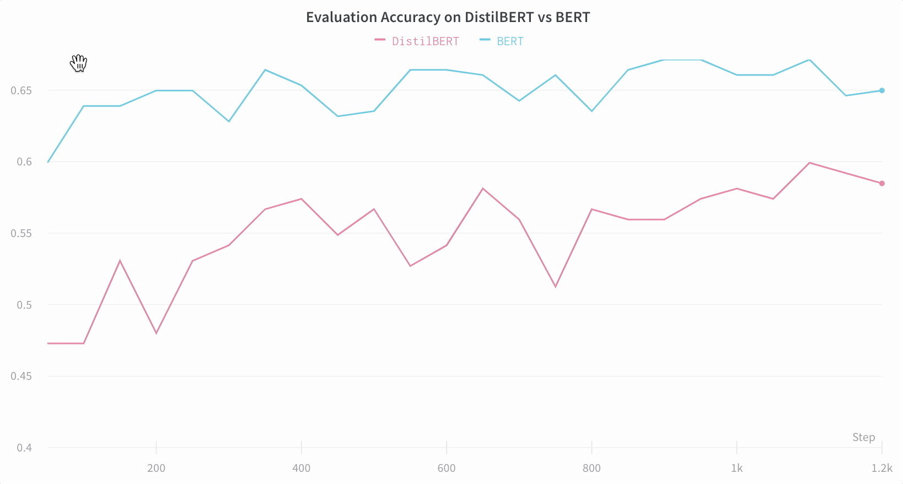

# Hugging Face

[Hugging Face](https://huggingface.co/) provides provides tools to quickly train neural networks for NLP \(Natural Language Processing\) on any task \(classification, translation, question answering, etc\) and any dataset with PyTorch and TensorFlow 2.0

W&B integration with 🤗 Hugging Face can automatically:

* log your configuration parameters
* log your losses and metrics
* log gradients and parameter distributions
* log your model
* keep track of your code
* log your system metrics \(GPU, CPU, memory, temperature, etc\)

## 🤗 Get going with no extra line of code!

To get training logged automatically, just install the library and log in:

```text
pip install wandb
wandb login
```

**Note**: To enable logging to W&B, set `report_to` to `wandb` in your `TrainingArguments` or script.

The `Trainer` or `TFTrainer` will automatically log losses, evaluation metrics, model topology and gradients.


Use `wandb.login()` in notebook environments \(Jupyter/Colab\)


## 📚 Check out real examples!

We've created a few examples for you to see how the integration works:

* [Demo in Google Colab](http://wandb.me/hf) with model logging
* [Huggingtweets ](https://wandb.ai/wandb/huggingtweets/reports/HuggingTweets-Train-a-Model-to-Generate-Tweets--VmlldzoxMTY5MjI)- Train a model to generate tweets
* [Does model size matter?](https://app.wandb.ai/jack-morris/david-vs-goliath/reports/Does-model-size-matter%3F-A-comparison-of-BERT-and-DistilBERT--VmlldzoxMDUxNzU) A comparison of BERT and DistilBERT

## 💻 Configuration options

Advanced configuration is possible by setting environment variables:

<table>
  <thead>
    <tr>
      <th style="text-align:left">Environment Variable</th>
      <th style="text-align:left">Options</th>
    </tr>
  </thead>
  <tbody>
    <tr>
      <td style="text-align:left">WANDB_LOG_MODEL</td>
      <td style="text-align:left">Log the model as artifact at the end of training (<b>false</b> by default)</td>
    </tr>
    <tr>
      <td style="text-align:left">WANDB_WATCH</td>
      <td style="text-align:left">
        <ul>
          <li><b>gradients</b> (default): Log histograms of the gradients</li>
          <li><b>all</b>: Log histograms of gradients and parameters</li>
          <li><b>false</b>: No gradient or parameter logging</li>
        </ul>
      </td>
    </tr>
    <tr>
      <td style="text-align:left">WANDB_PROJECT</td>
      <td style="text-align:left">Organize runs by project</td>
    </tr>
    <tr>
      <td style="text-align:left">WANDB_DISABLED</td>
      <td style="text-align:left">Set to <b>true</b> to disable logging entirely</td>
    </tr>
  </tbody>
</table>

Set run names with `run_name` argument present in scripts or as part of `TrainingArguments`.

Additional configuration options are available through generic [wandb environment variables](https://docs.wandb.com/library/environment-variables).

## 📊 Visualize Results

Explore your results dynamically in the W&B Dashboard. It's easy to look across dozens of experiments, zoom in on interesting findings, and visualize highly dimensional data.


Here's an example comparing [BERT vs DistilBERT](https://app.wandb.ai/jack-morris/david-vs-goliath/reports/Does-model-size-matter%3F-Comparing-BERT-and-DistilBERT-using-Sweeps--VmlldzoxMDUxNzU) — it's easy to see how different architectures effect the evaluation accuracy throughout training with automatic line plot visualizations.



