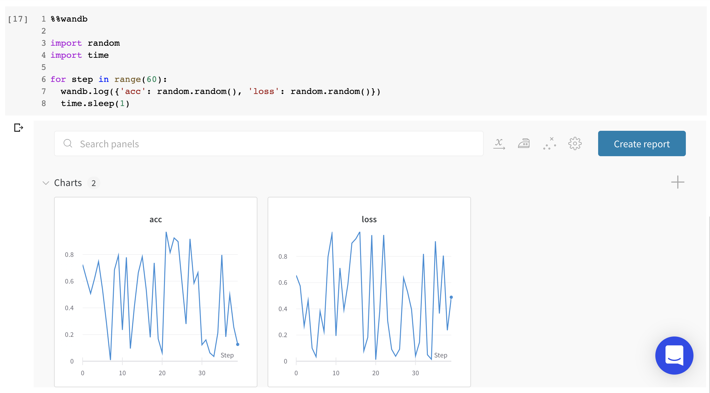

# Jupyter

Use Weights & Biases in your Jupyter notebooks to get interactive visualizations and do custom analysis on training runs.

## **Use Cases for W&B with Jupyter notebooks**

1. **Iterative experimentation**: Run and re-run experiments, tweaking parameters, and have all the runs you do saved automatically to W&B without having to take manual notes along the way.
2. **Code saving**: When reproducing a model, it's hard to know which cells in a notebook ran, and in which order. Turn on code saving on your [settings page ](https://app.wandb.ai/settings)to save a record of cell execution for each experiment.
3. **Custom analysis**: Once runs are logged to W&B, it's easy to get a dataframe from the API and do custom analysis, then log those results to W&B to save and share in reports.

## Configuring notebooks

Start your notebook with the following code to install W&B and link your account:

```python
!pip install wandb -qqq
import wandb
wandb.login()
```

Next, set up your experiment and save hyperparameters:

```python
wandb.init(project="jupyter-projo",
           config={
               "batch_size": 128,
               "learning_rate": 0.01,
               "dataset": "CIFAR-100",
           })
```

After running `wandb.init()` , start a new cell with `%%wandb` to see live graphs in the notebook. If you run this cell multiple times, data will be appended to the run.

```python
%%wandb

# Your training loop here
```

Try it for yourself in this [quick example script →](https://bit.ly/wandb-jupyter-widgets-colab)



As an alternative to the `%%wandb` decorator, after running `wandb.init()` you can end any cell with `wandb.run` to show in-line graphs:

```python
# Initialize wandb.run first
wandb.init()

# If cell outputs wandb.run, you'll see live graphs
wandb.run
```

## Additional Jupyter features in W&B

1. **Colab**: When you call `wandb.init()` for the first time in a Colab, we automatically authenticate your runtime if you're currently logged in to W&B in your browser. On the overview tab of your run page, you'll see a link to the Colab. If you turn on code saving in [settings](https://app.wandb.ai/settings), you can also see the cells that were executed to run the experiment, enabling better reproducibility.
2. **Launch Docker Jupyter**: Call `wandb docker --jupyter` to launch a docker container, mount your code in it, ensure Jupyter is installed, and launch on port 8888.
3. **run.finish\(\)**: By default, we wait until the next time wandb.init\(\) is called to mark a run as finished. That allows you to run individual cells and have them all log to the same run. To mark a run as complete manually in a Jupyter notebook, use the **run.finish\(\)** feature.

```python
import wandb
run = wandb.init()
# Training script and logging goes here
run.finish()
```

### **Silence W&B info messages**

To disable info messages, run the following in a notebook cell:

```python
import logging
logger = logging.getLogger("wandb")
logger.setLevel(logging.ERROR)
```

## Common Questions

### Notebook name

If you're seeing the error message "Failed to query for notebook name, you can set it manually with the WANDB\_NOTEBOOK\_NAME environment variable," you can solve this by setting the environment variable from your script like so: `os.environ['WANDB_NOTEBOOK_NAME'] = 'some text here'`

