# Scikit

You can use wandb to visualize and compare your scikit-learn models' performance with just a few lines of code. [**Try an example →**](https://colab.research.google.com/drive/1j_4UQTT0Lib8ueAU5zXECxesCj_ofjw7)

### Making Plots

#### Step 1: Import wandb and initialize a new run.

```python
import wandb
wandb.init(project="visualize-sklearn")

# load and preprocess dataset
# train a model
```

#### Step 2: Visualize individual plots.

```python
# Visualize single plot
wandb.sklearn.plot_confusion_matrix(y_true, y_pred, labels)
```

#### Or visualize all plots at once:

```python
# Visualize all classifier plots
wandb.sklearn.plot_classifier(clf, X_train, X_test, y_train, y_test, y_pred, y_probas, labels,
                                                         model_name='SVC', feature_names=None)

# All regression plots
wandb.sklearn.plot_regressor(reg, X_train, X_test, y_train, y_test,  model_name='Ridge')

# All clustering plots
wandb.sklearn.plot_clusterer(kmeans, X_train, cluster_labels, labels=None, model_name='KMeans')
```

### Supported Plots

#### Learning Curve

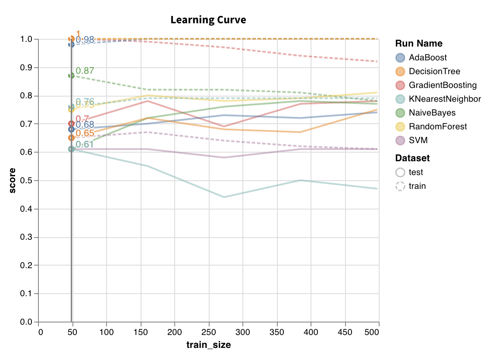

Trains model on datasets of varying lengths and generates a plot of cross validated scores vs dataset size, for both training and test sets.

`wandb.sklearn.plot_learning_curve(model, X, y)`

* model \(clf or reg\): Takes in a fitted regressor or classifier.
* X \(arr\): Dataset features.
* y \(arr\): Dataset labels.

#### ROC

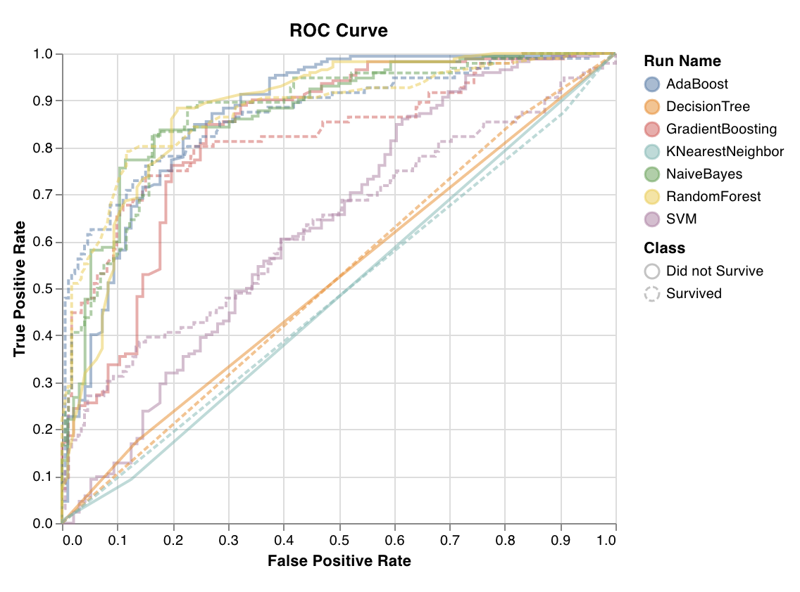

ROC curves plot true positive rate \(y-axis\) vs false positive rate \(x-axis\). The ideal score is a TPR = 1 and FPR = 0, which is the point on the top left. Typically we calculate the area under the ROC curve \(AUC-ROC\), and the greater the AUC-ROC the better.

`wandb.sklearn.plot_roc(y_true, y_probas, labels)`

* y\_true \(arr\): Test set labels.
* y\_probas \(arr\): Test set predicted probabilities.
* labels \(list\): Named labels for target varible \(y\).

#### Class Proportions

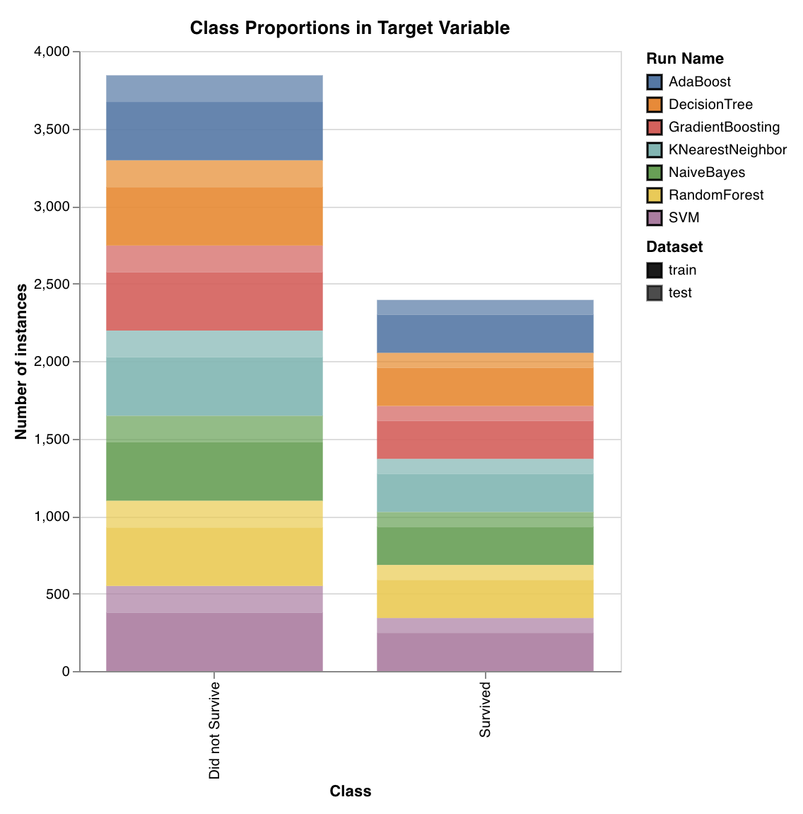

Plots the distribution of target classes in training and test sets. Useful for detecting imbalanced classes and ensuring that one class doesn't have a disproportionate influence on the model.

`wandb.sklearn.plot_class_proportions(y_train, y_test, ['dog', 'cat', 'owl'])`

* y\_train \(arr\): Training set labels.
* y\_test \(arr\): Test set labels.
* labels \(list\): Named labels for target varible \(y\).

#### Precision Recall Curve

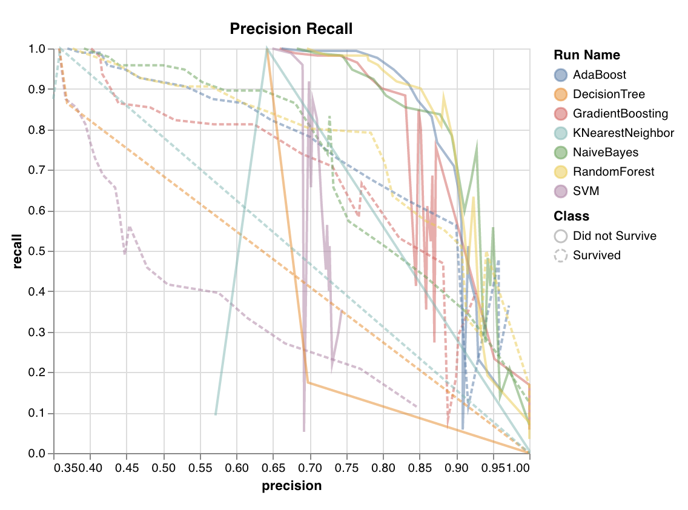

Computes the tradeoff between precision and recall for different thresholds. A high area under the curve represents both high recall and high precision, where high precision relates to a low false positive rate, and high recall relates to a low false negative rate.

High scores for both show that the classifier is returning accurate results \(high precision\), as well as returning a majority of all positive results \(high recall\). PR curve is useful when the classes are very imbalanced.

`wandb.sklearn.plot_precision_recall(y_true, y_probas, labels)`

* y\_true \(arr\): Test set labels.
* y\_probas \(arr\): Test set predicted probabilities.
* labels \(list\): Named labels for target varible \(y\).

#### Feature Importances

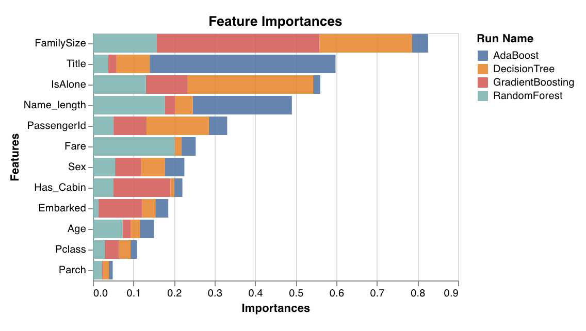

Evaluates and plots the importance of each feature for the classification task. Only works with classifiers that have a `feature_importances_` attribute, like trees.

`wandb.sklearn.plot_feature_importances(model, ['width', 'height, 'length'])`

* model \(clf\): Takes in a fitted classifier.
* feature\_names \(list\): Names for features. Makes plots easier to read by replacing feature indexes with corresponding names.

#### Calibration Curve

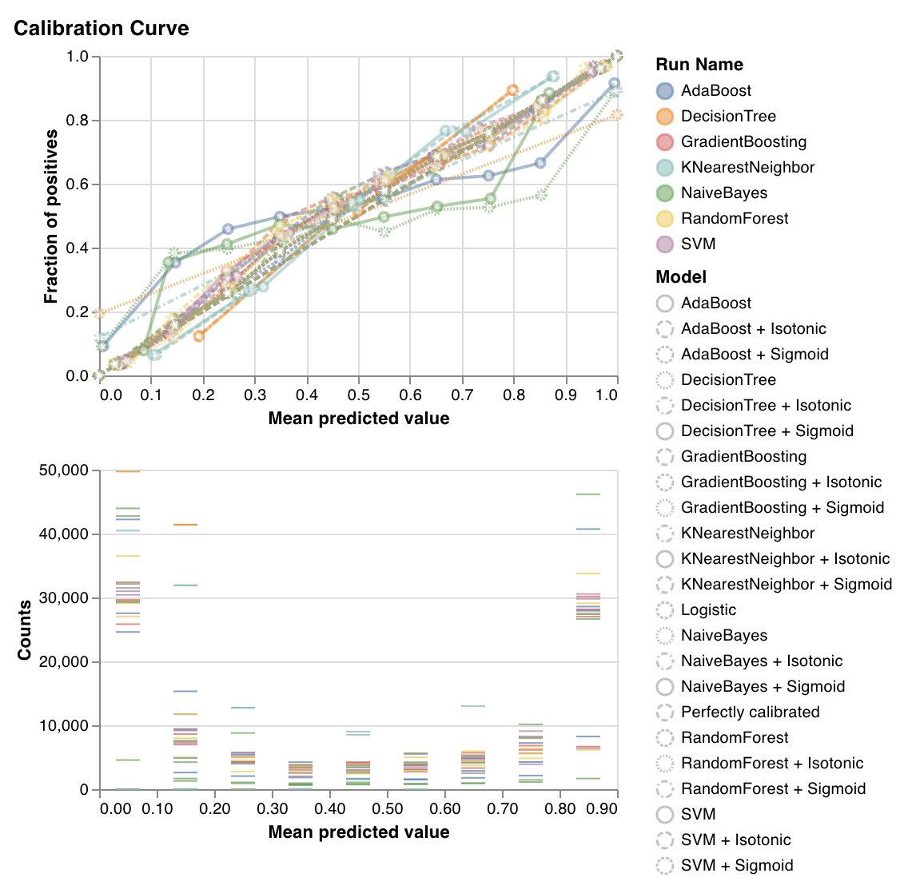

Plots how well calibrated the predicted probabilities of a classifier are and how to calibrate an uncalibrated classifier. Compares estimated predicted probabilities by a baseline logistic regression model, the model passed as an argument, and by both its isotonic calibration and sigmoid calibrations.

The closer the calibration curves are to a diagonal the better. A transposed sigmoid like curve represents an overfitted classifier, while a sigmoid like curve represents an underfitted classifier. By training isotonic and sigmoid calibrations of the model and comparing their curves we can figure out whether the model is over or underfitting and if so which calibration \(sigmoid or isotonic\) might help fix this.

For more details, check out [sklearn's docs](https://scikit-learn.org/stable/auto_examples/calibration/plot_calibration_curve.html).

`wandb.sklearn.plot_calibration_curve(clf, X, y, 'RandomForestClassifier')`

* model \(clf\): Takes in a fitted classifier.
* X \(arr\): Training set features.
* y \(arr\): Training set labels.
* model\_name \(str\): Model name. Defaults to 'Classifier'

#### Confusion Matrix

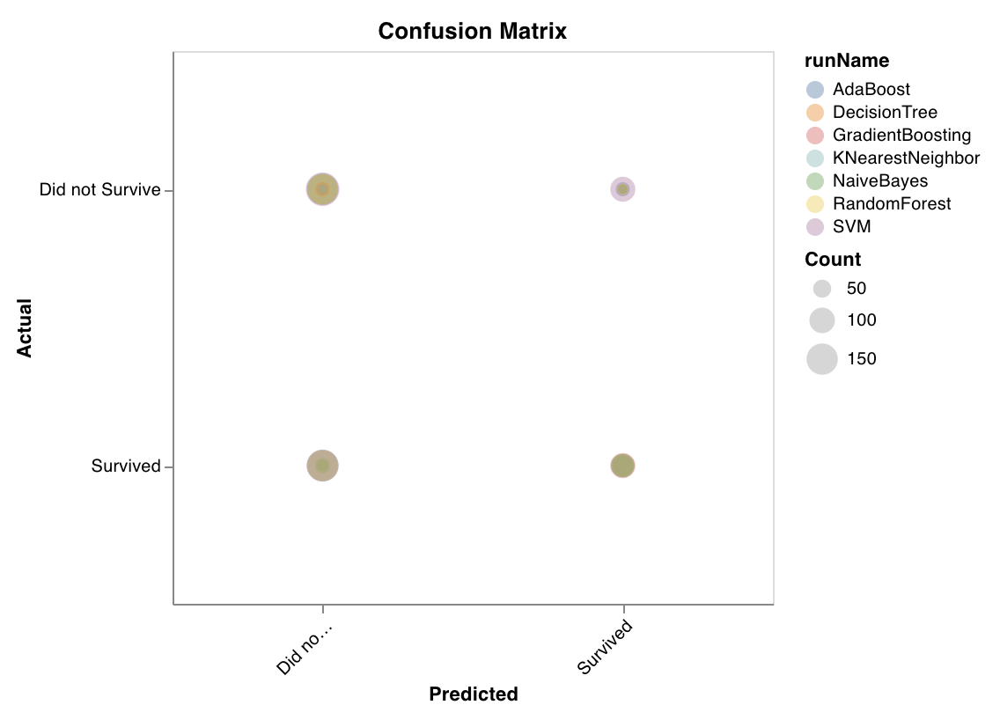

Computes the confusion matrix to evaluate the accuracy of a classification. It's useful for assessing the quality of model predictions and finding patterns in the predictions the model gets wrong. The diagonal represents the predictions the model got right, i.e. where the actual label is equal to the predicted label.

`wandb.sklearn.plot_confusion_matrix(y_true, y_pred, labels)`

* y\_true \(arr\): Test set labels.
* y\_pred \(arr\): Test set predicted labels.
* labels \(list\): Named labels for target variable \(y\).

#### Summary Metrics

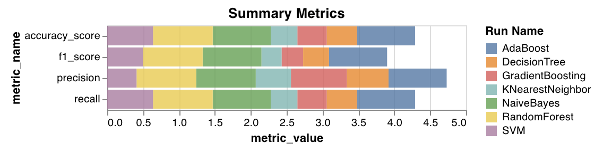

Calculates summary metrics \(like f1, accuracy, precision and recall for classification and mse, mae, r2 score for regression\) for both regression and classification algorithms.

`wandb.sklearn.plot_summary_metrics(model, X_train, X_test, y_train, y_test)`

* model \(clf or reg\): Takes in a fitted regressor or classifier.
* X \(arr\): Training set features.
* y \(arr\): Training set labels.
  * X\_test \(arr\): Test set features.
* y\_test \(arr\): Test set labels.

#### Elbow Plot

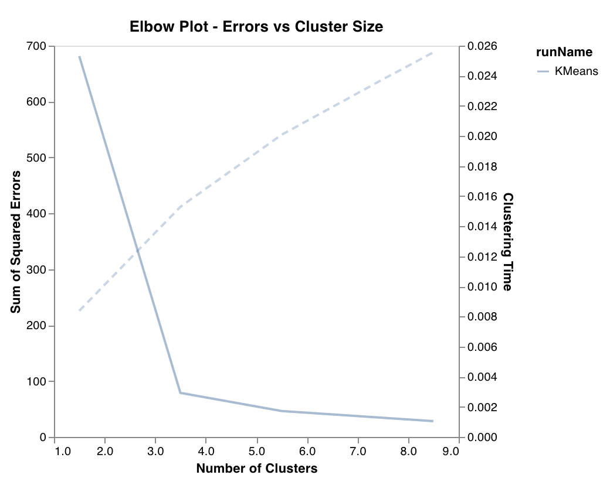

Measures and plots the percentage of variance explained as a function of the number of clusters, along with training times. Useful in picking the optimal number of clusters.

`wandb.sklearn.plot_elbow_curve(model, X_train)`

* model \(clusterer\): Takes in a fitted clusterer.
* X \(arr\): Training set features.

#### Silhouette Plot

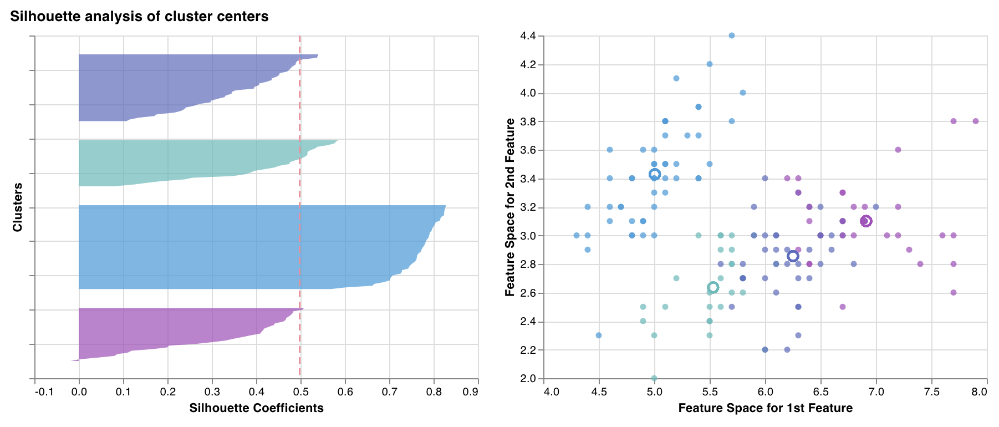

Measures & plots how close each point in one cluster is to points in the neighboring clusters. The thickness of the clusters corresponds to the cluster size. The vertical line represents the average silhouette score of all the points.

Silhouette coefficients near +1 indicate that the sample is far away from the neighboring clusters. A value of 0 indicates that the sample is on or very close to the decision boundary between two neighboring clusters and negative values indicate that those samples might have been assigned to the wrong cluster.

In general we want all silhouette cluster scores to be above average \(past the red line\) and as close to 1 as possible. We also prefer cluster sizes that reflect the underlying patterns in the data.

`wandb.sklearn.plot_silhouette(model, X_train, ['spam', 'not spam'])`

* model \(clusterer\): Takes in a fitted clusterer.
* X \(arr\): Training set features.
  * cluster\_labels \(list\): Names for cluster labels. Makes plots easier to read by replacing cluster indexes with corresponding names.

#### Outlier Candidates Plot

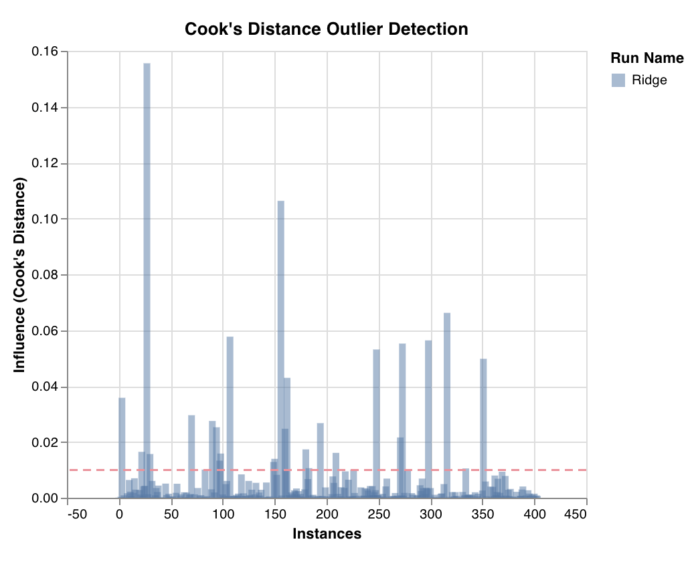

Measures a datapoint's influence on regression model via cook's distance. Instances with heavily skewed influences could potentially be outliers. Useful for outlier detection.

`wandb.sklearn.plot_outlier_candidates(model, X, y)`

* model \(regressor\): Takes in a fitted classifier.
* X \(arr\): Training set features.
* y \(arr\): Training set labels.

#### Residuals Plot

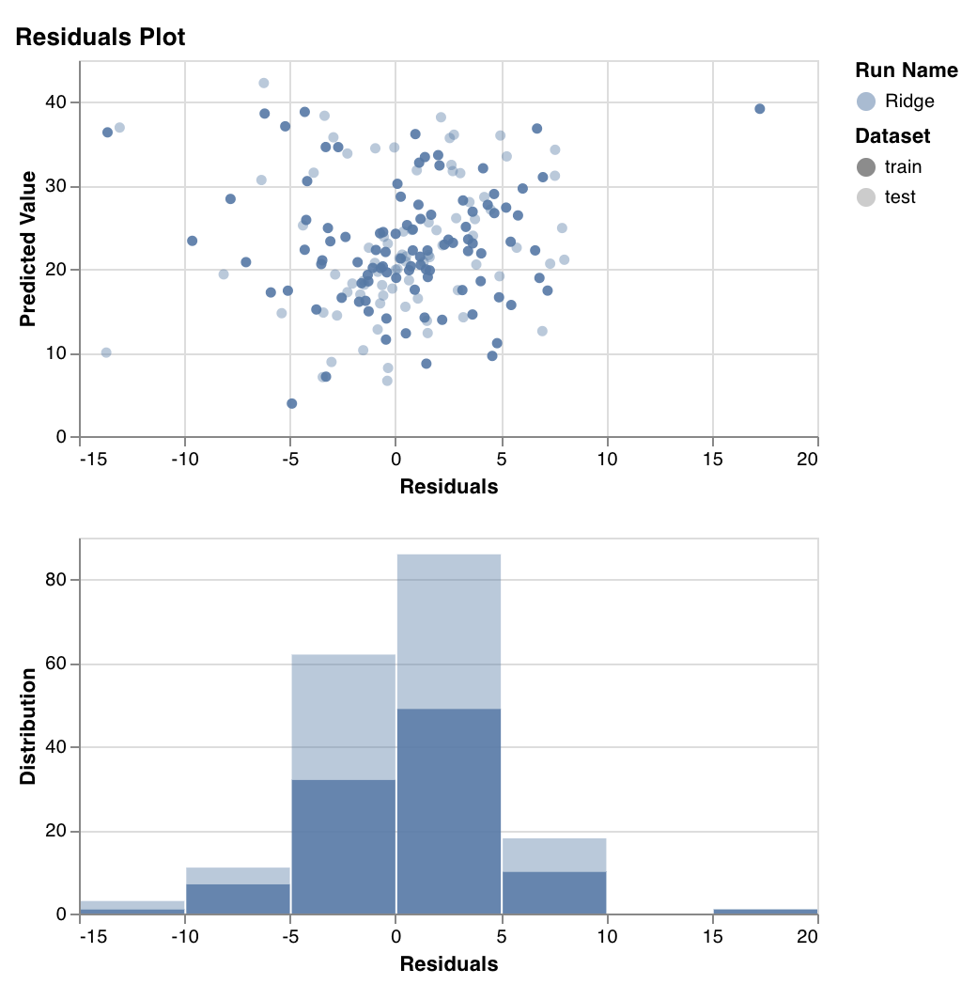

Measures and plots the predicted target values \(y-axis\) vs the difference between actual and predicted target values \(x-axis\), as well as the distribution of the residual error.

Generally, the residuals of a well-fit model should be randomly distributed because good models will account for most phenomena in a data set, except for random error.

`wandb.sklearn.plot_residuals(model, X, y)`

* model \(regressor\): Takes in a fitted classifier.
* X \(arr\): Training set features.
* y \(arr\): Training set labels.

  If you have any questions, we'd love to answer them in our [slack community](http://wandb.me/slack).

## Example

* [Run in colab](https://colab.research.google.com/drive/1tCppyqYFCeWsVVT4XHfck6thbhp3OGwZ): A simple notebook to get you started
* [Wandb Dashboard](https://app.wandb.ai/wandb/iris): View result on W&B

