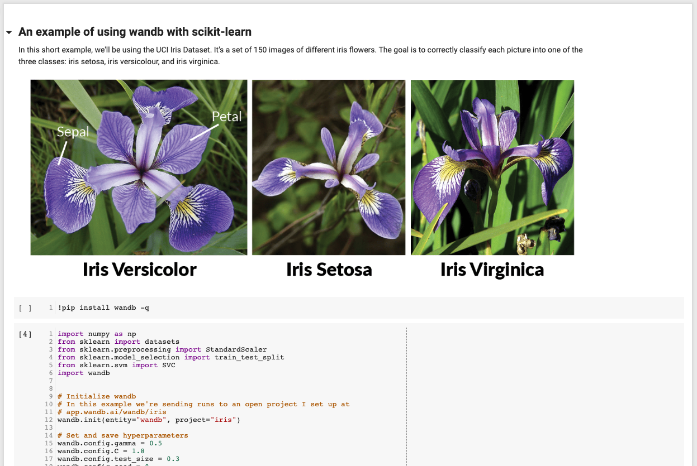

# Scikit Example

This example project shows how to use wandb with sklearn. 

I set up a [Google Colab](https://colab.research.google.com/drive/1tCppyqYFCeWsVVT4XHfck6thbhp3OGwZ) where you can run this example and see results in the [open project page](https://app.wandb.ai/wandb/iris).



```python
import numpy as np
from sklearn import datasets
from sklearn.preprocessing import StandardScaler
from sklearn.model_selection import train_test_split
from sklearn.svm import SVC
import wandb


# Initialize wandb
# In this example we're sending runs to an open project I set up at
# app.wandb.ai/wandb/iris
wandb.init(entity="wandb", project="iris")

# Set and save hyperparameters         
wandb.config.gamma = 0.5
wandb.config.C = 1.8
wandb.config.test_size = 0.3
wandb.config.seed = 0

iris = datasets.load_iris()

X = iris.data[:, [2, 3]]
y = iris.target

X_train, X_test, y_train, y_test = train_test_split(X, y, test_size=wandb.config.test_size, random_state=wandb.config.seed)

sc = StandardScaler()
sc.fit(X_train)

X_train_std = sc.transform(X_train)
X_test_std = sc.transform(X_test)

X_combined_std = np.vstack((X_train_std, X_test_std))
y_combined = np.hstack((y_train, y_test))

# Fit model
svm = SVC(kernel='rbf', random_state=wandb.config.seed, gamma=wandb.config.gamma, C=wandb.config.C)
svm.fit(X_train_std, y_train)

# Save metrics
wandb.log({"Train Accuracy": svm.score(X_train_std, y_train), 
           "Test Accuracy": svm.score(X_test_std, y_test)})

# Create a matplotlib custom plot to save 
def plot_data():
    from matplotlib.colors import ListedColormap
    import matplotlib.pyplot as plt

    markers = ('s', 'x', 'o')
    colors = ('red', 'blue', 'lightgreen')
    cmap = ListedColormap(colors[:len(np.unique(y_test))])
    for idx, cl in enumerate(np.unique(y)):
        plt.scatter(x=X[y == cl, 0], y=X[y == cl, 1],
               c=cmap(idx), marker=markers[idx], label=cl)

    wandb.log({"Data": plt})

plot_data()
```

