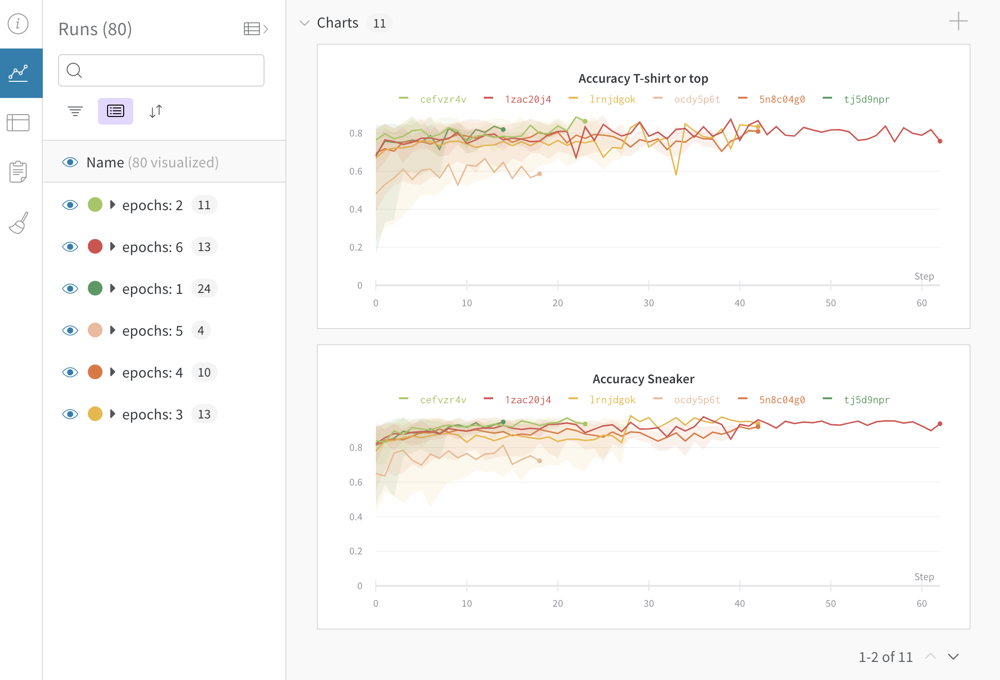
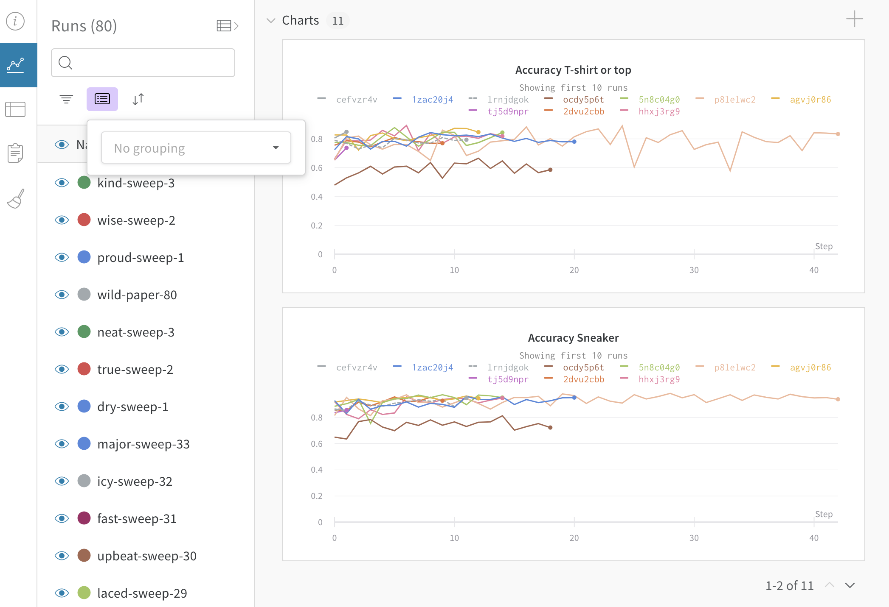
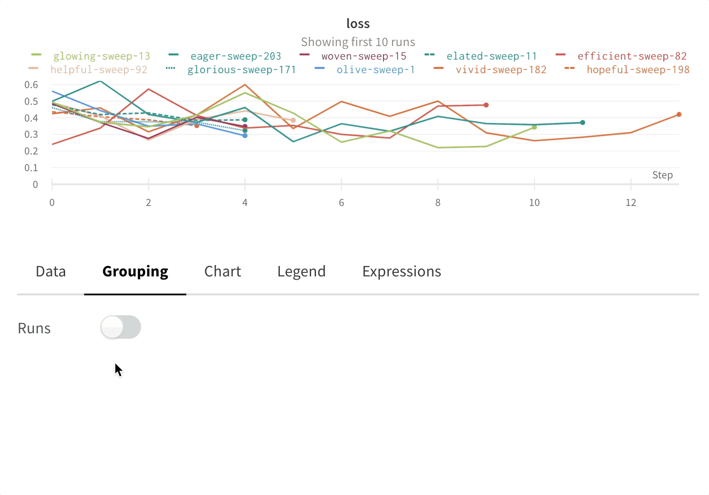

# Grouping

Group individual runs into experiments by passing a unique **group** name to **wandb.init\(\)**.

### **Use Cases**

1. **Distributed training:** Use grouping if your experiments are split up into different pieces with separate training and evaluation scripts that should be viewed as parts of a larger whole.
2. **Multiple processes**: Group multiple smaller processes together into an experiment.
3. **K-fold cross-validation**: Group together runs with different random seeds to see a larger experiment. Here's [an example](https://github.com/wandb/examples/tree/master/examples/wandb-sweeps/sweeps-cross-validation) of k-fold cross validation with sweeps and grouping.

### What it looks like

If you set grouping in your script, we will group the runs by default in the table in the UI. You can toggle this on and off by clicking the **Group** button at the top of the table. Here's an example of grouping on the project page.

* **Sidebar**: Runs are grouped by the number of epochs.
* **Graphs**: Each line represents the mean of the group, and the shading indicates the variance. This behavior can be change in the graph settings.

There are a few ways to use grouping:

**Setting a group in your script**

Pass an optional group and job\_type to wandb.init\(\). For example:`wandb.init(group="experiment_1", job_type="eval")`**. Group** should be unique within your project and shared by all runs in the group.  You can use `wandb.util.generate_id()` to generate a unique 8 character string to use in all your processes— for example:`os.environ["WANDB_RUN_GROUP"] = "experiment-" + wandb.util.generate_id()`

**Set a group environment variable**

Use `WANDB_RUN_GROUP` to specify a group for your runs as an environment variable. For more on this, check our docs for [**Environment Variables**](environment-variables.md)**.**

**Toggle grouping in the UI**

You can dynamically group by any config column. For example, if you use `wandb.config` to log batch size or learning rate, you can then group by those hyperparameters dynamically in the web app. 

### Turn off grouping

Click the grouping button and clear group fields at any time, which returns the table and graphs to their ungrouped state.

### Grouping graph settings

Click the edit button in the upper right corner of a graph and select the **Advanced** tab to change the line and shading. You can select the mean, minimum, or maximum value to for the line in each group. For the shading, you can turn off shading, show the min and max, the standard deviation, and the standard error.

