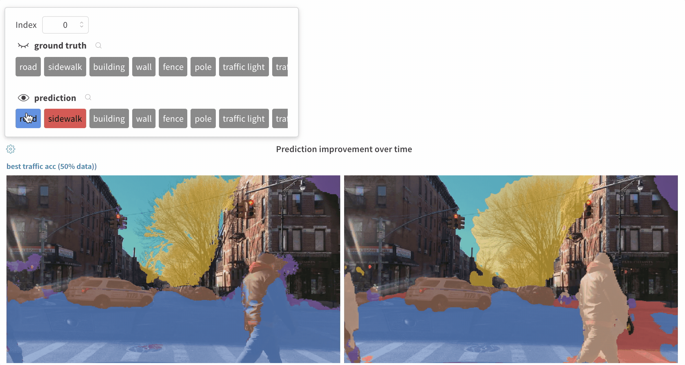
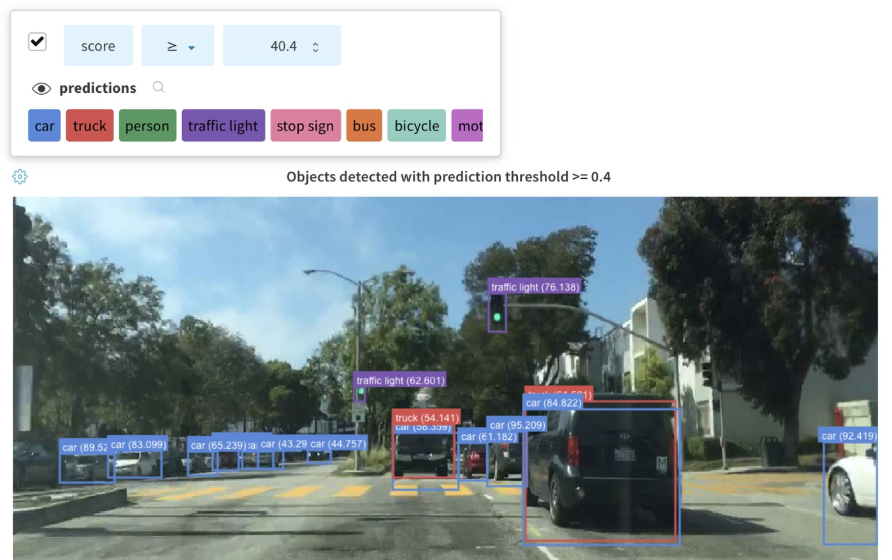
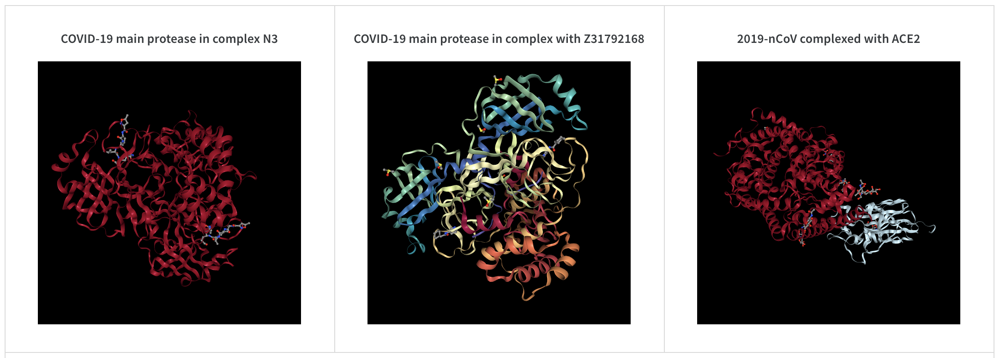
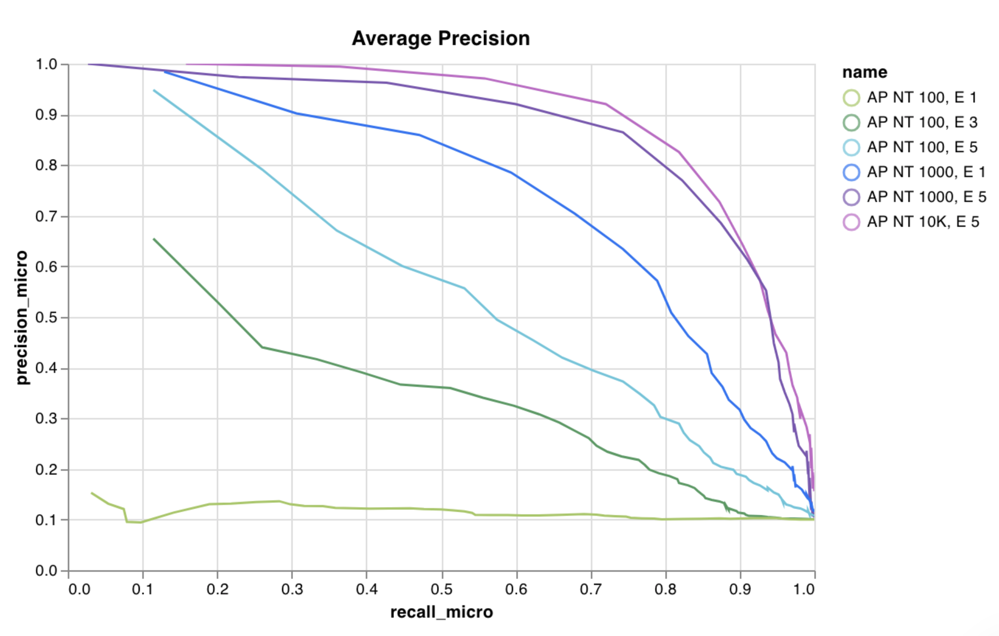
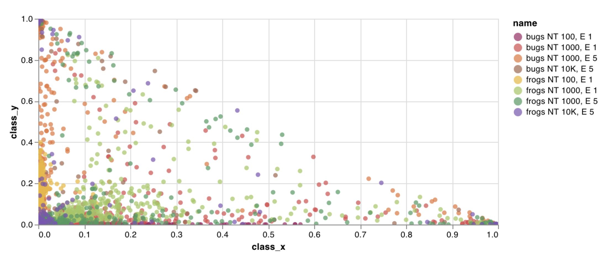
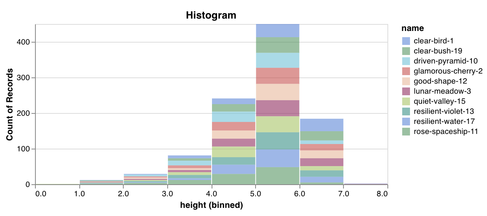
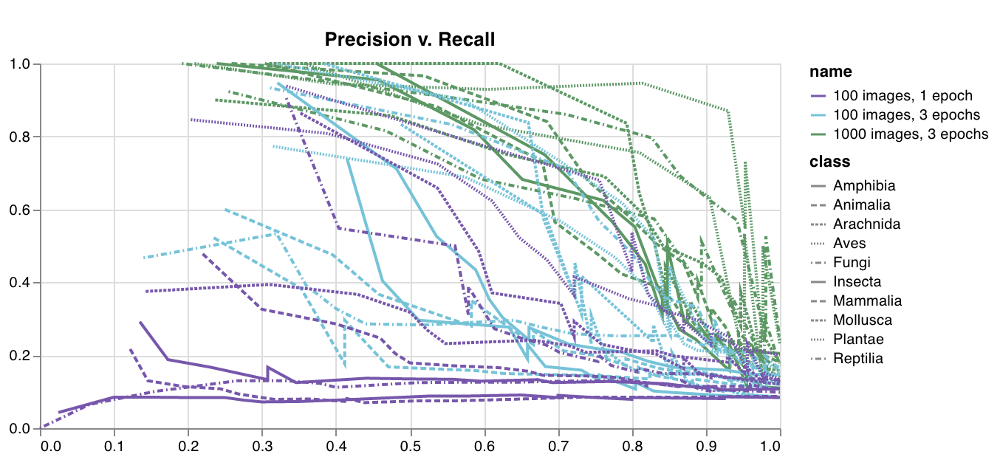
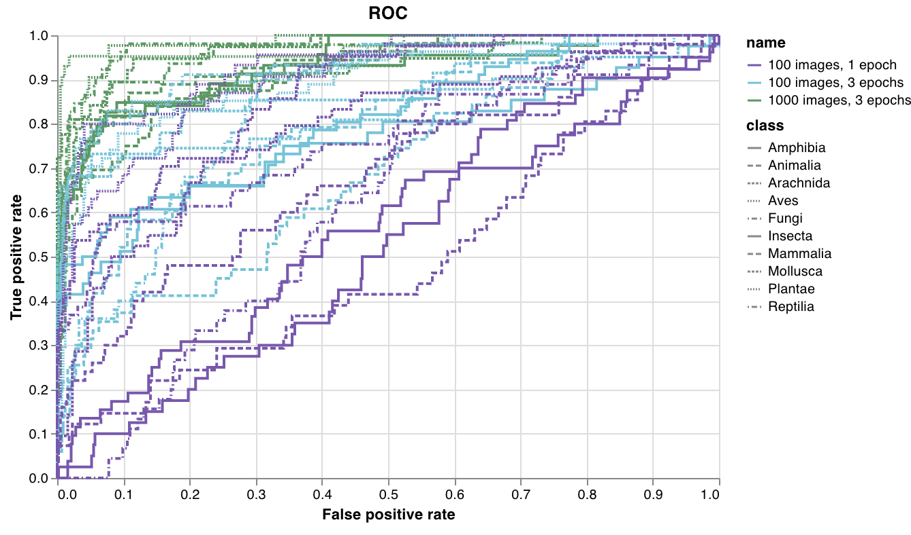
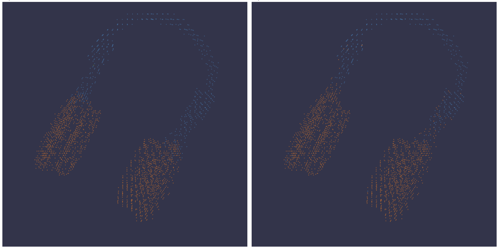

# wandb.log\(\)

Call `wandb.log(dict)` to log a dictionary of metrics or custom objects to a step. By default we increment the step each time, so you'll see outputs of your model over time in graphs and rich visualizations.

Keyword arguments:

* **step** — Which time step to associate the logs with \(see [Incremental Logging](log.md#incremental-logging)\)
* **commit** — By default commit=true, which means we increment the step each time you call wandb.log. Set commit=false to have multiple sequential wandb.log\(\) commands save data to the same step.

Example usage:

```python
wandb.log({'accuracy': 0.9, 'epoch': 5})
```

## Logging Objects

We support images, video, audio, custom graphs, and more. Log rich media to explore your results and visualize comparisons between your runs.

[Try it in Colab ](https://colab.research.google.com/drive/15MJ9nLDIXRvy_lCwAou6C2XN3nppIeEK)

### Histograms

```python
wandb.log({"gradients": wandb.Histogram(numpy_array_or_sequence)})
wandb.run.summary.update({"gradients": wandb.Histogram(np_histogram=np.histogram(data))})
```

If a sequence is provided as the first argument, we will bin the histogram automatically. You can also pass what is returned from np.histogram to the np\_histogram keyword argument to do your own binning. The maximum number of bins supported is 512. You can use the optional num\_bins keyword argument when passing a sequence to override the default of 64 bins.

If histograms are in your summary they will appear as sparklines on the individual run pages. If they are in your history, we plot a heatmap of bins over time.

### Images and Overlays



`wandb.log({"examples": [wandb.Image(numpy_array_or_pil, caption="Label")]})`

If a numpy array is supplied we assume it's gray scale if the last dimension is 1, RGB if it's 3, and RGBA if it's 4. If the array contains floats we convert them to ints between 0 and 255. You can specify a [mode](https://pillow.readthedocs.io/en/3.1.x/handbook/concepts.html#concept-modes) manually or just supply a `PIL.Image`. It's recommended to log fewer than 50 images per step.



If you have images with masks for semantic segmentation, you can log the masks and toggle them on and off in the UI. To log multiple masks, log a mask dictionary with multiple keys. Here's an example:

* **mask\_data**: a 2D numpy array containing an integer class label for each pixel
* **class\_labels**: a dictionary mapping the numbers from **mask\_data** to readable labels

```python
mask_data = np.array([[1, 2, 2, ... , 2, 2, 1], ...])

class_labels = {
  1: "tree",
  2: "car",
  3: "road"
}

mask_img = wandb.Image(image, masks={
  "predictions": {
    "mask_data": mask_data,
    "class_labels": class_labels
  },
  "groud_truth": {
    ...
  },
  ...
})
```

[See a live example →](https://app.wandb.ai/stacey/deep-drive/reports/Image-Masks-for-Semantic-Segmentation--Vmlldzo4MTUwMw)

[Sample code →](https://colab.research.google.com/drive/1SOVl3EvW82Q4QKJXX6JtHye4wFix_P4J)





Log bounding boxes with images, and use filters and toggles to dynamically visualize different sets of boxes in the UI.

```python
class_id_to_label = {
    1: "car",
    2: "road",
    3: "building",
    ....
}

img = wandb.Image(image, boxes={
    "predictions": {
        "box_data": [{
            "position": {
                "minX": 0.1,
                "maxX": 0.2,
                "minY": 0.3,
                "maxY": 0.4,
            },
            "class_id" : 2,
            "box_caption": "minMax(pixel)",
            "scores" : {
                "acc": 0.1,
                "loss": 1.2
            },
        }, 
        # Log as many boxes as needed
        ...
        ],
        "class_labels": class_id_to_label
    },
    "ground_truth": {
    # Log each group of boxes with a unique key name
    ...
    }
})

wandb.log({"driving_scene": img})
```

Optional Parameters

`class_labels` An optional argument mapping your class\_ids to string values. By default we will generate class\_labels `class_0`, `class_1`, etc...

Boxes - Each box passed into box\_data can be defined with different coordinate systems.

`position`

* Option 1: `{minX, maxX, minY, maxY}` Provide a set of coordinates defining the upper and lower bounds of each box dimension.
* Option 2: `{middle, width, height}`  Provide a set of coordinates specifying the middle coordinates as `[x,y]`, and `width`, and `height` as scalars 

`domain` Change the domain of your position values based on your data representation

* `percentage` \(Default\) A relative value representing the percent of the image as distance
* `pixel`An absolute pixel value

[See a live example →](https://app.wandb.ai/stacey/yolo-drive/reports/Bounding-Boxes-for-Object-Detection--Vmlldzo4Nzg4MQ)





### Media



```python
wandb.log({"examples": [wandb.Audio(numpy_array, caption="Nice", sample_rate=32)]})
```

The maximum number of audio clips that can be logged per step is 100.



```python
wandb.log({"video": wandb.Video(numpy_array_or_path_to_video, fps=4, format="gif")})
```

If a numpy array is supplied we assume the dimensions are: time, channels, width, height. By default we create a 4 fps gif image \(ffmpeg and the moviepy python library is required when passing numpy objects\). Supported formats are "gif", "mp4", "webm", and "ogg". If you pass a string to `wandb.Video` we assert the file exists and is a supported format before uploading to wandb. Passing a BytesIO object will create a tempfile with the specified format as the extension.

On the W&B runs page, you will see your videos in the Media section.



Use wandb.Table\(\) to log text in tables to show up in the UI. By default, the column headers are `["Input", "Output", "Expected"]`. The maximum number of rows is 10,000.

```python
# Method 1
data = [["I love my phone", "1", "1"],["My phone sucks", "0", "-1"]]
wandb.log({"examples": wandb.Table(data=data, columns=["Text", "Predicted Label", "True Label"])})

# Method 2
table = wandb.Table(columns=["Text", "Predicted Label", "True Label"])
table.add_data("I love my phone", "1", "1")
table.add_data("My phone sucks", "0", "-1")
wandb.log({"examples": table})
```



```python
wandb.log({"custom_file": wandb.Html(open("some.html"))})
wandb.log({"custom_string": wandb.Html('<a href="https://mysite">Link</a>')})
```

Custom html can be logged at any key, this exposes an HTML panel on the run page. By default we inject default styles, you can disable default styles by passing `inject=False`.

```python
wandb.log({"custom_file": wandb.Html(open("some.html"), inject=False)})
```



```python
wandb.log({"protein": wandb.Molecule(open("6lu7.pdb"))}
```

Log molecular data in any of 10 file types:

`'pdb', 'pqr', 'mmcif', 'mcif', 'cif', 'sdf', 'sd', 'gro', 'mol2', 'mmtf'`

When your run finishes, you'll be able to interact with 3D visualizations of your molecules in the UI.

[See a live example →](https://app.wandb.ai/nbaryd/Corona-Virus/reports/Visualizing-Molecular-Structure-with-Weights-%26-Biases--Vmlldzo2ODA0Mw)





### Custom Charts

These presets have builtin `wandb.plot` methods that make it fast to log charts directly from your script and see the exact visualizations you're looking for in the UI.



`wandb.plot.line()`

Log a custom line plot—a list of connected and ordered points \(x,y\) on arbitrary axes x and y.

```python
data = [[x, y] for (x, y) in zip(x_values, y_values)]
table = wandb.Table(data=data, columns = ["x", "y"])
wandb.log({"my_custom_plot_id" : wandb.plot.line(table, "x", "y", title="Custom Y vs X Line Plot")})
```

You can use this to log curves on any two dimensions. Note that if you're plotting two lists of values against each other, the number of values in the lists must match exactly \(i.e. each point must have an x and a y\).



[See in the app →](https://wandb.ai/wandb/plots/reports/Custom-Line-Plots--VmlldzoyNjk5NTA)

[Run the code →](https://tiny.cc/custom-charts)



`wandb.plot.scatter()`

Log a custom scatter plot—a list of points \(x, y\) on a pair of arbitrary axes x and y.

```python
data = [[x, y] for (x, y) in zip(class_x_prediction_scores, class_y_prediction_scores)]
table = wandb.Table(data=data, columns = ["class_x", "class_y"])
wandb.log({"my_custom_id" : wandb.plot.scatter(table, "class_x", "class_y")})
```

You can use this to log scatter points on any two dimensions. Note that if you're plotting two lists of values against each other, the number of values in the lists must match exactly \(i.e. each point must have an x and a y\).



[See in the app →](https://wandb.ai/wandb/plots/reports/Custom-Scatter-Plots--VmlldzoyNjk5NDQ)

[Run the code →](https://tiny.cc/custom-charts)



`wandb.plot.bar()`

Log a custom bar chart—a list of labeled values as bars—natively in a few lines:

```python
data = [[label, val] for (label, val) in zip(labels, values)]
table = wandb.Table(data=data, columns = ["label", "value"])
wandb.log({"my_bar_chart_id" : wandb.plot.bar(table, "label", "value", title="Custom Bar Chart")
```

You can use this to log arbitrary bar charts. Note that the number of labels and values in the lists must match exactly \(i.e. each data point must have both\).


[See in the app →](https://wandb.ai/wandb/plots/reports/Custom-Bar-Charts--VmlldzoyNzExNzk)

[Run the code →](https://tiny.cc/custom-charts)



`wandb.plot.histogram()`

Log a custom histogram—sort list of values into bins by count/frequency of occurrence—natively in a few lines. Let's say I have a list of prediction confidence scores \(`scores`\) and want to visualize their distribution:

```python
data = [[s] for s in scores]
table = wandb.Table(data=data, columns=["scores"])
wandb.log({'my_histogram': wandb.plot.histogram(table, "scores", title=None)})
```

You can use this to log arbitrary histograms. Note that `data` is a list of lists, intended to support a 2D array of rows and columns.



[See in the app →](https://wandb.ai/wandb/plots/reports/Custom-Histograms--VmlldzoyNzE0NzM)

[Run the code →](https://tiny.cc/custom-charts)



`wandb.plot.pr_curve()`

Log a [Precision-Recall curve](https://scikit-learn.org/stable/modules/generated/sklearn.metrics.precision_recall_curve.html#sklearn.metrics.precision_recall_curve) in one line:

```python
wandb.log({"pr" : wandb.plot.pr_curve(ground_truth, predictions,
                     labels=None, classes_to_plot=None)})
```

You can log this whenever your code has access to:

* a model's predicted scores \(`predictions`\) on a set of examples
* the corresponding ground truth labels \(`ground_truth`\) for those examples
* \(optionally\) a list of the labels/class names \(`labels=["cat", "dog", "bird"...]` if label index 0 means cat, 1 = dog, 2 = bird, etc.\)
* \(optionally\) a subset \(still in list format\) of the labels to visualize in the plot



[See in the app →](https://wandb.ai/wandb/plots/reports/Plot-Precision-Recall-Curves--VmlldzoyNjk1ODY)

[Run the code →](https://colab.research.google.com/drive/1mS8ogA3LcZWOXchfJoMrboW3opY1A8BY?usp=sharing)



`wandb.plot.roc_curve()`

Log an [ROC curve](https://scikit-learn.org/stable/modules/generated/sklearn.metrics.roc_curve.html#sklearn.metrics.roc_curve) in one line:

```text
wandb.log({"roc" : wandb.plot.roc_curve( ground_truth, predictions, \
                        labels=None, classes_to_plot=None)})
```

You can log this whenever your code has access to:

* a model's predicted scores \(`predictions`\) on a set of examples
* the corresponding ground truth labels \(`ground_truth`\) for those examples
* \(optionally\) a list of the labels/ class names \(`labels=["cat", "dog", "bird"...]` if label index 0 means cat, 1 = dog, 2 = bird, etc.\)
* \(optionally\) a subset \(still in list format\) of these labels to visualize on the plot



[See in the app →](https://wandb.ai/wandb/plots/reports/Plot-ROC-Curves--VmlldzoyNjk3MDE)

[Run the code →](https://colab.research.google.com/drive/1_RMppCqsA8XInV_jhJz32NCZG6Z5t1RO?usp=sharing)



### **Custom presets**

Tweak a builtin Custom Chart preset, or create a new preset, then save the chart. Use the chart ID to log data to that custom preset directly from your script.

```python
# Create a table with the columns to plot
table = wandb.Table(data=data, columns=["step", "height"])

# Map from the table's columns to the chart's fields
fields = {"x": "step",
          "value": "height"}

# Use the table to populate the new custom chart preset
# To use your own saved chart preset, change the vega_spec_name
my_custom_chart = wandb.plot_table(vega_spec_name="carey/new_chart",
              data_table=table,
              fields=fields,
              )
```

[Run the code →](https://tiny.cc/custom-charts)

### Matplotlib

```python
import matplotlib.pyplot as plt
plt.plot([1, 2, 3, 4])
plt.ylabel('some interesting numbers')
wandb.log({"chart": plt})
```

You can pass a `matplotlib` pyplot or figure object to `wandb.log()`. By default we'll convert the plot into a [Plotly](https://plot.ly/) plot. If you want to explicitly log the plot as an image, you can pass the plot into `wandb.Image`. We also accept directly logging Plotly charts.

### 3D Visualizations



Log files in the formats `obj`, `gltf`, or `glb`, and we will render them in the UI when your run finishes.

```python
wandb.log({"generated_samples":
           [wandb.Object3D(open("sample.obj")),
            wandb.Object3D(open("sample.gltf")),
            wandb.Object3D(open("sample.glb"))]})
```



[See a live example →](https://app.wandb.ai/nbaryd/SparseConvNet-examples_3d_segmentation/reports/Point-Clouds--Vmlldzo4ODcyMA)



Log 3D point clouds and Lidar scenes with bounding boxes. Pass in a numpy array containing coordinates and colors for the points to render.

```python
point_cloud = np.array([[0, 0, 0, COLOR...], ...])

wandb.log({"point_cloud": wandb.Object3D(point_cloud)})
```

Three different shapes of numpy arrays are supported for flexible color schemes.

* `[[x, y, z], ...]` `nx3`
* `[[x, y, z, c], ...]` `nx4` `| c is a category` in the range `[1, 14]` \(Useful for segmentation\)
* `[[x, y, z, r, g, b], ...]` `nx6 | r,g,b` are values in the range `[0,255]`for red, green, and blue color channels.

Here's an example of logging code below:

* `points`is a numpy array with the same format as the simple point cloud renderer shown above.
* `boxes` is a numpy array of python dictionaries with three attributes:
  * `corners`- a list of eight corners
  * `label`- a string representing the label to be rendered on the box \(Optional\)
  * `color`- rgb values representing the color of the box 
* `type` is a string representing the scene type to render. Currently the only supported value is `lidar/beta`

```python
# Log points and boxes in W&B
wandb.log(
        {
            "point_scene": wandb.Object3D(
                {
                    "type": "lidar/beta",
                    "points": np.array(
                        [
                            [0.4, 1, 1.3], 
                            [1, 1, 1], 
                            [1.2, 1, 1.2]
                        ]
                    ),
                    "boxes": np.array(
                        [
                            {
                                "corners": [
                                    [0,0,0],
                                    [0,1,0],
                                    [0,0,1],
                                    [1,0,0],
                                    [1,1,0],
                                    [0,1,1],
                                    [1,0,1],
                                    [1,1,1]
                                ],
                                "label": "Box",
                                "color": [123,321,111],
                            },
                            {
                                "corners": [
                                    [0,0,0],
                                    [0,2,0],
                                    [0,0,2],
                                    [2,0,0],
                                    [2,2,0],
                                    [0,2,2],
                                    [2,0,2],
                                    [2,2,2]
                                ],
                                "label": "Box-2",
                                "color": [111,321,0],
                            }
                        ]
                    ),
                    "vectors": [
                        {"start": [0,0,0], "end": [0.1,0.2,0.5]}
                    ]
                }
            )
        }
    )
```



## Incremental Logging

If you want to log to a single history step from lots of different places in your code you can pass a step index to `wandb.log()` as follows:

```python
wandb.log({'loss': 0.2}, step=step)
```

As long as you keep passing the same value for `step`, W&B will collect the keys and values from each call in one unified dictionary. As soon you call `wandb.log()` with a different value for `step` than the previous one, W&B will write all the collected keys and values to the history, and start collection over again. Note that this means you should only use this with consecutive values for `step`: 0, 1, 2, .... This feature doesn't let you write to absolutely any history step that you'd like, only the "current" one and the "next" one.

You can also set **commit=False** in `wandb.log` to accumulate metrics, just be sure to call `wandb.log` without the **commit** flag to persist the metrics.

```python
wandb.log({'loss': 0.2}, commit=False)
# Somewhere else when I'm ready to report this step:
wandb.log({'accuracy': 0.8})
```

## Summary Metrics

The summary statistics are used to track single metrics per model. If a summary metric is modified, only the updated state is saved. We automatically set summary to the last history row added unless you modify it manually. If you change a summary metric, we only persist the last value it was set to.

```python
wandb.init(config=args)

best_accuracy = 0
for epoch in range(1, args.epochs + 1):
  test_loss, test_accuracy = test()
  if (test_accuracy > best_accuracy):
    wandb.run.summary["best_accuracy"] = test_accuracy
    best_accuracy = test_accuracy
```

You may want to store evaluation metrics in a runs summary after training has completed. Summary can handle numpy arrays, pytorch tensors or tensorflow tensors. When a value is one of these types we persist the entire tensor in a binary file and store high level metrics in the summary object such as min, mean, variance, 95% percentile, etc.

```python
api = wandb.Api()
run = api.run("username/project/run_id")
run.summary["tensor"] = np.random.random(1000)
run.summary.update()
```

### Accessing Logs Directly

The history object is used to track metrics logged by _wandb.log_. You can access a mutable dictionary of metrics via `run.history.row`. The row will be saved and a new row created when `run.history.add` or `wandb.log` is called.

#### Tensorflow Example

```python
wandb.init(config=flags.FLAGS)

# Start tensorflow training
with tf.Session() as sess:
  sess.run(init)

  for step in range(1, run.config.num_steps+1):
      batch_x, batch_y = mnist.train.next_batch(run.config.batch_size)
      # Run optimization op (backprop)
      sess.run(train_op, feed_dict={X: batch_x, Y: batch_y})
      # Calculate batch loss and accuracy
      loss, acc = sess.run([loss_op, accuracy], feed_dict={X: batch_x, Y: batch_y})

      wandb.log({'acc': acc, 'loss':loss}) # log accuracy and loss
```

#### PyTorch Example

```python
# Start pytorch training
wandb.init(config=args)

for epoch in range(1, args.epochs + 1):
  train_loss = train(epoch)
  test_loss, test_accuracy = test()

  torch.save(model.state_dict(), 'model')

  wandb.log({"loss": train_loss, "val_loss": test_loss})
```

## Common Questions

### **Compare images from different epochs**

Each time you log images from a step, we save them to show in the UI. Pin the image panel, and use the **step slider** to look at images from different steps. This makes it easy to compare how a model's output changes over training.

```python
wandb.log({'epoch': epoch, 'val_acc': 0.94})
```

### Batch logging

If you'd like to log certain metrics in every batch and standardize plots, you can log x axis values that you want to plot with your metrics. Then in the custom plots, click edit and select the custom x-axis.

```python
wandb.log({'batch': 1, 'loss': 0.3})
```

### **Log a PNG**

wandb.Image converts numpy arrays or instances of PILImage to PNG's by default.

```python
wandb.log({"example": wandb.Image(...)})
# Or multiple images
wandb.log({"example": [wandb.Image(...) for img in images]})
```

### **Log a JPEG**

To save a JPEG you can pass a path to a file:

```python
im = PIL.fromarray(...)
rgb_im = im.convert('RGB')
rgb_im.save('myimage.jpg')
wandb.log({"example": wandb.Image("myimage.jpg")})
```

### **Log a Video**

```python
wandb.log({"example": wandb.Video("myvideo.mp4")})
```

Now you can view videos in the media browser. Go to your project workspace, run workspace, or report and click "Add visualization" to add a rich media panel.

### Custom x-axis

By default, we increment the global step every time you call wandb.log. If you'd like, you can log your own monotonically increasing step and then select it as a custom x-axis on your graphs.

For example, if you have training and validation steps you'd like to align, pass us your own step counter: `wandb.log({“acc”:1, “global_step”:1})`. Then in the graphs choose "global\_step" as the x-axis.

`wandb.log({“acc”:1,”batch”:10}, step=epoch)` would enable you to choose “batch” as an x axis in addition to the default step axis

### Navigating and zooming in point clouds

You can hold control and use the mouse to move around inside the space

### Nothing shows up in the graphs

If you're seeing "No visualization data logged yet" that means that we haven't gotten the first wandb.log call from your script yet. This could be because your run takes a long time to finish a step. If you're logging at the end of each epoch, you could log a few times per epoch to see data stream in more quickly.

### **Duplicate metric names**

If you're logging different types under the same key, we have to split them out in the database. This means you'll see multiple entries of the same metric name in a dropdown in the UI. The types we group by are `number`, `string`, `bool`, `other` \(mostly arrays\), and any wandb type \(`histogram`, `images`, etc\). Please send only one type to each key to avoid this behavior.

### Performance and limits

**Sampling**

The more points you send us, the longer it will take to load your graphs in the UI. If you have more than 1000 points on a line, we sample down to 1000 points on the backend before we send your browser the data. This sampling is nondeterministic, so if you refresh the page you'll see a different set of sampled points.

If you'd like all the original data, you can use our [data API](https://docs.wandb.com/library/api) to pull down unsampled data.

**Guidelines**

We recommend that you try to log less than 10,000 points per metric. If you have more than 500 columns of config and summary metrics, we'll only show 500 in the table. If you log more than 1 million points in a line, it will take us while to load the page.

We store metrics in a case-insensitive fashion, so make sure you don't have two metrics with the same name like "My-Metric" and "my-metric".

### Control image uploading

"I want to integrate W&B in my project, but I don't want to upload any images"

Our integration doesn't automatically upload images— you specify any files you'd like to upload explicitly. Here's a quick example I made for PyTorch where I explicitly log images: [http://bit.ly/pytorch-mnist-colab](http://bit.ly/pytorch-mnist-colab)

```python
wandb.log({
        "Examples": example_images,
        "Test Accuracy": 100. * correct / len(test_loader.dataset),
        "Test Loss": test_loss})
```

