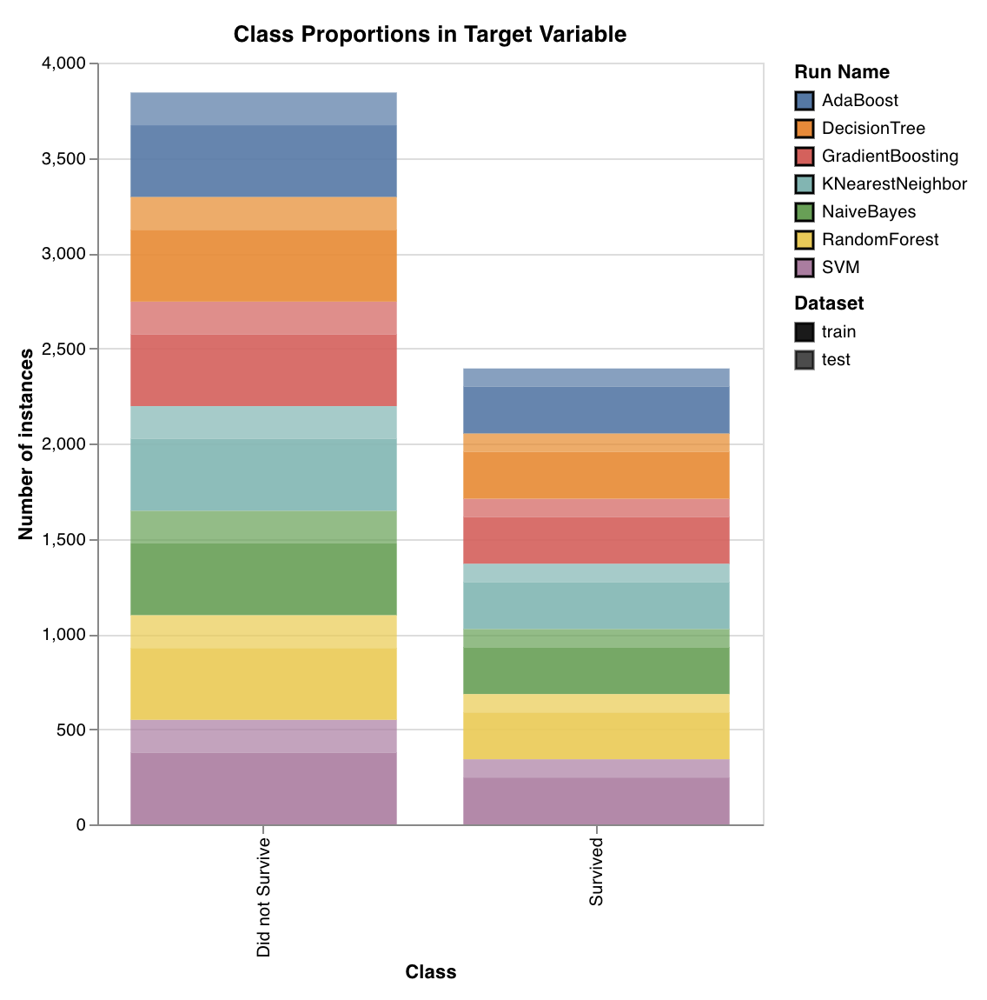

# Scikit

只需要几行代码，即可利用wandb把scikit-learn模型的表现可视化并加以比较。[**看一个例子→**](https://colab.research.google.com/drive/1j_4UQTT0Lib8ueAU5zXECxesCj_ofjw7)\*\*\*\*

### **绘制图表**

**第1步：导入wandb并初始化一个新运行项。**

```python
import wandb
wandb.init(project="visualize-sklearn")

# load and preprocess dataset
# train a model
```

#### **第2步：可视化单个图表。**

```python
# Visualize single plot
wandb.sklearn.plot_confusion_matrix(y_true, y_pred, labels)
```

####   **或者一次性可视化全部图表。**

```python
# Visualize all classifier plots
wandb.sklearn.plot_classifier(clf, X_train, X_test, y_train, y_test, y_pred, y_probas, labels,
                                                         model_name='SVC', feature_names=None)

# All regression plots
wandb.sklearn.plot_regressor(reg, X_train, X_test, y_train, y_test,  model_name='Ridge')

# All clustering plots
wandb.sklearn.plot_clusterer(kmeans, X_train, cluster_labels, labels=None, model_name='KMeans')
```

###  **支持的图表类型**

#### Learning  **学习曲线**


 用不同长度的数据集训练模型，然后生成交叉验证分数­数据集大小的图表，训练组和测试组都要这样做。

`wandb.sklearn.plot_learning_curve(model, X, y)`

* model（clf或reg）：传入一个拟合回归子或拟合分类器
*  X（数组型）：数据集特征
* y（数组型）：数据集标签。

#### ROC


 ROC曲线绘制真正类率（Y轴）­假正类率（X轴）。理想分数为TPR = 1且FPR = 0，就是左上角的点。一般情况下我们计算ROC曲线下面积（AUC-ROC），AUC-ROC越大越好。

`wandb.sklearn.plot_roc(y_true, y_probas, labels)`

* y\_true（数组型）：测试组标签。
* y\_probas（数组型）：测试组预测概率。
*  labels（列表型）：为目标变量\(y\)准备的已命名标签。

#### **类占比**



绘制出训练组和测试组中目标类的分布。用于检测不平衡的类，并保证这些类不会对模型产生不相称的影响。

`wandb.sklearn.plot_class_proportions(y_train, y_test, ['dog', 'cat', 'owl'])`

* y\_train（数组型）：训练组标签。
* y\_test（数组型）：测试组标签。
* labels（列表型）：为目标变量\(y\)准备的已命名标签。

####  **精确率­召回率曲线**


计算不同阈值的精确率和召回率的权衡。曲线下方面积大，代表着召回率和精确率都很高，较高的精确率得益于较低的假正类率，而较高的召回率得益于较低的假负类率。

两者分数都高，说明分类器返回的结果比较准确（高精确率），并且返回了全部正类结果中的绝大部分。当多个类很不平衡时，精确率­召回率曲线就派上了用场

`wandb.sklearn.plot_precision_recall(y_true, y_probas, labels)`

* y\_true（数组型）：测试组标签。
* y\_probas（数组型）：测试组预测概率
* labels（列表型）：为目标变量\(y\)准备的已命名标签。

####  **特征重要性**


评估并绘制分类任务中每项特征的重要性。仅适用于带有属性`featureimportances`的分类器，比如树。.

`wandb.sklearn.plot_feature_importances(model, ['width', 'height, 'length'])`

* model \(clf\)：传入一个拟合分类器。
* feature\_names（列表型）：特征的名称。把特征的索引值换成对应的名称，会使图表更容易读懂

#### **校准曲线**


 绘制出分类器的预测概率被校准得如何、如何校准未校准的分类器。利用基准逻辑回归模型比较估算的预测概率，该模型作为参数传入，并且传入时要通过模型的保序校准和乙状（sigmoid）校准。

 校准曲线离对角线越近越好。对调的乙状曲线代表分类器过度拟合，而乙状曲线代表分类器欠拟合。通过训练模型的保序校准和乙状校准并比较其曲线，我们就可以判定模型是过度拟合还是欠拟合，确定以后，再判定哪种校准（保序还是乙状）有助于矫正。

若要深入了解，请查看[Sklearn说明文档](https://scikit-learn.org/stable/auto_examples/calibration/plot_calibration_curve.html)。

`wandb.sklearn.plot_calibration_curve(clf, X, y, 'RandomForestClassifier')`

*  model \(clf\)：传入一个拟合分类器。
* X （数组型）：训练集特征。
* y（数组型）：训练集标签。
* model\_name（字符串型）：模型名称。默认为“Classifier”。

#### Confusion Matrix


计算混淆矩阵来评估分类的准确度。可用来判定模型预测的质量、找到模型在预测中出错的模式。对角线代表着模型做对的预测，也就是说，在这条线上实际标签等于预测标签。

`wandb.sklearn.plot_confusion_matrix(y_true, y_pred, labels)`

* y\_true（数组型）：测试集标签。
* y\_pred（数组型）：测试集预测标签。
* labels（列表型）：为目标变量\(y\)准备的已命名标签。

#### **汇总指标**


 计算汇总指标（如分类的F1、准确率、精确率和召回率，回归和分类算法的均方误差（MSE）、平均绝对误差（MAE）、R2系数）。

`wandb.sklearn.plot_summary_metrics(model, X_train, X_test, y_train, y_test)`

* model \(clf或reg\)：传入一个拟合的回归子或分类器。
* X （数组型）：训练集特征。
* y（数组型）：训练集标签。
  * X\_test（数组型）：测试集特征。
* y\_test（数组型）：测试集标签。

**肘形图（Elbow Plot）**


测量并绘制出方差的百分比，方差的百分比是聚类数和训练时间的函数。可用来挑选最优聚类数。

`wandb.sklearn.plot_elbow_curve(model, X_train)`

* model \(clusterer\): Takes in a fitted clusterer.
* X \(arr\): Training set features.

####  **轮廓图**


 测量并绘制出一个聚类中每个点离相邻聚类中的点的距离。聚类的浓度对应着聚类大小。那条竖线代表着所有点的平均轮廓系数。

轮廓系数接近+1表示该样本远离相邻聚类。值为0表示该样本处于或非常接近两个相邻聚类的判定边界，负值表示这些样本可能被分配错了聚类。

总而言之，我们希望全部轮廓聚类系数高于平均值（超过红线），尽可能接近1.我们还想要聚类大小，聚类大小反映数据的底层模式。

`wandb.sklearn.plot_silhouette(model, X_train, ['spam', 'not spam'])`

* model \(clusterer\)：传入一个拟合聚类器（clusterer）。
* X （数组型）：训练集特征。
  * cluster\_labels（列表型）：聚类标签名称。把聚类索引值换成对应的名称，使图表更容易读懂。

**离群点候选图（Outlier Candidates Plot）**


通过库克距离测算数据点对回归模型的影响。有严重倾斜影响的实例可能就是离群点。可用来检测离群点。

`wandb.sklearn.plot_outlier_candidates(model, X, y)`

*  model（回归子）：传入一个拟合分类器。
* X （数组型）：训练集特征。
* y（数组型）：训练集标签。

#### **残差图**


 测量并绘制出预测目标值（Y轴）­真实目标值与预测目标值的差别，以及残差的分布。

一般情况下，拟合良好的模型的残差应该为随机分布，因为好模型会考虑到数据集中的大部分现象，除了随机误差以外。

`wandb.sklearn.plot_residuals(model, X, y)`

*  model（回归子）：传入一个拟合分类器。
*  X （数组型）：训练集特征
* y（数组型）：训练集标签。

   如果你有什么问题，就发到我们的[Slack社区](https://app.slack.com/client/TL4V2PWQ3)吧，我们在那里回复。

## **范例**

*  [在Colab运行](https://colab.research.google.com/drive/1tCppyqYFCeWsVVT4XHfck6thbhp3OGwZ)：从一个简单的笔记本入手
*  [wandb指示板](https://wandb.ai/wandb/iris)：在权阈中查看结果。

