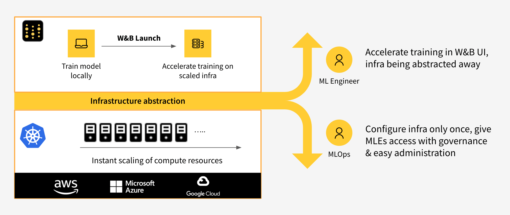

# wandb.log\(\)

 调用`wandb.log(dict)`将指标字典或自定义对象记录到一个步（Step）中。每次记录时，我们都会默认递增步长，让你随时间推移查看指标（Metric）。

###  使用实例：

```python
wandb.log({'accuracy': 0.9, 'epoch': 5})
```

### **常用工作流程**

1. 比较最佳准确率（Accuracy）: 要在不同运行中比较一个指标（Metric）的最佳值，请为该指标设置总结（Summary）值。默认情况下，总结（Summary）设置为你为每个键记录的最后一个值。这在UI中的表格中非常有用，你可以根据其总结指标（Summary Metric）对运行进行排序和过滤——因此，你可以根据其最佳准确率而不是最终准确率在表格或条形图中比较运行。例如，你可以这样设置总结（Summary）:   `wandb.run.summary["accuracy"] = best_accuracy`
2. **一个图上多个指标（Metric）：**在调用wandb.log\(\)时记录多个指标，例如:`wandb.log({'acc': 0.9, 'loss': 0.1})` ,它们都将可以根据自定义x轴进行绘制。
3.  **自定义x轴：**在同一个 log 调用中添加一个自定义x轴，以便在W&B 仪表盘中以一个不同的轴来可视化你的指标。

###  **参考文档**

查看参考文档，由 wandb Python库生成。

##  **记录对象**

我们支持图像、视频、音频、自定义图表等等。记录富媒体以探究结果并可视化不同运行之间的对比结果。

[ ](https://colab.research.google.com/drive/15MJ9nLDIXRvy_lCwAou6C2XN3nppIeEK) ​[ ](https://colab.research.google.com/drive/15MJ9nLDIXRvy_lCwAou6C2XN3nppIeEK)[在Colab中](https://colab.research.google.com/drive/15MJ9nLDIXRvy_lCwAou6C2XN3nppIeEK)尝试​

###  **直方图**

```python
wandb.log({"gradients": wandb.Histogram(numpy_array_or_sequence)})
wandb.run.summary.update({"gradients": wandb.Histogram(np_histogram=np.histogram(data))})
```

如果提供的第一个参数是序列，我们会对直方图自动分箱。你也可以将从np.histogram返回的值赋给np\_histogram关键字参数来进行自己的分箱。所支持的最大分箱数为512。你可以使用可选的num\_bins关键字参数来覆盖默认的64个分箱数。

如果直方图在你的总结（Summary）中，它们将在各运行页面以走势图的形式出现。如果它们在你的历史记录中，我们会绘制一个随时间变化的分箱热图。

###  **图像和覆盖物**



`wandb.log({"examples": [wandb.Image(numpy_array_or_pil, caption="Label")]})`

 如果提交的是一个numpy数组，我们指定，如果最后一维为1，是灰度；如果为3，是RGB；如果为4，是RGBA。如果数组含有浮点数，我们将它们转化为0-255的整数。你可以手动指定一个[模式](https://pillow.readthedocs.io/en/3.1.x/handbook/concepts.html#concept-modes)，或直接提供一个`PIL.Image`。建议每步记录的图像数少于50。



 如果你的图像带有用于语义分割的掩码，你可以记录这些掩码并在UI中打开或关闭它们。要记录多个掩码，请记录一个带有多键的掩码字典。下面是一个例子:

* **mask\_data**:  一个二维 numpy数组，包含每个像素的整数类标签
* **class\_labels**: 一个将mask\_data中的数字映射到可读标签的字典

```python
mask_data = np.array([[1, 2, 2, ... , 2, 2, 1], ...])

class_labels = {
  1: "tree",
  2: "car",
  3: "road"
}

mask_img = wandb.Image(image, masks={
  "predictions": {
    "mask_data": mask_data,
    "class_labels": class_labels
  },
  "groud_truth": {
    ...
  },
  ...
})
```

 [查看一个实战案例](https://app.wandb.ai/stacey/deep-drive/reports/Image-Masks-for-Semantic-Segmentation--Vmlldzo4MTUwMw)

 [示例代码](https://colab.research.google.com/drive/1SOVl3EvW82Q4QKJXX6JtHye4wFix_P4J)





Log bounding boxes with images, and use filters and toggles to dynamically visualize different sets of boxes in the UI.

```python
class_id_to_label = {
    1: "car",
    2: "road",
    3: "building",
    ....
}

img = wandb.Image(image, boxes={
    "predictions": {
        "box_data": [{
            "position": {
                "minX": 0.1,
                "maxX": 0.2,
                "minY": 0.3,
                "maxY": 0.4,
            },
            "class_id" : 2,
            "box_caption": "minMax(pixel)",
            "scores" : {
                "acc": 0.1,
                "loss": 1.2
            },
        }, 
        # Log as many boxes as needed
        ...
        ],
        "class_labels": class_id_to_label
    },
    "ground_truth": {
    # Log each group of boxes with a unique key name
    ...
    }
})

wandb.log({"driving_scene": img})
```

Optional Parameters

`class_labels` An optional argument mapping your class\_ids to string values. By default we will generate class\_labels `class_0`, `class_1`, etc...

Boxes - Each box passed into box\_data can be defined with different coordinate systems.

`position`

* Option 1: `{minX, maxX, minY, maxY}` Provide a set of coordinates defining the upper and lower bounds of each box dimension.
* Option 2: `{middle, width, height}`  Provide a set of coordinates specifying the middle coordinates as `[x,y]`, and `width`, and `height` as scalars 

`domain` Change the domain of your position values based on your data representation

* `percentage` \(Default\) A relative value representing the percent of the image as distance
* `pixel`An absolute pixel value

[See a live example →](https://app.wandb.ai/stacey/yolo-drive/reports/Bounding-Boxes-for-Object-Detection--Vmlldzo4Nzg4MQ)





###  **边界框**



```python
wandb.log({"examples": [wandb.Audio(numpy_array, caption="Nice", sample_rate=32)]})
```

每步可记录的音频片段最大数量为100。



```python
wandb.log({"video": wandb.Video(numpy_array_or_path_to_video, fps=4, format="gif")})
```

如果提供了一个numpy数组，我们指定其维度为:时间、通道、宽度、高度。默认我们会创建一个4fps的gif图像（当传递numpy对象时，需要使用ffmpeg和moviepy python库）。支持的格式有“gif”,“mp4”,“webm”和“ogg”。如果你向wandb.Video传递一个字符串，我们会在上传到wandb之前断言该文件存在并且是支持的格式。 传递BytesIO将创建一个以指定格式为扩展名的临时文件（tempfile）。



使用 wandb.Table\(\)来记录表格中的文本以便在UI中显示。默认列头是`["Input", "Output", "Expected"]`。行数上限是 10,000 行。

```python
# Method 1
data = [["I love my phone", "1", "1"],["My phone sucks", "0", "-1"]]
wandb.log({"examples": wandb.Table(data=data, columns=["Text", "Predicted Label", "True Label"])})

# Method 2
table = wandb.Table(columns=["Text", "Predicted Label", "True Label"])
table.add_data("I love my phone", "1", "1")
table.add_data("My phone sucks", "0", "-1")
wandb.log({"examples": table})
```

 你也可以传递一个 pandas `DataFrame` 对象

```python
table = wandb.Table(dataframe=my_dataframe)
```



```python
wandb.log({"custom_file": wandb.Html(open("some.html"))})
wandb.log({"custom_string": wandb.Html('<a href="https://mysite">Link</a>')})
```

自定义html可以在任意键上被记录，这将在运行页面上显示一个HTML面板。默认情况下，我们会注入默认样式，你可以通过传入 `inject=False` 来禁用默认样式。

```python
wandb.log({"custom_file": wandb.Html(open("some.html"), inject=False)})
```



```python
wandb.log({"protein": wandb.Molecule(open("6lu7.pdb"))}
```

记录10种文件类型任意一种中的molecular数据:

`'pdb', 'pqr', 'mmcif', 'mcif', 'cif', 'sdf', 'sd', 'gro', 'mol2', 'mmtf'`

当你的运行完成后，你将能够在UI中与你的molecules 三维模型进行交互。

 [查看一个实战案例](https://app.wandb.ai/nbaryd/Corona-Virus/reports/Visualizing-Molecular-Structure-with-Weights-%26-Biases--Vmlldzo2ODA0Mw) 





###  **自定义图表**

 这些预设有内置的`wandb.plot`方法，能够直接从你的脚本中快速记录图表，在UI看到想要的可视化结果。



`wandb.plot.line()`

记录一个自定义线条图——在x和y任意轴上有序连接的一系列点\(x,y\)

```python
data = [[x, y] for (x, y) in zip(x_values, y_values)]
table = wandb.Table(data=data, columns = ["x", "y"])
wandb.log({"my_custom_plot_id" : wandb.plot.line(table, "x", "y", title="Custom Y vs X Line Plot")})
```

 可以用这记录任意二维空间上的曲线。注意，如果你要绘制两个数值列表，列表中值的数量必须正好匹配（即每个点必须有一个x和一个y）。


[在应用程序中查看→](https://wandb.ai/wandb/plots/reports/Custom-Line-Plots--VmlldzoyNjk5NTA)​

  [运行代码→](https://colab.research.google.com/drive/1uXLKDmsYg7QMRVFyjUAlg-eZH2MW8yWH?usp=sharing)​ 



`wandb.plot.scatter()`

Log a custom scatter plot—a list of points \(x, y\) on a pair of arbitrary axes x and y.

```python
data = [[x, y] for (x, y) in zip(class_x_prediction_scores, class_y_prediction_scores)]
table = wandb.Table(data=data, columns = ["class_x", "class_y"])
wandb.log({"my_custom_id" : wandb.plot.scatter(table, "class_x", "class_y")})
```

You can use this to log scatter points on any two dimensions. Note that if you're plotting two lists of values against each other, the number of values in the lists must match exactly \(i.e. each point must have an x and a y\).


[See in the app →](https://wandb.ai/wandb/plots/reports/Custom-Scatter-Plots--VmlldzoyNjk5NDQ)

[Run the code →](https://tiny.cc/custom-charts)



`wandb.plot.bar()`

Log a custom bar chart—a list of labeled values as bars—natively in a few lines:

```python
data = [[label, val] for (label, val) in zip(labels, values)]
table = wandb.Table(data=data, columns = ["label", "value"])
wandb.log({"my_bar_chart_id" : wandb.plot.bar(table, "label", "value", title="Custom Bar Chart")
```

You can use this to log arbitrary bar charts. Note that the number of labels and values in the lists must match exactly \(i.e. each data point must have both\).


[See in the app →](https://wandb.ai/wandb/plots/reports/Custom-Bar-Charts--VmlldzoyNzExNzk)

[Run the code →](https://tiny.cc/custom-charts)



`wandb.plot.histogram()`

Log a custom histogram—sort list of values into bins by count/frequency of occurrence—natively in a few lines. Let's say I have a list of prediction confidence scores \(`scores`\) and want to visualize their distribution:

```python
data = [[s] for s in scores]
table = wandb.Table(data=data, columns=["scores"])
wandb.log({'my_histogram': wandb.plot.histogram(table, "scores", title=None)})
```

You can use this to log arbitrary histograms. Note that `data` is a list of lists, intended to support a 2D array of rows and columns.


[See in the app →](https://wandb.ai/wandb/plots/reports/Custom-Histograms--VmlldzoyNzE0NzM)

[Run the code →](https://tiny.cc/custom-charts)



`wandb.plot.pr_curve()`

Log a [Precision-Recall curve](https://scikit-learn.org/stable/modules/generated/sklearn.metrics.precision_recall_curve.html#sklearn.metrics.precision_recall_curve) in one line:

```python
wandb.log({"pr" : wandb.plot.pr_curve(ground_truth, predictions,
                     labels=None, classes_to_plot=None)})
```

You can log this whenever your code has access to:

* a model's predicted scores \(`predictions`\) on a set of examples
* the corresponding ground truth labels \(`ground_truth`\) for those examples
* \(optionally\) a list of the labels/class names \(`labels=["cat", "dog", "bird"...]` if label index 0 means cat, 1 = dog, 2 = bird, etc.\)
* \(optionally\) a subset \(still in list format\) of the labels to visualize in the plot


[See in the app →](https://wandb.ai/wandb/plots/reports/Plot-Precision-Recall-Curves--VmlldzoyNjk1ODY)

[Run the code →](https://colab.research.google.com/drive/1mS8ogA3LcZWOXchfJoMrboW3opY1A8BY?usp=sharing)



`wandb.plot.roc_curve()`

Log an [ROC curve](https://scikit-learn.org/stable/modules/generated/sklearn.metrics.roc_curve.html#sklearn.metrics.roc_curve) in one line:

```text
wandb.log({"roc" : wandb.plot.roc_curve( ground_truth, predictions, \
                        labels=None, classes_to_plot=None)})
```

You can log this whenever your code has access to:

* a model's predicted scores \(`predictions`\) on a set of examples
* the corresponding ground truth labels \(`ground_truth`\) for those examples
* \(optionally\) a list of the labels/ class names \(`labels=["cat", "dog", "bird"...]` if label index 0 means cat, 1 = dog, 2 = bird, etc.\)
* \(optionally\) a subset \(still in list format\) of these labels to visualize on the plot


[See in the app →](https://wandb.ai/wandb/plots/reports/Plot-ROC-Curves--VmlldzoyNjk3MDE)

[Run the code →](https://colab.research.google.com/drive/1_RMppCqsA8XInV_jhJz32NCZG6Z5t1RO?usp=sharing)



`wandb.plot.confusion_matrix()`

 **在一行上记录多类**[**混淆矩阵**](https://scikit-learn.org/stable/auto_examples/model_selection/plot_confusion_matrix.html)

```text
wandb.log({"conf_mat" : wandb.plot.confusion_matrix(
                        predictions, ground_truth, class_names})
```

**每当你的代码访问了如下内容，你就可以记录该曲线:**

* 一个模型在一组示例上的预测分数`（predictions）`
* 这些示例的相应的基准真值`（ground truth）`标签`（ground_truth）`
*  一个完整的标签/类名字符串列表`（class_names,例如class_names=["cat", "dog", "bird"...]`如果标签索引0表示`cat,那么1=dog,2=bird,等）`



​​ ​[在应用程序中查看 →](https://wandb.ai/wandb/plots/reports/Confusion-Matrix--VmlldzozMDg1NTM)​

​ [运行代码 →](https://colab.research.google.com/drive/1OlTbdxghWdmyw7QPtSiWFgLdtTi03O8f?usp=sharing)




###  **散点图**

 你可以用它来记录任意二维空间上的散点。注意，如果你要绘制两个数值列表，列表中值的数量必须正好匹配（即每个点必须有一个x和一个y）。

```python
# Create a table with the columns to plot
table = wandb.Table(data=data, columns=["step", "height"])

# Map from the table's columns to the chart's fields
fields = {"x": "step",
          "value": "height"}

# Use the table to populate the new custom chart preset
# To use your own saved chart preset, change the vega_spec_name
my_custom_chart = wandb.plot_table(vega_spec_name="carey/new_chart",
              data_table=table,
              fields=fields,
              )
```

 [运行代码→](https://colab.research.google.com/drive/1uXLKDmsYg7QMRVFyjUAlg-eZH2MW8yWH?usp=sharing)​

### Matplotlib

```python
import matplotlib.pyplot as plt
plt.plot([1, 2, 3, 4])
plt.ylabel('some interesting numbers')
wandb.log({"chart": plt})
```

 你可以把`matplotlib`的pyplot或 figure对象传递给`andb.log()`。默认情况下，我们会把该图转化为[Plotly](https://plot.ly/)图。如果你明确要将该图记录为图像，则可以把该图传给`wandb.Image`。我们也接受直接记录Plotly图表。

###  **三维可视化**



记录文件的格式为`obj`、`gltf`或`glb`，你的运行结束后，我们将在UI中渲染它们。

```python
wandb.log({"generated_samples":
           [wandb.Object3D(open("sample.obj")),
            wandb.Object3D(open("sample.gltf")),
            wandb.Object3D(open("sample.glb"))]})
```


 [查看一个实战案例 →](https://app.wandb.ai/nbaryd/SparseConvNet-examples_3d_segmentation/reports/Point-Clouds--Vmlldzo4ODcyMA)​



Log 3D point clouds and Lidar scenes with bounding boxes. Pass in a numpy array containing coordinates and colors for the points to render.

```python
point_cloud = np.array([[0, 0, 0, COLOR...], ...])

wandb.log({"point_cloud": wandb.Object3D(point_cloud)})
```

Three different shapes of numpy arrays are supported for flexible color schemes.

* `[[x, y, z], ...]` `nx3`
* `[[x, y, z, c], ...]` `nx4` `| c is a category` in the range `[1, 14]` \(Useful for segmentation\)
* `[[x, y, z, r, g, b], ...]` `nx6 | r,g,b` are values in the range `[0,255]`for red, green, and blue color channels.

Here's an example of logging code below:

* `points`is a numpy array with the same format as the simple point cloud renderer shown above.
* `boxes` is a numpy array of python dictionaries with three attributes:
  * `corners`- a list of eight corners
  * `label`- a string representing the label to be rendered on the box \(Optional\)
  * `color`- rgb values representing the color of the box 
* `type` is a string representing the scene type to render. Currently the only supported value is `lidar/beta`

```python
# Log points and boxes in W&B
wandb.log(
        {
            "point_scene": wandb.Object3D(
                {
                    "type": "lidar/beta",
                    "points": np.array(
                        [
                            [0.4, 1, 1.3], 
                            [1, 1, 1], 
                            [1.2, 1, 1.2]
                        ]
                    ),
                    "boxes": np.array(
                        [
                            {
                                "corners": [
                                    [0,0,0],
                                    [0,1,0],
                                    [0,0,1],
                                    [1,0,0],
                                    [1,1,0],
                                    [0,1,1],
                                    [1,0,1],
                                    [1,1,1]
                                ],
                                "label": "Box",
                                "color": [123,321,111],
                            },
                            {
                                "corners": [
                                    [0,0,0],
                                    [0,2,0],
                                    [0,0,2],
                                    [2,0,0],
                                    [2,2,0],
                                    [0,2,2],
                                    [2,0,2],
                                    [2,2,2]
                                ],
                                "label": "Box-2",
                                "color": [111,321,0],
                            }
                        ]
                    ),
                    "vectors": [
                        {"start": [0,0,0], "end": [0.1,0.2,0.5]}
                    ]
                }
            )
        }
    )
```



## **递增式记录**

 如果你想根据不同的x轴绘制你的指标（Metric）,你可以将步（Step）作为一个指标（Metric）记录，例如 `wandb.log({'loss': 0.1, 'epoch': 1, 'batch': 3})` 。在UI中，你可以在图表设置中切换x轴。

I 如果你想在你的代码中从很多不同的地方记录到一个单一的历史步（Step），你可以传递一个步（Step）索引到`wandb.log（）`，如下所示:

```python
wandb.log({'loss': 0.2}, step=step)
```

只要你一直传递相同的步（Step）值，W&B就会把每次调用的键和值收集到一个统一的字典中。只要你在调用wandb.log\(\)时传递的步（step）值和上次不一样了，W&B就会把收集到的键和值写入历史记录，并重新开始收集。注意，你使用该方法时，只能赋给`step`连续的值：0、1、2……该功能绝不允许你随意写入任意一个历史步（Step），只能写入“当前”的和“下一个”。  


 你也可以在`wandb.log`中设置**commit=False**，以累积指标，只要确保在调用`wandb.log`时没有commit标记即可持久化指标。

```python
wandb.log({'loss': 0.2}, commit=False)
# Somewhere else when I'm ready to report this step:
wandb.log({'accuracy': 0.8})
```

## **总结指标**

总结（summary）统计，用于跟踪每个模型的单一指标。如果总结指标被更改了，只有更新的状态会被保存。除非你手动修改，否则我们会将总结（summary）自动设置为最后添加的历史行。如果你修改了某个总结（summary）指标，我们仅保留设置的最后一个值。

```python
wandb.init(config=args)

best_accuracy = 0
for epoch in range(1, args.epochs + 1):
  test_loss, test_accuracy = test()
  if (test_accuracy > best_accuracy):
    wandb.run.summary["best_accuracy"] = test_accuracy
    best_accuracy = test_accuracy
```

 你可能想在训练完成后，将评价指标（Evalution Metrics）保存在运行总结（Summary）中。 `summary`可以处理`numpy`数组、`pytorch` tensors、`tensorflow` tensors。当某个值属于这些类型之一，我们会把整个tensor保存到一个二进制文件，并把高级指标保存至`summary`对象，例如最小值、平均值、方差、95%百分位数等等。

```python
api = wandb.Api()
run = api.run("username/project/run_id")
run.summary["tensor"] = np.random.random(1000)
run.summary.update()
```

### **直接访问记录**

历史对象用来跟踪`wandb.log`记录的指标。你可以用`run.history.row`获取指标的可更改字典。每当调用`run.history.add`或wandb.log，该行就被保存，新的一行被创建。

####  **Tensorflow例子**

```python
wandb.init(config=flags.FLAGS)

# Start tensorflow training
with tf.Session() as sess:
  sess.run(init)

  for step in range(1, run.config.num_steps+1):
      batch_x, batch_y = mnist.train.next_batch(run.config.batch_size)
      # Run optimization op (backprop)
      sess.run(train_op, feed_dict={X: batch_x, Y: batch_y})
      # Calculate batch loss and accuracy
      loss, acc = sess.run([loss_op, accuracy], feed_dict={X: batch_x, Y: batch_y})

      wandb.log({'acc': acc, 'loss':loss}) # log accuracy and loss
```

####  **PyTorch例子**

```python
# Start pytorch training
wandb.init(config=args)

for epoch in range(1, args.epochs + 1):
  train_loss = train(epoch)
  test_loss, test_accuracy = test()

  torch.save(model.state_dict(), 'model')

  wandb.log({"loss": train_loss, "val_loss": test_loss})
```

## **常见问题**

### **比较不同周期（epoch）的图像**

每当你从一个步（step）中记录的图像，我们都会将他们保存到UI中显示。固定图像面板，然后移动**步（step）滑块**即可查看不同步（step）的图像。这便于比较训练过程中模型的输出如何变化。

```python
wandb.log({'epoch': epoch, 'val_acc': 0.94})
```

### **批量记录**

如果你想记录每批（batch）的某些指标并使图表标准化，你可以记录你想与你的指标一起绘制的x轴值。然后在自定义图表中，点击编辑并选择自定义x轴。

```python
wandb.log({'batch': 1, 'loss': 0.3})
```

### **记录一个PNG**

默认情况下，wandb.Image把numpy数组或PILImage实例转化为png图像。

```python
wandb.log({"example": wandb.Image(...)})
# Or multiple images
wandb.log({"example": [wandb.Image(...) for img in images]})
```

**记录一个JPEG**

要保存一个JPEG,你可以传递一个文件的路径。

```python
im = PIL.fromarray(...)
rgb_im = im.convert('RGB')
rgb_im.save('myimage.jpg')
wandb.log({"example": wandb.Image("myimage.jpg")})
```

### **记录一个视频**

```python
wandb.log({"example": wandb.Video("myvideo.mp4")})
```

现在你可以在媒体浏览器中查看视频。进入你的项目工作区、运行工作区或者报告，然后点击“添加可视化”，以添加一个富媒体面板。

###  **自定义x轴**

默认情况下，每当你调用wandb.log，我们都会递增全局步长。如果你想，你可以自行记录单调递增步长，然后在你的图上选择它作为自定义x轴。

例如，如果你想要匹配训练和验证步长，那就传给我们你的步长计数器：`wandb.log({“acc”:1, “global_step”:1})`。然后在图中选择“global\_step”作为x轴。

 除了默认的步长（step）轴，`wandb.log({“acc”:1,”batch”:10}, step=epoch)`能让你选择“batch”作为一个x轴。

###  **在点云中导航和缩放**

在点云中，你可以按住“Ctrl”键并使用鼠标在空间内移动。

###  **图中没有任何显示**

如果你看到“No visualization data logged yet”（尚未记录可视化数据），说明我们还没有收到你的脚本对wandb.log的调用。这可能因为你的运行要用很长时间才能完成一个步（Step）。如果你是在每个周期（epoch）的结尾进行记录，你可以在每个周期（epoch）记录几次，以便更快地看到数据流。

###  **重复的指标名称**

 如果你在同一键下记录不同类型，我们必须在数据库中把它们拆分开。这就意味着你会在UI中的下拉菜单中看到同一个指标名称的多个条目。我们按照以下类型分组：数字、字符串、布尔及其它（主要为数组），以及wandb类型（直方图、图像等等）。为了避免这种情况，请给每个键只发送一种类型。

###  **性能和限制**

 **采样**

你给我们发送的点越多，在UI中加载你的图表所用的时间就越长。如果你在一条线上有超过1000个点，那么我们在向你的浏览器发送数据之前，会在后台采样其中的1000个点。这种采样具有不确定性，所以，如果你刷新页面，你会看到一组不同的采样点。

如果你想要全部原始数据，可以用我们的[数据API](https://docs.wandb.com/library/api)提取未采样的数据。

**指南**

我们建议你尽量每个指标记录少于10,000个点。如果你有超过500列配置和总结指标，我们将在表格中仅展示500列。如果你一条线记录了超过1百万个点，我们要花很长时间才能载入页面。

我们存储指标时不分大小写，所以确保你不会有两个名称相同的指标，例如“My-Metric”和“my-metric”。

###  **控制图像上传**

"我想把W&B集成到我的项目，但我不想上传任何图像"

我们的集成不会自动上传图像——由你明确指定要上传哪些文件。下面是一个简短示例，用的是PyTorch，其中我明确记录了图像：[http://bit.ly/pytorch-mnist-colab](http://bit.ly/pytorch-mnist-colab)​

```python
wandb.log({
        "Examples": example_images,
        "Test Accuracy": 100. * correct / len(test_loader.dataset),
        "Test Loss": test_loss})
```

