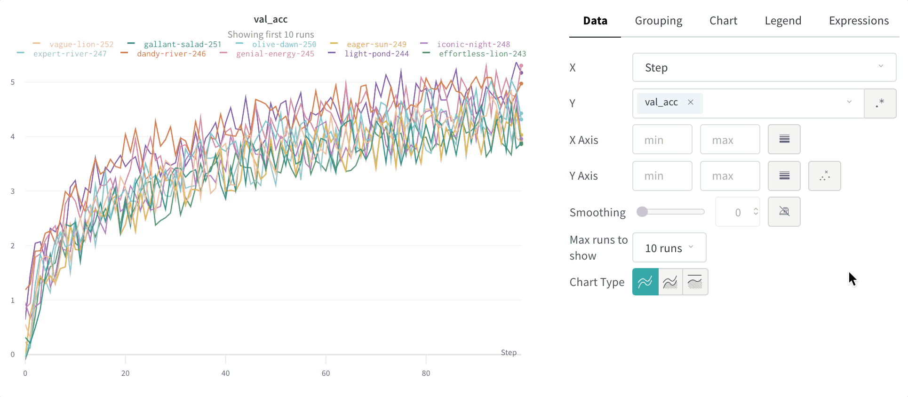
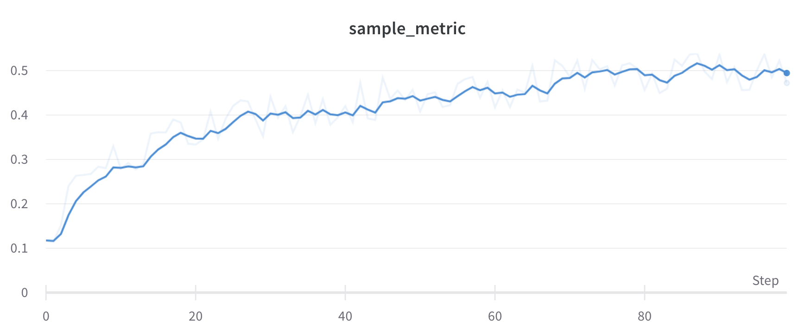
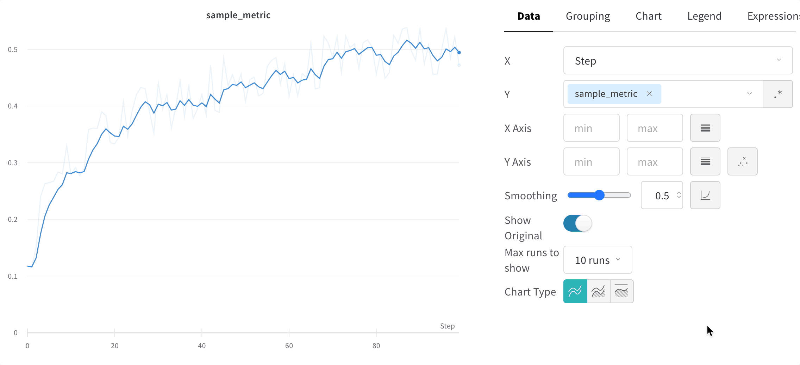

# Smoothing

In Weights & Biases line plots, we support three types of smoothing:

* [exponential moving average](smoothing.md#exponential-moving-average-default) (default)
* [gaussian smoothing](smoothing.md#gaussian-smoothing)
* [running average](smoothing.md#running-average)

See these live in an [interactive W\&B report](https://wandb.ai/carey/smoothing-example/reports/W-B-Smoothing-Features--Vmlldzo1MzY3OTc).



## Exponential Moving Average (Default)

Exponential moving average is implemented to match TensorBoard's smoothing algorithm. The range is 0 to 1. See [Exponential Smoothing](https://www.wikiwand.com/en/Exponential\_smoothing) for background. There is a debias term added so that early values in the time series are not biases towards zero.

Here is sample code for how this works under the hood:

```javascript
  data.forEach(d => {
    const nextVal = d;
    last = last * smoothingWeight + (1 - smoothingWeight) * nextVal;
    numAccum++;
    debiasWeight = 1.0 - Math.pow(smoothingWeight, numAccum);
    smoothedData.push(last / debiasWeight);
```

Here's what this looks like [in the app](https://wandb.ai/carey/smoothing-example/reports/W-B-Smoothing-Features--Vmlldzo1MzY3OTc):



## Gaussian Smoothing

Gaussian smoothing (or gaussian kernel smoothing) computes a weighted average of the points, where the weights correspond to a gaussian distribution with the standard deviation specified as the smoothing parameter. See . The smoothed value is calculated for every input x value.

Gaussian smoothing is a good standard choice for smoothing if you are not concerned with matching TensorBoard's behavior. Unlike an exponential moving average the point will be smoothed based on points occurring both before and after the value.

Here's what this looks like [in the app](https://wandb.ai/carey/smoothing-example/reports/W-B-Smoothing-Features--Vmlldzo1MzY3OTc#3.-gaussian-smoothing):

.png>)

## Running Average

Running average is a simple smoothing algorithm that replaces a point with the average of points in a window before and after the given x value. See "Boxcar Filter" at [https://en.wikipedia.org/wiki/Moving\_average](https://en.wikipedia.org/wiki/Moving\_average). The selected parameter for running average tells Weights and Biases the number of points to consider in the moving average.

Running average is a simple, trivial to replicate smoothing algorithm. If your points are spaced unevenly on the x-axis Gaussian Smoothing may be a better choice.

Here's what this looks like [in the app](https://wandb.ai/carey/smoothing-example/reports/W-B-Smoothing-Features--Vmlldzo1MzY3OTc#4.-running-average):

.png>)

## Implementation Details

All of the smoothing algorithms run on the sampled data, meaning that if you log more than 3000 points, the smoothing algorithm will run _after_ the points are downloaded from the server. The intention of the smoothing algorithms is to help find patterns in data quickly. If you need exact smoothed values on metrics with a large number of logged points, it may be better to download your metrics through the API and run your own smoothing methods.

## Hide original data

By default we show the original, unsmoothed data as a faint line in the background. Click the **Show Original** toggle to turn this off.


