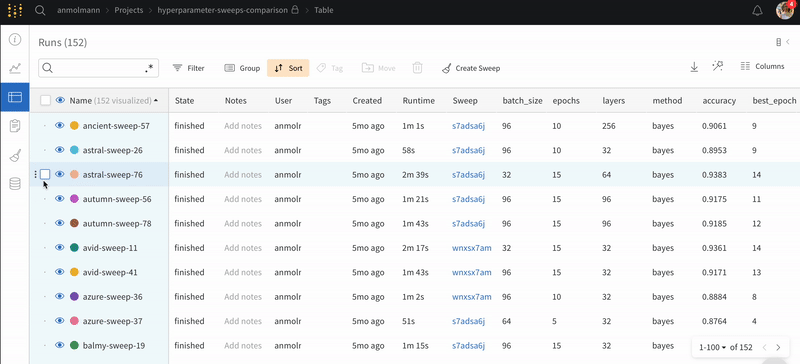

# Runs Table

On the project page, we show runs in a sidebar. Expand the sidebar to view a table of hyperparameters and summary metrics across runs.

## Search run names

We support full [regex](https://dev.mysql.com/doc/refman/8.0/en/regexp.html) search on run names in the table. When you type a query in the search box, that will filter down the visible runs in the graphs on the workspace as well as filtering the rows of the table.

#### What to do in case regex fails?

If regex doesn't provide you the desired results, you can make use of [tags](tags.md) to filter out the runs in Runs Table. Tags can be added either on run creation or after they're finished. Once the tags are added to a run, you can add a tag filter as shown in the gif below.

## Search End Time for runs

We provide a column named `End Time` that logs that last heartbeat from the client process. The field is hidden by default.

 (1) (8).png>)

## Resize the sidebar

Would you like to make more space for the graphs on the project page? Click and drag the edge of the column header to resize the sidebar. You'll still be able to click on the eye icon to turn on and off runs on the graphs.

## Add sidebar columns

On the project page, we show runs in a sidebar. To show more columns:

1. Click the button in the upper right corner of the sidebar to expand the table.
2. On a column header, click the dropdown menu to pin a column.
3. Pinned columns will be available in the sidebar when you collapse the table.

Here's a screen capture. I expand the table, pin two columns, collapse the table, then resize the sidebar.

## Bulk select runs

Delete multiple runs at once, or tag a group of runs— bulk selection makes it easier to keep the runs table organized.

## Select all runs in table

Click the checkbox in the upper left corner of the table, and click "Select all runs" to select every run that matches the current set of filters.

## Move runs between projects

To move runs from one project to another:

1. Expand the table
2. Click the checkbox next to the runs you want to move
3. Click move and select the destination project

## See active runs

Look for a green dot next to the name of runs— this indicates they're active in the table and on the graph legends.

## Hide uninteresting runs

Do you want to hide crashed runs? Are short runs filling up your table? Do you want to only see your work in a group project? Hide the noise with a filter. Some filters we recommend:

* **Show only my work** filters down to runs under your username
* **Hide crashed runs** filters out any runs marked crashed from the table
* **Duration**: add a new filter and select "duration" to hide short runs

.png>)

## Filter runs with tags

Filter runs based on their tags with the filter button.

## Filter and delete unwanted runs

If you filter down the table to just the ones you want to delete, you can select all and press delete to remove them from your project. Deleting runs is project-global, so if you delete runs from a report that will be reflected in the rest of your project.

## Export runs table to CSV

Export the table of all your runs, hyperparameters, and summary metrics to a CSV with the download button.

## Search columns in the table

Search for the columns in the table UI guide with the **Columns** button.

