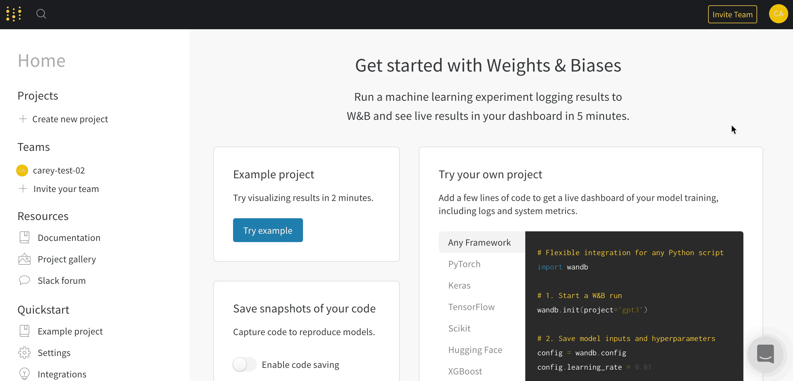

# Teams

Use W\&B Teams as a central workspace for your ML team to build better models faster.

* **Track all the experiments** your team has tried so you never duplicate work.
* **Save and reproduce** previously trained models.
* **Share progress** and results with your boss and collaborators.
* **Catch regressions** and immediately get alerted when performance drops.
* **Benchmark model performance** and compare model versions.

## Create a collaborative team

1. \*\*\*\*[**Sign up or log in**](https://app.wandb.ai/login?signup=true) to your free W\&B account.
2. Click **Invite Team** in the navigation bar.
3. Create your team and invite collaborators.

We also offer [Self-Hosted](../../../guides/self-hosted/) installs for on-prem or private cloud customers.



## Team Trials

We offer free trials for business teams, **no credit card required**. During the trial, you and your colleagues will have access to all the features in W\&B. Once the trial is over, you can upgrade your plan to continue using a W\&B Team to collaborate. Your personal W\&B account will always remain free, and if you're a student or teacher you can enroll in an academic plan.

See the [pricing page](https://wandb.ai/site/pricing) for more information on our plans. You can download all your data at any time, either using the dashboard UI or via our [Export API](../../python/public-api/).

## Common Questions

### Move runs to a team

On the project page:

1. Click the table tab to expand the runs table
2. Click the checkbox to select all runs
3. Click **Move**: the destination project can be in your personal account or any team that you're a member of.


### Send new runs to a team

In your script, set the entity to your team. "Entity" just means your username or team name. Create an entity (personal account or team account) in the web app before sending runs there.

```python
wandb.init(entity="example-team")
```

Your **default entity** is updated when you join a team. This means that on your [settings page](https://app.wandb.ai/settings), you'll see that the default location to create a new project is now the team you've just joined. Here's an example of what that [settings page](https://app.wandb.ai/settings) section looks like:


### Invite team members

You can invite new members to your team on your team settings page:\
app.wandb.ai/teams/\<your-team-name>

### See privacy settings

You can see the privacy settings of all team projects on the team settings page:\
app.wandb.ai/teams/\<your-team-name>

### Remove members from teams

When a team member leaves, it's easy to remove them. Team admins can open the team settings page and click the delete button next to the departing member's name. Any runs that they logged to the team will remain after a user is removed.

### Account types

Invite colleagues to join the team, and select from these options:

* **Member**: A regular member of your team, invited by email
* **Admin**: A team member who can add and remove other admins and members
* **Service**: A service worker, an API key useful for using W\&B with your run automation tools. If you use the API key from a service account for your team, make sure to set the environment variable **WANDB_USERNAME** to attribute runs to the correct user.
