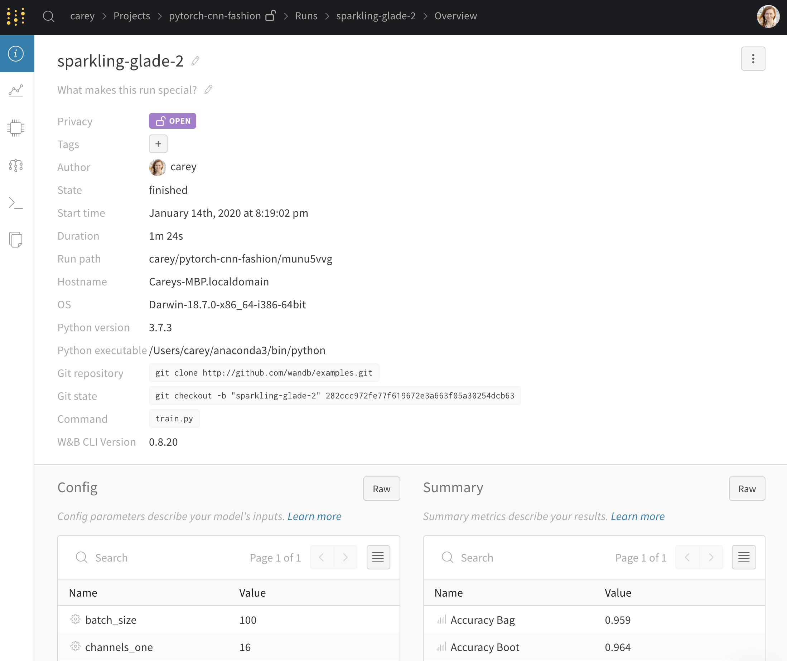
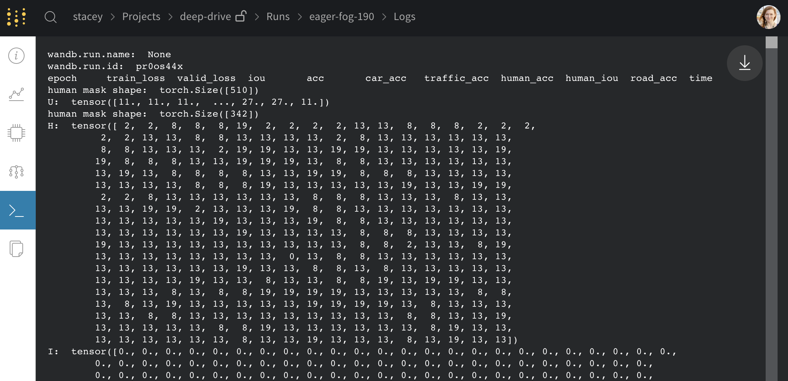

# Run Page

Use the run page to explore detailed information about a single version of your model.

## Overview Tab

* Run name, description, and tags
* Host name, operating system, Python version, and command that launched the run
* List of config parameters saved with [wandb.config](../../../guides/track/config.md)
* List of summary parameters saved with [wandb.log\(\)](../../../guides/track/log.md), by default set to the last value logged

[View a live example →](https://app.wandb.ai/carey/pytorch-cnn-fashion/runs/munu5vvg/overview?workspace=user-carey)

The Python details are private, even if you make the page itself public. Here is an example of my run page in incognito on the left and my account on the right.

## Charts Tab

* Search, group, and arrange visualizations
* Click the pencil icon ✏️ on a graph to edit
  * change x-axis, metrics, and ranges
  * edit legends, titles, and colors of charts
* View examples predictions from your validation set
* To get these charts, log data with [wandb.log\(\)](../../../guides/track/log.md)

[View a live example →](https://app.wandb.ai/wandb/examples-keras-cnn-fashion/runs/wec25l0q?workspace=user-carey)

## System Tab

* Visualize CPU utilization, system memory, disk I/O, network traffic, GPU utilization, GPU temperature, GPU time spent accessing memory, GPU memory allocated, and GPU power usage
* Lambda Labs highlighted how to use W&B system metrics in a[ blog post →](https://lambdalabs.com/blog/weights-and-bias-gpu-cpu-utilization/)

[View a live example →](https://wandb.ai/stacey/deep-drive/runs/ki2biuqy/system?workspace=user-carey)

## Model Tab

* See the layers of your model, the number of parameters, and the output shape of each layer

[View a live example →](https://app.wandb.ai/stacey/deep-drive/runs/pr0os44x/model)

## Logs Tab

* Output printed on the command line, the stdout and stderr from the machine training the model
* We show the last 1000 lines. After the run has finished, if you'd like to download the full log file, click the download button in the upper right corner.

[View a live example →](https://app.wandb.ai/stacey/deep-drive/runs/pr0os44x/logs)

## Files Tab

* Save files to sync with the run using [wandb.save\(\)](../../../guides/track/advanced/save-restore.md)
* Keep model checkpoints, validation set examples, and more
* Use the diff.patch to [restore]() the exact version of your code

🌟New recommendation: Try [Artifacts](../../../guides/artifacts/) for tracking inputs and outputs

[View a live example →](https://app.wandb.ai/stacey/deep-drive/runs/pr0os44x/files/media/images)

