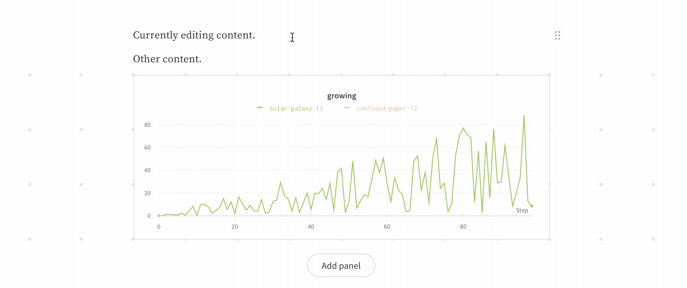
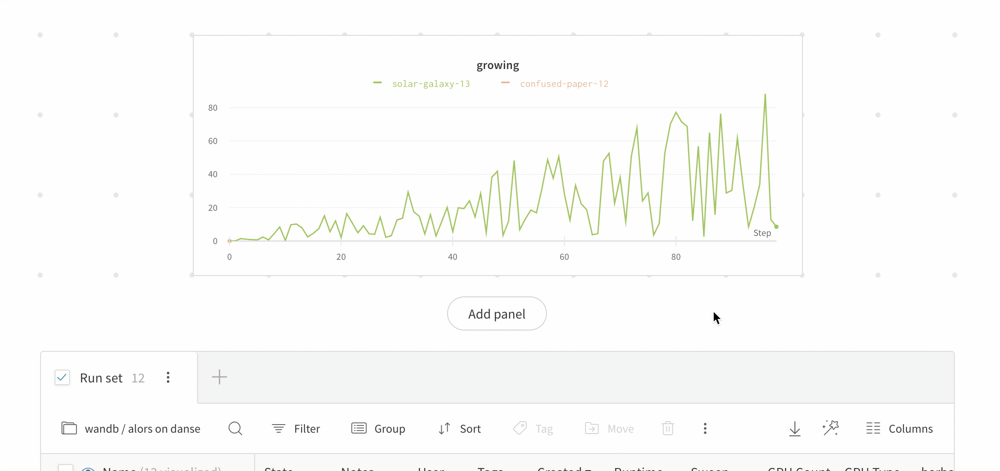

# Reports

Reports let you organize visualizations, describe your findings, and share updates with collaborators.

### Use Cases

1. **Notes**: Add a graph with a quick note to yourself.
2. **Collaboration**: Share findings with your colleagues.
3. **Work log**: Track what you've tried, and plan next steps.

### [See the OpenAI case study →](https://bit.ly/wandb-learning-dexterity)

Once you have [experiments in W&B](quickstart.md), easily visualize results in reports. Here's a quick overview video.



## Collaborate on reports

Once you've saved a report, you can click the **Share** button to collaborate. Make sure the visibility settings on your project allow your collaborators to access the report— you'll need an open project or a team project to share a report that you can edit together.

When you press edit, you'll be editing a draft copy of the report. This draft auto-saves, and when you press **Save to report** you'll be publishing your changes to the shared report.

If one of your collaborators has edited the report in the meantime, you'll get a warning to help you resolve potential edit conflicts.

### Comment on reports

Click the comment button on a panel in a report to add a comment directly to that panel.

## Panel Grids

If you'd like to compare a different set of runs, create a new panel grid. Each section's graphs are controlled by the **Run Sets** at the bottom of that section.

## Run Sets

* **Dynamic run sets**: If you start from "Visualize all" and filter or deselect runs to visualize, the run set will automatically update to show any new runs that match the filters.
* **Static run sets**: If you start from "Visualize none" and select the runs you want to include in your run set, you will only ever get those runs in the run set. No new runs will be added.
* **Defining keys**: If you have multiple Run Sets in a section, the columns are defined by the first run set. To show different keys from different projects, you can click "Add Panel Grid" to add a new section of graphs and run sets with that second set of keys. You can also duplicate a grid section.

## Exporting reports

Click the download button to export your report as a LaTeX zip file. Check the README.md in your downloaded folder to find instructions on how to convert this file to PDF. It's easy to upload the zip file to [Overleaf](https://www.overleaf.com/) to edit the LaTeX.

## Cross-project reports

Compare runs from two different projects with cross-project reports. Use the project selector in the run set table to pick a project.

The visualizations in the section pull columns from the first active runset. If you're not seeing the metric you're looking for in the line plot, make sure that the first run set checked in the section has that column available. This feature supports history data on time series lines, but we don't support pulling different summary metrics from different projects— so a scatter plot wouldn't work for columns that are only logged in another project.

If you really need to compare runs from two projects and the columns aren't working, add a tag to the runs in one project and then move those runs to the other project. You'll still be able to filter to just the runs from each project, but you'll have all the columns for both sets of runs available in the report.

### View-only report links

Share a view-only link to a report that is in a private project or team project.

### Send a graph to a report

Send a graph from your workspace to a report to keep track of your progress. Click the dropdown menu on the chart or panel you'd like to copy to a report and click **Add to report** to select the destination report.

## Reports FAQ

### Upload a CSV to a report

If you currently want to upload a CSV to a report you can do it via the `wandb.Table` format. Loading the CSV in your Python script and logging it as a `wandb.Table` object will allow you to render the data as a table in a report.

### Refreshing data

Reload the page to refresh data in a report and get the latest results from your active runs. Workspaces automatically load fresh data if you have the **Auto-refresh** option active \(available in the dropdown menu in the upper right corner of your page\). Auto-refresh does not apply to reports, so this data will not refresh until you reload the page.

## WYSIWYG Reports FAQ

**What's changed in the new reports release?**

Reports look the same in view mode, and can have all the same content as they did before, but report editing is now WYSIWYG.

**What is WYSIWYG?**

WYSIWYG is an acronym for What You See Is What You Get. It refers to a type of editor where the content always looks the same, whether you're editing or presenting. In contrast, W&B reports used to have Markdown editors, where you edit in [Markdown](https://www.markdownguide.org/) and have to switch to preview mode to see what it'll end up looking like. W&B reports are now fully WYSIWYG.

**Why change to WYSIWYG?**

Users have told us that context switching between Markdown mode and preview mode slows them down. We want to minimize the friction between you and sharing your research with the world, so Markdown-dependent editing had to go. With arbitrary reordering, cut+paste, and undo history for everything \(even panel grids!\), making reports should feel much more natural now. Furthermore, WYSIWYG makes it easier for us to add new advanced features in the future, like video embeds, commenting on specific text selections, and real-time collaboration.

**My report looks different after converting from Markdown.**

We try to keep your report looking the same after converting to WYSIWYG, but the process isn't perfect. If the changes are drastic or unexpected, let us know and we'll look into the issue. Until your editing session ends, you'll have the option of reverting the report back to its pre-conversion state.

**I prefer Markdown. Can I still use it?**

Absolutely! Type "/mark" anywhere in the document and hit enter to insert a Markdown block. You can edit these blocks with Markdown the way you used to.

**My report is running slowly now.**

Sorry! We're constantly working on performance improvements, but WYSIWYG reports may run slowly on older hardware or exceptionally large reports. You can assuage the problem for now by collapsing sections of the report that you're not currently working on, like so:

**I used to have collapsed headings, but now they're all expanded. How can I collapse them again?**

Collapsed headings inside Markdown blocks are no longer supported. However, collapsed WYSIWYG headings are fully supported. If you wish to keep your old reports in Markdown form but utilize collapsible headings, you can add a WYSIWYG heading above the Markdown block you'd like to collapse, remove the heading from the Markdown block, and collapse the WYSIWYG heading.

**How do I delete a panel grid?**

Select the panel grid, and hit delete/backspace. The easiest way to select a panel grid is by clicking its drag handle on the top-right, like so:

**How do I insert a table?**

Tables are the only feature from Markdown that we haven't added a WYSIWYG equivalent for yet. But because we still support Markdown, you can add a table by adding a Markdown block and creating a table inside of it.

**I converted my report to WYSIWYG but I'd like to revert back to Markdown.**

First, try clicking your document and hitting cmd+Z \(or ctrl+Z on Windows\) to undo. If that doesn't work, consider discarding your draft and editing your report from its last saved state. If that's not an option, let us know through the Intercom bubble at the bottom right and our team can try to restore your last working state.

**I have a problem that isn't addressed by this FAQ.**

Please send us a message through the Intercom bubble on the bottom-right of the page in the app, with a link to your report and the keyword "WYSIWYG". If you're not seeing an Intercom chat widget, it's likely blocked by your Ad Block browser extensions, and you can contact us at contact@wandb.com instead.

