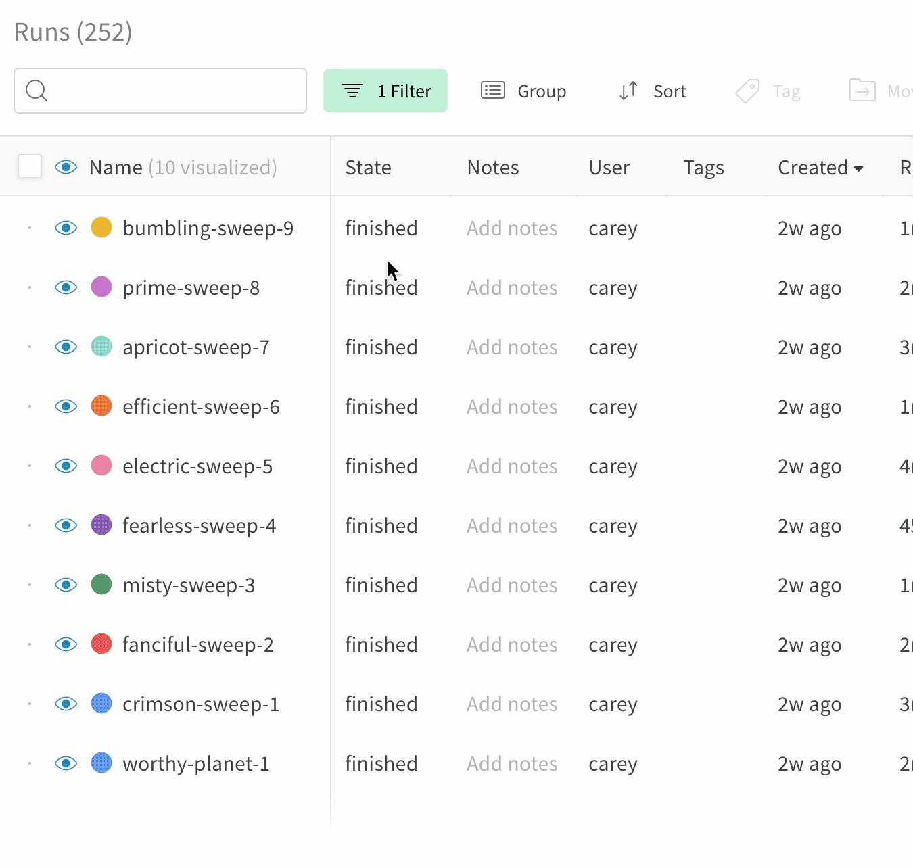

# Reports

Reports are a tool to capture visualizations, describe your findings, and share updates with collaborators.

Use reports to describe your process developing models. Report sections each have their own set of runs, so you can dive in to individual pieces of your project and describe run sets, so you can show comparisons of different runs from different projects in the same page. Panels in reports include visualizations, markdown, and images. Here's an [example report](https://app.wandb.ai/stacey/estuary/reports?view=stacey%2FDistributed%20Training) on distributed training.

## Add markdown

Click **Add a visualization** and select **Markdown** to add a text panel to a report.

## Add visualizations

Click the "Add a visualization" button to add a new graph.

Select what kind of visualization you'd like to use. We'll start with a line plot.

There are plenty of settings to customize your line plot. Select a metric to compare across runs.

## Sections

If you'd like to compare a different set of runs, create a new section. Each section's graphs are controlled by the table in that section.

Duplicate a section to copy the settings from your first section.

## Static and dynamic run sets

* **Dynamic run sets**: If you start from "Visualize all" and filter or deselect runs to visualize, the run set will automatically update to show any new runs that match the filters.
* **Static run sets**: If you start from "Visualize none" and select the runs you want to include in your run set, you will only ever get those runs in the run set. No new runs will be added.

Here's a gif of me clicking "Visualize none" and then selecting the runs I want to include in the run set. This run set will not update as I add more runs to my project.

## Exporting reports

Click the download button to export your report as a LaTeX zip file. Check the README.md in your downloaded folder to find instructions on how to convert this file to PDF. It's easy to upload the zip file to [Overleaf](https://www.overleaf.com/) to edit the LaTeX.

## Cross-project reports

Compare runs from two different projects with cross-project reports. Use the project selector in the run set table to pick a project.

The visualizations in the section pull columns from the first active runset. If you're not seeing the metric you're looking for in the line plot, make sure that the first run set checked in the section has that column available. This feature supports history data on time series lines, but we don't support pulling different summary metrics from different projects— so a scatter plot wouldn't work for columns that are only logged in another project.

If you really need to compare runs from two projects and the columns aren't working, add a tag to the runs in one project and then move those runs to the other project. You'll still be able to filter to just the runs from each project, but you'll have all the columns for both sets of runs available in the report.

## Collaborate on reports

Once you've saved a report, you can click the **Share** button to collaborate. Make sure the visibility settings on your project allow your collaborators to access the report— you'll need an open project or a team project to share a report that you can edit together.

When you press edit, you'll be editing a draft copy of the report. This draft auto-saves, and when you press **Save to report** you'll be publishing your changes to the shared report.

If one of your collaborators has edited the report in the meantime, you'll get a warning to help you resolve potential edit conflicts.

### Upload a CSV to a report 

If you currently want to upload a csv to a report you can do it via the `wandb.Table` format.Loading the csv in your python script and logging it as a `wandb.Table` object will allow you to render the data as a table in a report.

