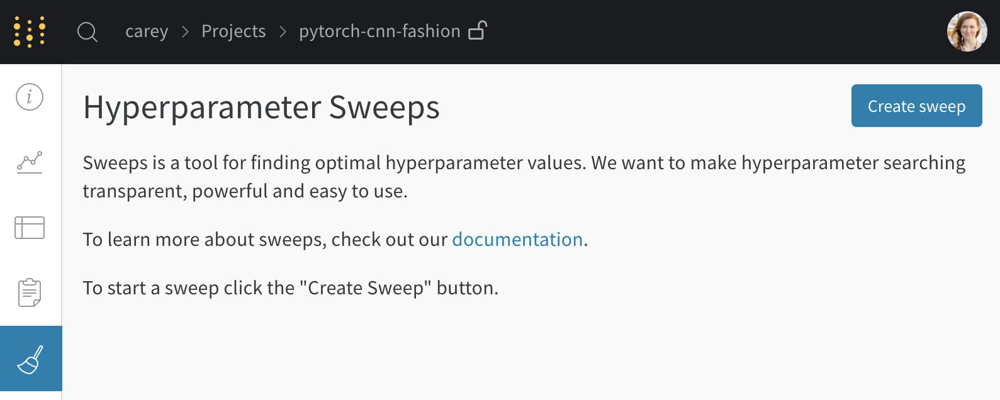
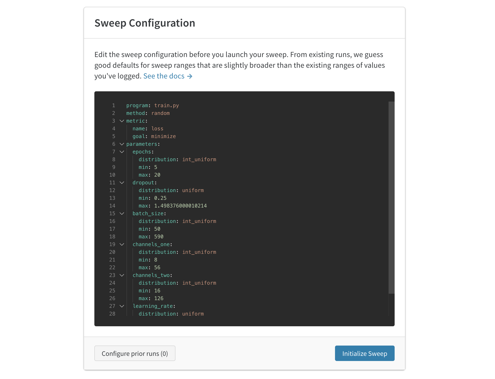
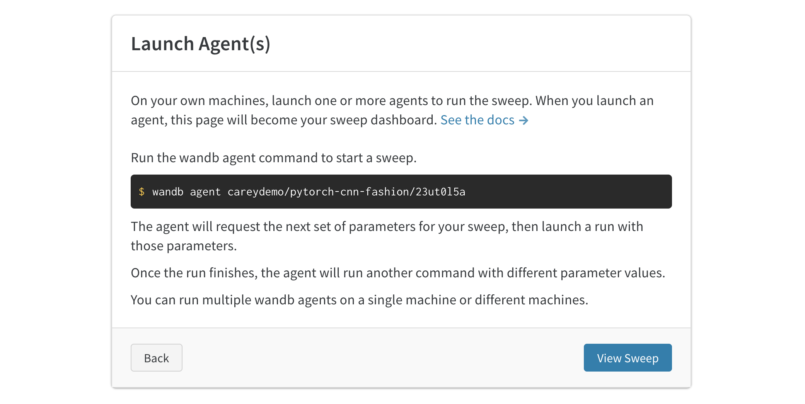

# Sweep from an existing project

If you have an existing W&B project, it’s easy to start optimizing your models with hyperparameter sweeps. I’ll walk through the steps with a working example— you can open my [W&B Dashboard](https://app.wandb.ai/carey/pytorch-cnn-fashion). I'm using the code from [this example repo](https://github.com/wandb/examples/tree/master/examples/pytorch/pytorch-cnn-fashion), which trains a PyTorch convolutional neural network to classify images from the [Fashion MNIST dataset](https://github.com/zalandoresearch/fashion-mnist).

## 1. Create a project

Run your first baseline run manually to check that W&B logging is working properly. You'll download this simple example model, train it for a few minutes, and see the example appear in the web dashboard.

* Clone this repo `git clone https://github.com/wandb/examples.git`
* Open this example `cd examples/pytorch/pytorch-cnn-fashion`
* Run a run manually `python train.py`

[View an example project page →](https://app.wandb.ai/carey/pytorch-cnn-fashion)

## 2. Create a sweep

From your project page, open the Sweep tab in the sidebar and click "Create Sweep".

The auto-generated config guesses values to sweep over based on the runs you've done already. Edit the config to specify what ranges of hyperparameters you want to try. When you launch the sweep, it starts a new process on our hosted W&B sweep server. This centralized service coordinates the agents— your machines that are running the training jobs.

## 3. Launch agents

Next, launch an agent locally. You can launch dozens of agents on different machines in parallel if you want to distribute the work and finish the sweep more quickly. The agent will print out the set of parameters it’s trying next.

That’s it! Now you're running a sweep. Here’s what the dashboard looks like as my example sweep gets started. [View an example project page →](https://app.wandb.ai/carey/pytorch-cnn-fashion)

## Seed a new sweep with existing runs

Launch a new sweep using existing runs that you've previously logged.

1. Open your project table.
2. Select the runs you want to use with checkboxes on the left side of the table.
3. Click the dropdown to create a new sweep.

Your sweep will now be set up on our server. All you need to do is launch one or more agent to start running runs.

