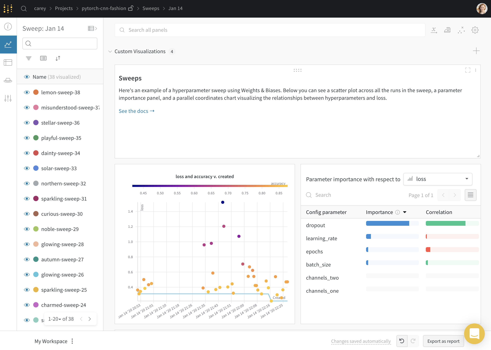

# Example Sweep

Voici un [exemple de code](https://github.com/wandb/examples/tree/master/examples/pytorch/pytorch-cnn-fashion) et un [exemple de tableau de bord](https://app.wandb.ai/carey/pytorch-cnn-fashion/sweeps/v8dil26q).

